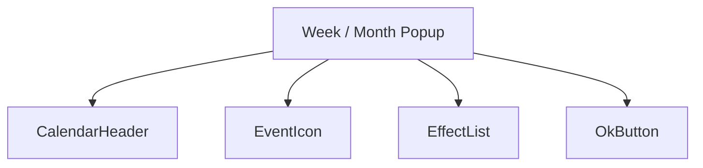
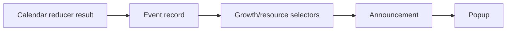
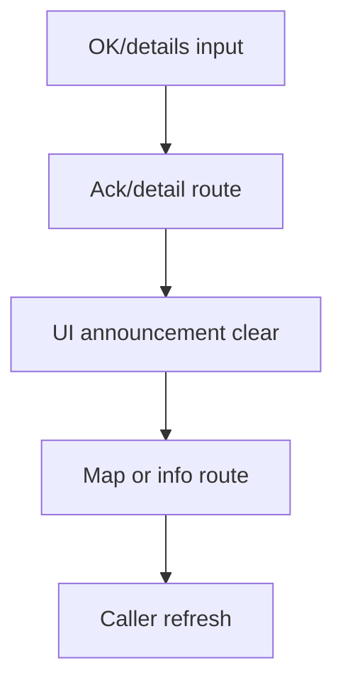
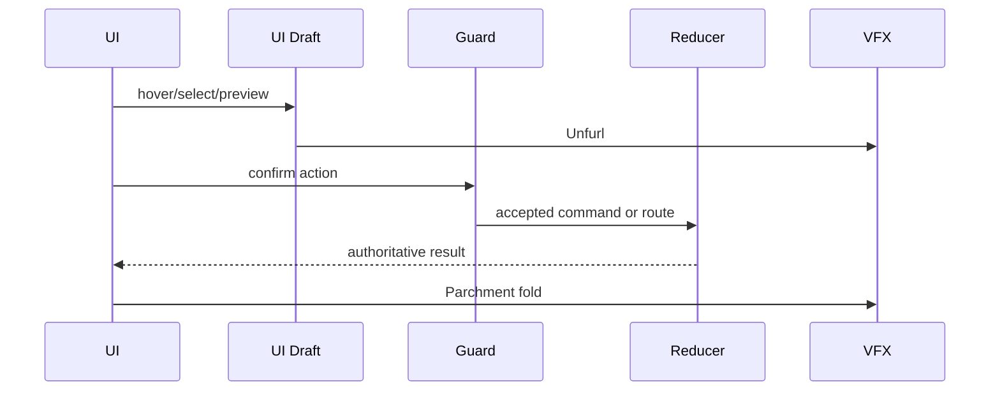
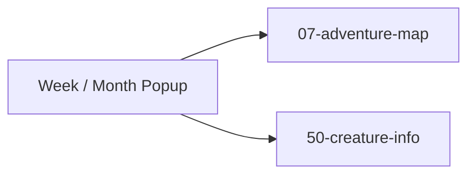

# Screen 58 Architecture: Week / Month Popup

System: system
Screen ID: week-month-popup
Visual Archetype: curated-week-month-popup
Curation Status: curated-pass-6

## Purpose
Start-of-week/month announcement popup for growth changes, plague, month creature, resource events, and calendar transition.

## Visual Direction
- Original internal UI contract. Do not use third-party captures,
  copied franchise art, or external product pixels as implementation input.

## Visual Composition

## Screen Load And Data Resolution

## Main Interaction Flow

## Animation Flow

## Outgoing Transitions

## State Inputs
- calendar -> state.calendar.currentDate
- eventRecord -> state.calendar.pendingAnnouncement
- growthEffects -> selectors.calendar.visibleGrowthEffects
- resourceEffects -> selectors.calendar.visibleResourceEffects
- acknowledged -> state.ui.calendarAnnouncement.acknowledged

## Implementation Contract
- Mockup defines visual regions and data hooks only.
- Spec defines the component/state contract.
- Interactions define controls, timing, command routing, disabled states, and error behavior.
- Data contracts define schemas, config, localization, asset, audio, VFX, save, and replay references.
- Diagrams are screen-specific summaries of the same contract and must not introduce hidden behavior.
