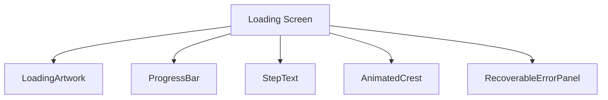
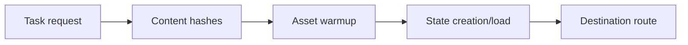
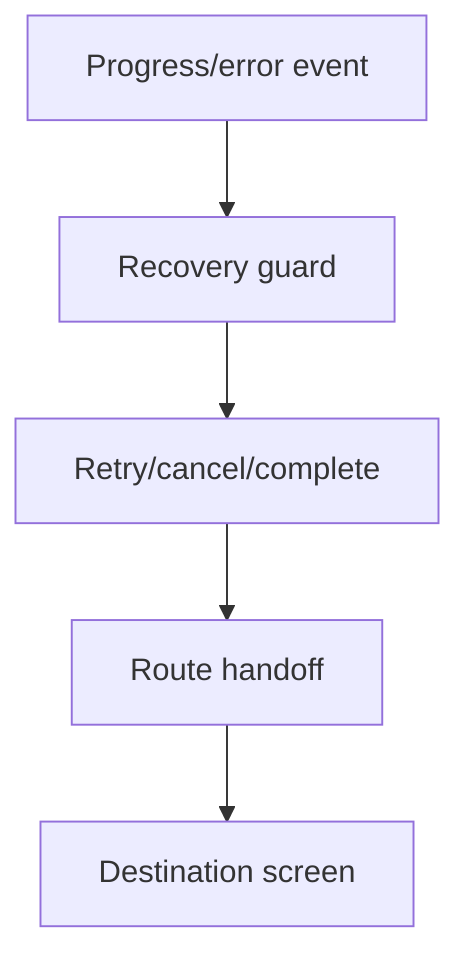
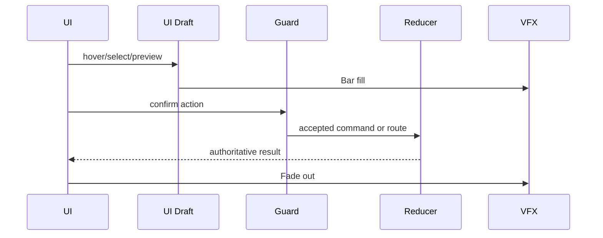
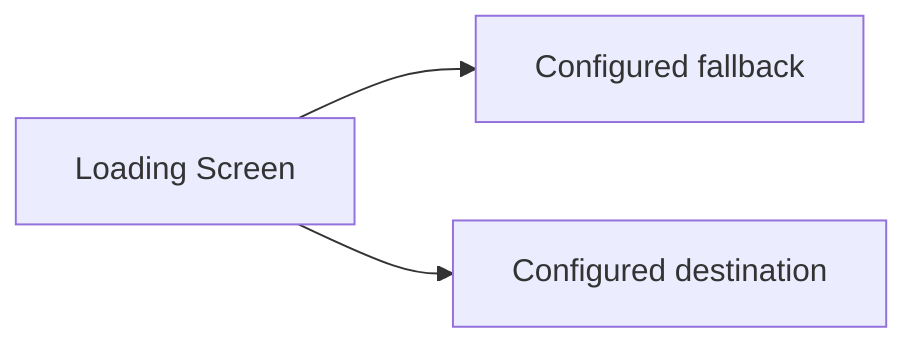

# Screen 59 Architecture: Loading Screen

System: system
Screen ID: loading-screen
Visual Archetype: curated-loading-screen
Curation Status: curated-pass-6

## Purpose
Loading/progress screen for scenario creation, save load, random map generation, asset warmup, and route handoff.

## Visual Direction
- Original internal UI contract. Do not use third-party captures,
  copied franchise art, or external product pixels as implementation input.

## Visual Composition

## Screen Load And Data Resolution

## Main Interaction Flow

## Animation Flow

## Outgoing Transitions

## State Inputs
- loadingTask -> state.ui.loading.taskId
- progress -> state.ui.loading.progress
- destination -> state.ui.loading.destinationRoute
- errors -> state.ui.loading.errors
- contentHashes -> state.ui.loading.contentHashes

## Canvas Lifecycle And Warmup Orchestration

The loading screen does **not** create or destroy the WebGL2 canvas.
The canvas is created once at app boot and persists for the lifetime
of the tab; during loading it is hidden via `display: none` (or
covered by the loading screen at z-layer 9700 — see
[`ui-technology-choice.md` § Z-Stack Contract](../../../ui-technology-choice.md#z-stack-contract))
but never destroyed. This avoids context-recreate stalls between
scenarios.

### Phases

The canonical phase order is:

1. `schema-validation` — content-runtime validates pack manifests and
   schema versions.
2. `pack-load` — pack archives mount; content hashes resolve.
3. `atlas-decode` — sprite/UI atlas PNGs decode in workers.
4. `atlas-upload` — decoded atlases upload into GL textures.
5. `shader-compile` — renderer compiles its shader programs.
6. `warmup-render` — renderer issues one off-screen render to JIT GL
   pipelines.
7. `route-transition` — UI shell hands off to the configured
   destination route.

Each phase emits a reducer command contributing a fixed weight to
`state.ui.loading.progress`. Weights live in
`src/content-runtime/loading-phases.ts` (planned) and total to 1.0.
The progress bar reads `state.ui.loading.progress` only; no phase
writes the bar directly.

### Failure Routing

Any phase that errors writes a structured entry to
`state.ui.loading.errors[]` with `{ phase, code, recoverable, retry }`
and the loading screen surfaces a localized recovery panel
(`RecoverableErrorPanel` in the component tree). Non-recoverable
failures escalate to the fatal error boundary (z-layer 10000).

### Diagram

See [diagram 28 — loading orchestration](../../../diagrams/28-loading-orchestration.md)
for the end-to-end sequence covering canvas persistence, phase
ordering, progress weights, and the error-recovery branch.

## Implementation Contract
- Mockup defines visual regions and data hooks only.
- Spec defines the component/state contract.
- Interactions define controls, timing, command routing, disabled states, and error behavior.
- Data contracts define schemas, config, localization, asset, audio, VFX, save, and replay references.
- Diagrams are screen-specific summaries of the same contract and must not introduce hidden behavior.
- Canvas is persistent across loads. Phase weights and progress are
  reducer-driven, never UI-driven.
