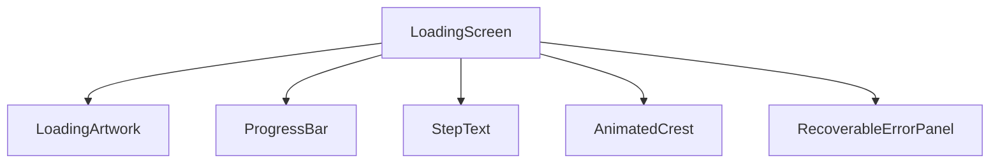
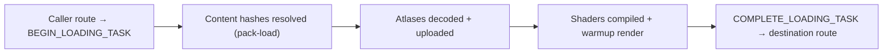
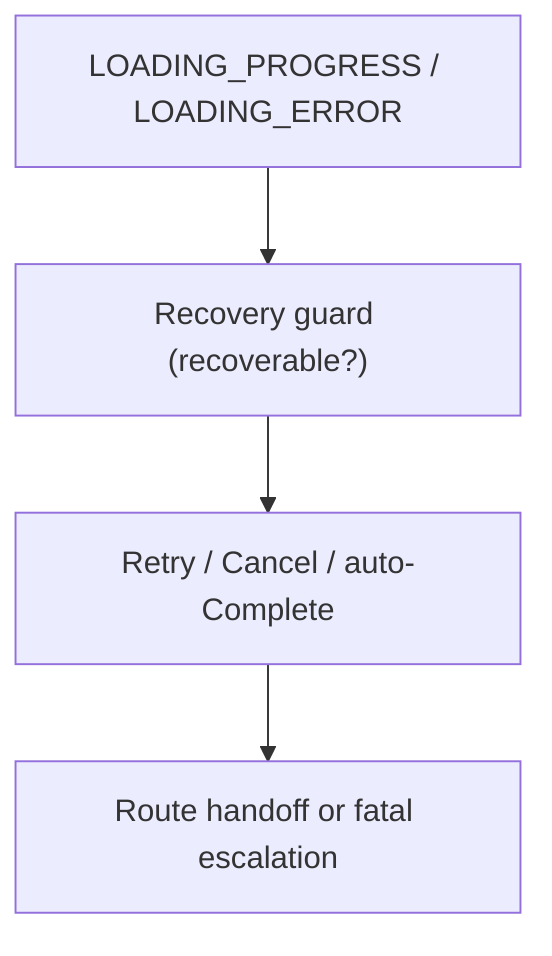
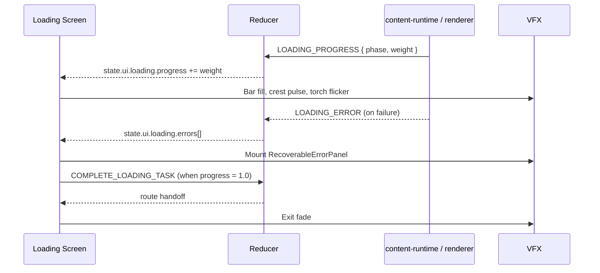
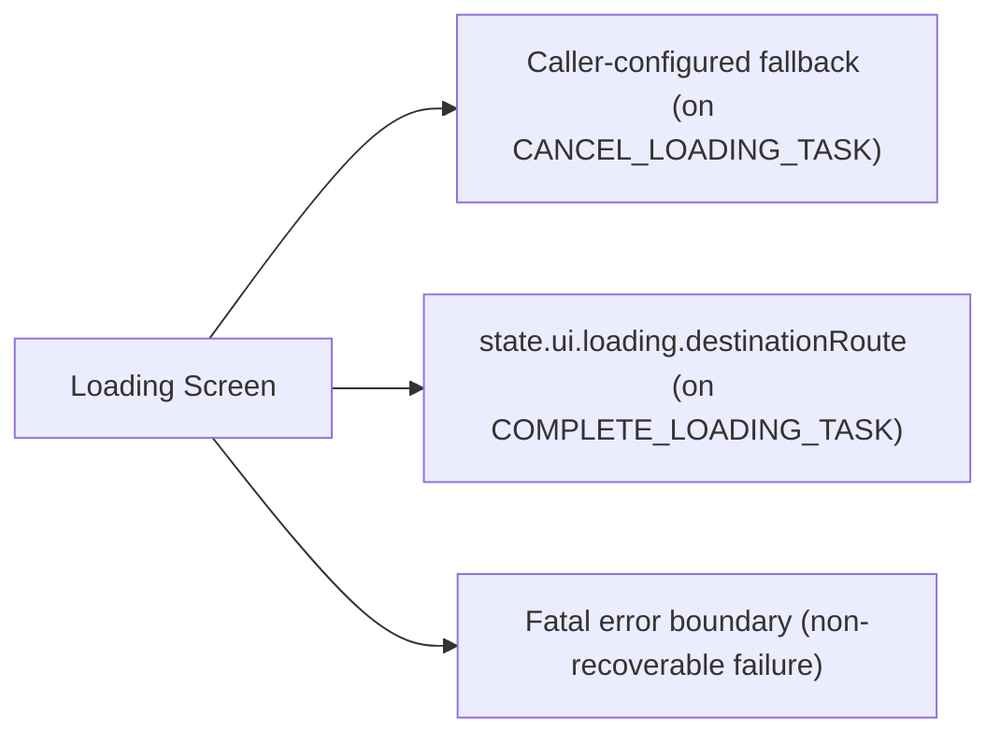

# Screen 59 Architecture: Loading Screen

System: `system`
Screen ID: `loading-screen`
Visual Archetype: `curated-loading-screen`
Curation Status: `curated-pass-6`

## Purpose
Holds the route while content packs, scenario data, save files,
random-map generation, and renderer assets resolve, then hands
off to the configured destination. Drives no gameplay state.

## Companion Docs
- Sibling: [`spec.md`](spec.md), [`interactions.md`](interactions.md), [`data-contracts.md`](data-contracts.md), [`mockup.html`](mockup.html).
- Z-stack: [`ui-technology-choice.md` § Z-Stack Contract](../../../ui-technology-choice.md#z-stack-contract) — loading plate sits at z-layer `9700`.
- Orchestration sequence: [diagram 28 — loading orchestration](../../../diagrams/28-loading-orchestration.md).
- Owning task: [`mvp.07-ui-shell.09-loading-screen`](../../../../../tasks/mvp/07-ui-shell/09-loading-screen.md).

## Visual Direction
- Original internal UI contract. Do not use third-party
  captures, copied franchise art, or external product pixels as
  implementation input.

## Visual Composition

## Screen Load And Data Resolution

## Main Interaction Flow

## Animation Flow

## Outgoing Transitions

## State Inputs
- `loadingTask` → `state.ui.loading.taskId`
- `progress` → `state.ui.loading.progress`
- `destination` → `state.ui.loading.destinationRoute`
- `errors` → `state.ui.loading.errors`
- `contentHashes` → `state.ui.loading.contentHashes`

All inputs live in `state.ui.loading.*` — in-memory,
session-scoped, never persisted (see
[`data-contracts.md` § Save And Replay Fields](data-contracts.md#save-and-replay-fields)).

## Canvas Lifecycle And Warmup Orchestration

The loading screen does **not** create or destroy the WebGL2
canvas. The canvas is created once at app boot and persists for
the lifetime of the tab. During loading it is hidden via
`display: none` (or covered by the loading plate at z-layer
`9700` — see
[`ui-technology-choice.md` § Z-Stack Contract](../../../ui-technology-choice.md#z-stack-contract))
but never destroyed. This avoids context-recreate stalls
between scenarios.

### Phases

The canonical order is:

1. `schema-validation` — content-runtime validates pack
   manifests and schema versions.
2. `pack-load` — pack archives mount; content hashes resolve.
3. `atlas-decode` — sprite/UI atlas PNGs decode in workers.
4. `atlas-upload` — decoded atlases upload into GL textures.
5. `shader-compile` — renderer compiles its shader programs.
6. `warmup-render` — renderer issues one off-screen render to
   JIT the GL pipelines.
7. `route-transition` — UI shell hands off to the configured
   destination route.

Each phase emits a `LOADING_PROGRESS` reducer command with a
fixed weight. Weights live in
`src/content-runtime/loading-phases.ts` (planned; see
[`data-contracts.md` § Issues](data-contracts.md#-issues) for
the open ownership gap) and total to `1.0`. The progress bar
reads `state.ui.loading.progress` only; no phase writes the bar
directly.

### Failure Routing

Any phase that errors writes a structured entry to
`state.ui.loading.errors[]` as `{ phase, code, recoverable,
retry }`. The shell mounts `RecoverableErrorPanel` when any
entry carries `recoverable: true`. Non-recoverable failures
bypass the panel and escalate to the fatal error boundary
(z-layer `10000`). All user-visible error text is produced by
`formatUserError(err, locale)` from
[`error-formatter.md`](../../../error-formatter.md).

### Diagram

[Diagram 28 — loading orchestration](../../../diagrams/28-loading-orchestration.md)
holds the end-to-end sequence covering canvas persistence,
phase ordering, progress weights, and the recovery branch.

## Implementation Contract
- `mockup.html` defines visible regions and data hooks only.
- `spec.md` defines the component / state contract.
- `interactions.md` defines controls, timing, command routing,
  disabled states, and error behavior.
- `data-contracts.md` defines schemas, config, localization,
  asset, audio, VFX, save, and replay references.
- Diagrams in this file are screen-specific summaries of the
  same contract and must not introduce hidden behavior.
- Canvas is persistent across loads. Phase weights and
  progress are reducer-driven, never UI-driven.

---

## 🔍 Sync Check

- **UI: ✔** — Diagrams cover the components, control surfaces, and transitions in sibling `spec.md` and `interactions.md`. Z-layer `9700` matches [`ui-technology-choice.md` § Z-Stack Contract](../../../ui-technology-choice.md#z-stack-contract).
- **Schema: ✔** — Phase order, command names (`BEGIN_LOADING_TASK`, `LOADING_PROGRESS`, `LOADING_ERROR`, `COMPLETE_LOADING_TASK`, `RETRY_LOADING_STEP`, `CANCEL_LOADING_TASK`), and `state.ui.loading.*` shape match [diagram 28](../../../diagrams/28-loading-orchestration.md) and sibling `data-contracts.md`.
- **Tasks: ✔** — Owning task [`mvp.07-ui-shell.09-loading-screen`](../../../../../tasks/mvp/07-ui-shell/09-loading-screen.md) Reads-First this file; its Read-First block also names diagrams 04 and 17, which corroborate the load orchestration.

## ⚠ Issues

- **Phase-weight file has no explicit task owner.** This file pins `src/content-runtime/loading-phases.ts` (planned) as the phase-weight source, but the owning task `mvp.07-ui-shell.09-loading-screen` declares only `src/ui/screens/LoadingScreen.tsx` as an Owned Path. Per `.agents/rules/tasks.md` (one task primarily owns each path), either the loading-screen task should extend `Owned Paths` to include `src/content-runtime/loading-phases.ts`, or a co-task under `mvp/02b-asset-pipeline/` should own it. Same gap noted in sibling `data-contracts.md` § Issues. No fix applied here (Hard Prohibition D — never edit cross-checked files).
