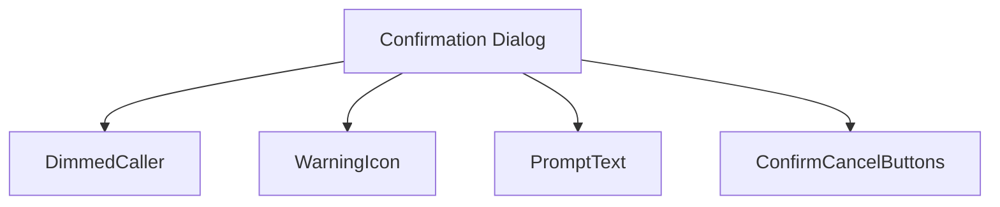
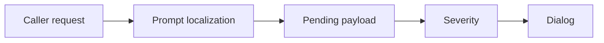
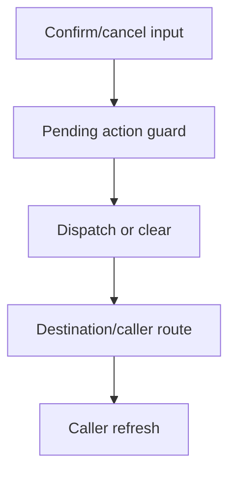
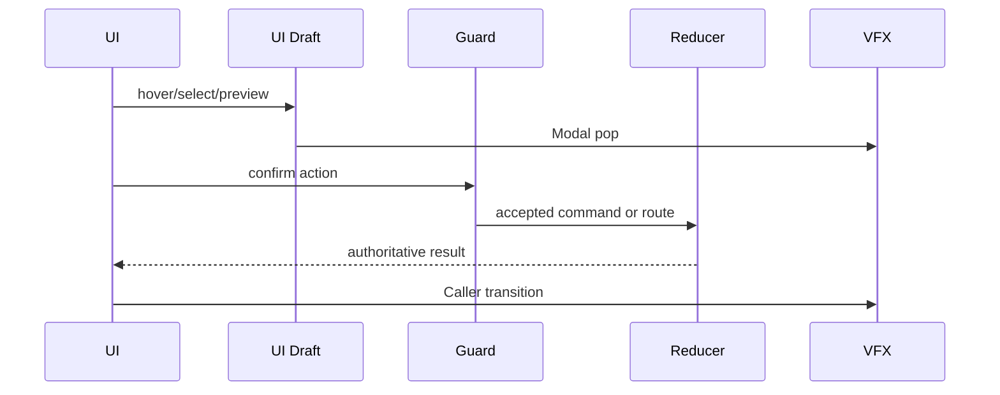
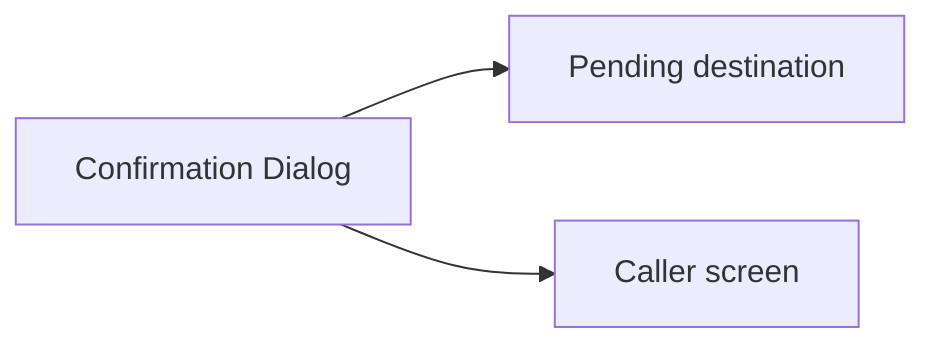

# Screen 60 Architecture: Confirmation Dialog

System: system
Screen ID: confirmation-dialog
Visual Archetype: curated-confirmation-dialog
Curation Status: curated-pass-6

## Purpose
Reusable confirmation dialog for destructive, irreversible, or route-changing actions.

## Visual Direction
- Original internal UI contract. Do not use third-party captures,
  copied franchise art, or external product pixels as implementation input.

## Visual Composition

## Screen Load And Data Resolution

## Main Interaction Flow

## Animation Flow

## Outgoing Transitions

## State Inputs
- pendingAction -> state.ui.confirmation.pendingAction
- promptKey -> state.ui.confirmation.promptKey
- callerRoute -> state.ui.confirmation.callerRoute
- confirmPayload -> state.ui.confirmation.payload
- severity -> state.ui.confirmation.severity

## Implementation Contract
- Mockup defines visual regions and data hooks only.
- Spec defines the component/state contract.
- Interactions define controls, timing, command routing, disabled states, and error behavior.
- Data contracts define schemas, config, localization, asset, audio, VFX, save, and replay references.
- Diagrams are screen-specific summaries of the same contract and must not introduce hidden behavior.
