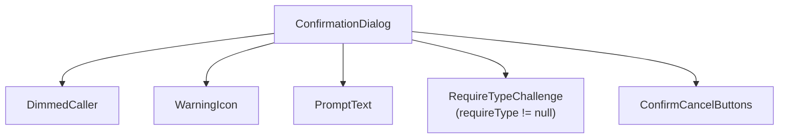
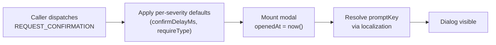
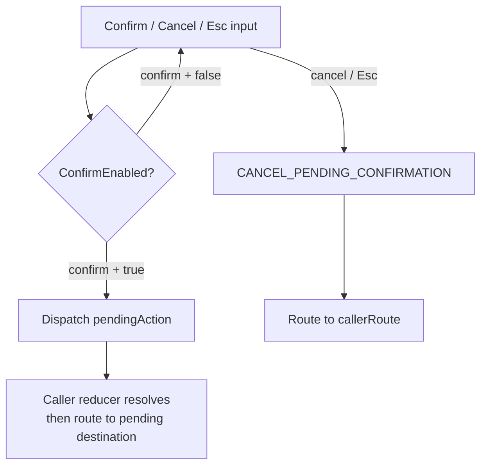
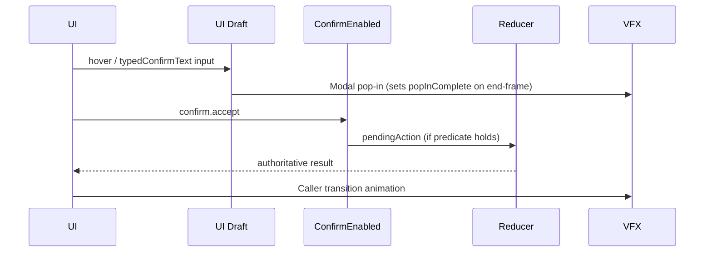
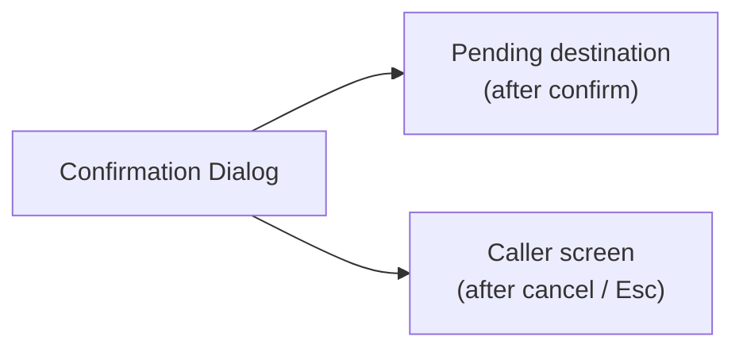
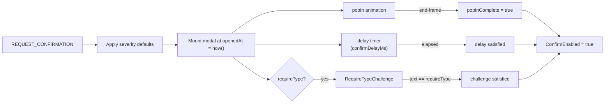

# Screen 60 Architecture: Confirmation Dialog

System: system
Screen ID: confirmation-dialog
Visual Archetype: curated-confirmation-dialog
Curation Status: curated-pass-6

## Purpose
Reusable confirmation dialog for destructive, irreversible, or
route-changing actions. Diagrams here mirror the behaviour in
sibling [`interactions.md`](./interactions.md) and the bindings in
sibling [`spec.md`](./spec.md); they introduce no new behaviour.

## Visual Direction
- Original internal UI contract. Do not use third-party captures,
  copied franchise art, or external product pixels as implementation
  input.

## Visual Composition

## Screen Load And Data Resolution

## Main Interaction Flow

## Animation Flow

## Outgoing Transitions

## State Inputs
- `pendingAction` → `state.ui.confirmation.pendingAction`
- `promptKey` → `state.ui.confirmation.promptKey`
- `callerRoute` → `state.ui.confirmation.callerRoute`
- `confirmPayload` → `state.ui.confirmation.payload`
- `severity` → `state.ui.confirmation.severity`
- `openedAt` → `state.ui.confirmation.openedAt`
- `confirmDelayMs` → `state.ui.confirmation.confirmDelayMs`
- `requireType` → `state.ui.confirmation.requireType`
- `typedConfirmText` → `state.ui.confirmation.typedConfirmText`
- `popInComplete` → `state.ui.confirmation.popInComplete`

## Click-Through Resistance Flow

## Implementation Contract
- `mockup.html` defines visual regions and data hooks only.
- `spec.md` defines the component / state contract.
- `interactions.md` defines controls, timing, command routing,
  disabled states, and error behaviour.
- `data-contracts.md` defines schemas, config, localization, asset,
  audio, VFX, save, and replay references.
- Diagrams in this file are screen-specific summaries of those same
  contracts and MUST NOT introduce hidden behaviour.

---

## 🔍 Sync Check

- **UI: ✔** — Visual Composition tree now matches sibling [`spec.md` § Component Tree](./spec.md#component-tree) (added the `RequireTypeChallenge` node that the prior revision omitted); Z-layer / styling claims live in `spec.md` per the package convention.
- **Schema: ✔** — `REQUEST_CONFIRMATION` and the click-through flow match the payload and per-severity defaults in [`command-schema.md` § Consent, Onboarding & Destructive-UX Commands](../../../command-schema.md#consent-onboarding--destructive-ux-commands) and sibling [`spec.md` § Click-Through Resistance](./spec.md#click-through-resistance).
- **Tasks: ✔** — Diagrams reflect the `ConfirmEnabled` predicate enforced by [`mvp.07-ui-shell.28-confirmation-dialog-hardening`](../../../../../tasks/mvp/07-ui-shell/28-confirmation-dialog-hardening.md); owning screen task [`phase-2.07-ui-screen-backlog.60-confirmation-dialog-screen`](../../../../../tasks/phase-2/07-ui-screen-backlog/60-confirmation-dialog-screen.md) Reads First this file.

## ⚠ Issues

- **Visual Composition reconciled with sibling `spec.md`.** The previous revision's `Visual Composition` Mermaid tree listed only four child nodes (`DimmedCaller`, `WarningIcon`, `PromptText`, `ConfirmCancelButtons`) and omitted `RequireTypeChallenge`, which sibling [`spec.md` § Component Tree](./spec.md#component-tree) and [`data-contracts.md` § Runtime State Selectors](./data-contracts.md#runtime-state-selectors) both require for the `requireType != null` flow. Added the node with its mount condition labelled inline. No code or contract change implied — the component already exists in the spec.
