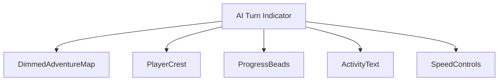
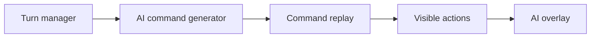
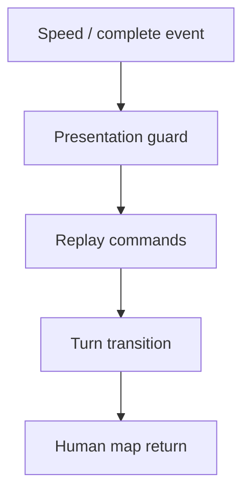
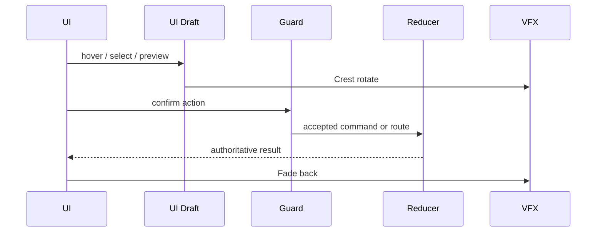
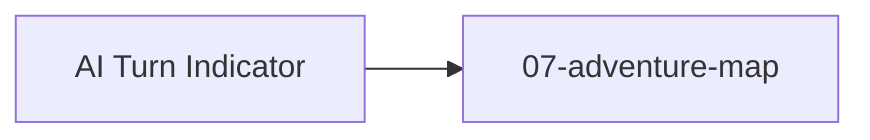

# Screen 61: AI Turn Indicator — Architecture Diagrams

System: `system` · Screen slug: `ai-turn-indicator` ·
Archetype: `curated-ai-turn-indicator` · Curation: `curated-pass-6`.

## 1. Screen Package

- Mockup: [`mockup.html`](./mockup.html) — visual reference only.
- Spec: [`spec.md`](./spec.md) — components, bindings, acceptance.
- Interactions: [`interactions.md`](./interactions.md) — per-control
  behavior, timing, disabled / error rules.
- Data Contracts: [`data-contracts.md`](./data-contracts.md) —
  schemas, selectors, commands, assets, localization.

## 2. Purpose

AI turn overlay: active AI color, visible thinking / progress state,
optional fast-forward, and turn-result messaging. Diagrams below
summarize the same contract owned by the sibling files — they must
not introduce hidden behavior.

## 3. Visual Direction

Original internal UI contract. Do not use third-party captures,
copied franchise art, or external product pixels as implementation
input.

## 4. Visual Composition

## 5. Screen Load And Data Resolution

## 6. Main Interaction Flow

## 7. Animation Flow

## 8. Outgoing Transitions

Only `aiTurn.complete` routes off-screen, per
[`interactions.md` § 5](./interactions.md).

## 9. State Inputs

| Binding | Source |
|---|---|
| `aiPlayer` | `state.turn.activePlayerId` |
| `aiPhase` | `state.ai.currentPhase` |
| `commandBatch` | `state.ai.visibleCommandBatch` |
| `speed` | `config.ui.aiTurnSpeed` |
| `interruptGuard` | `selectors.ai.canFastForwardOrPause` |

Canonical definitions live in
[`data-contracts.md` § 3](./data-contracts.md).

## 10. Implementation Contract

- `mockup.html` defines visual regions and data hooks only.
- `spec.md` defines the component / state contract.
- `interactions.md` defines controls, timing, command routing,
  disabled states, and error behavior.
- `data-contracts.md` defines schema, config, localization, asset,
  audio, VFX, save, and replay references.
- Diagrams in this file are screen-specific summaries of those
  contracts and **must not introduce hidden behavior**.

---

## 🔍 Sync Check

- **UI: ✔** — Component tree (§ 4) matches
  [`spec.md` § 5](./spec.md); outgoing transition (§ 8) matches
  [`interactions.md` § 5](./interactions.md).
- **Schema: ✔** — State inputs (§ 9) match
  [`data-contracts.md` § 3](./data-contracts.md) exactly.
- **Tasks: ✔** — Owning task
  [`phase-2.07-ui-screen-backlog.61-ai-turn-indicator-screen`](../../../../../tasks/phase-2/07-ui-screen-backlog/61-ai-turn-indicator-screen.md)
  references this file in its Read First block.

## ⚠ Issues

- **Diagram component `SpeedControls` versus mockup.** See sibling
  `spec.md` § ⚠ Issues — aligned. The Visual Composition diagram
  retains `SpeedControls` because the spec component tree and the
  `aiTurn.speed` interaction both require it; the mockup currently
  exposes only the fast-forward affordance. The owning task should
  reconcile the mockup with this tree before implementation.
