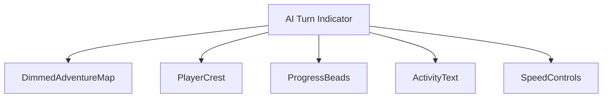
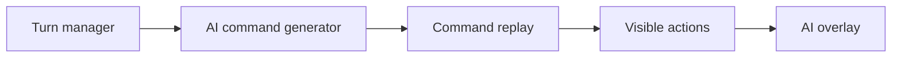
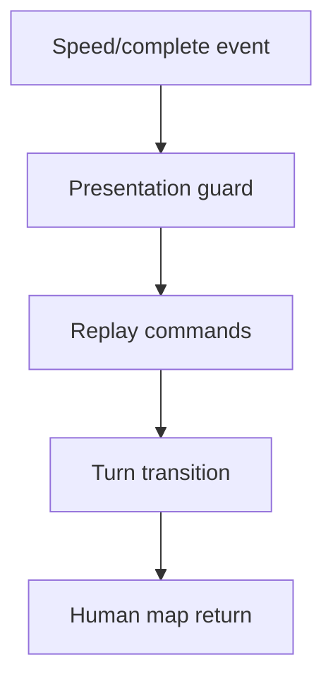
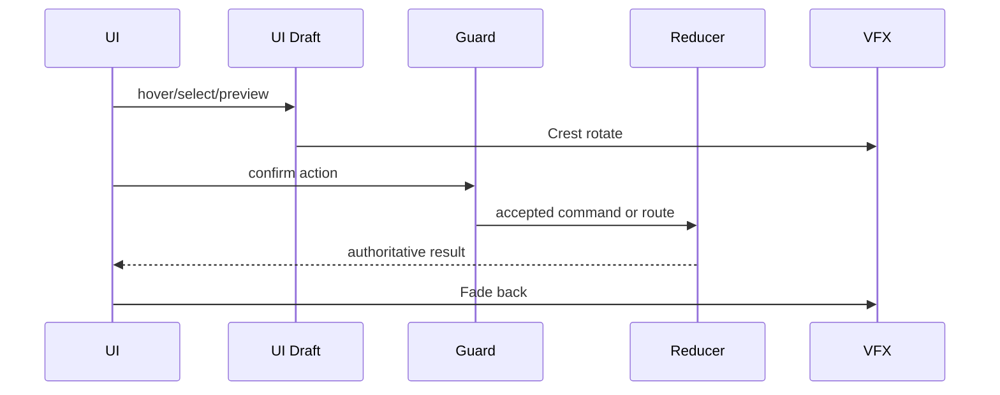
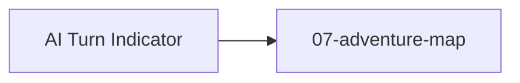

# Screen 61 Architecture: AI Turn Indicator

System: system
Screen ID: ai-turn-indicator
Visual Archetype: curated-ai-turn-indicator
Curation Status: curated-pass-6

## Purpose
AI turn overlay showing active AI color, visible thinking/progress state, optional fast-forward, and turn-result messages.

## Visual Direction
- Original internal UI contract. Do not use third-party captures,
  copied franchise art, or external product pixels as implementation input.

## Visual Composition

## Screen Load And Data Resolution

## Main Interaction Flow

## Animation Flow

## Outgoing Transitions

## State Inputs
- aiPlayer -> state.turn.activePlayerId
- aiPhase -> state.ai.currentPhase
- commandBatch -> state.ai.visibleCommandBatch
- speed -> config.ui.aiTurnSpeed
- interruptGuard -> selectors.ai.canFastForwardOrPause

## Implementation Contract
- Mockup defines visual regions and data hooks only.
- Spec defines the component/state contract.
- Interactions define controls, timing, command routing, disabled states, and error behavior.
- Data contracts define schemas, config, localization, asset, audio, VFX, save, and replay references.
- Diagrams are screen-specific summaries of the same contract and must not introduce hidden behavior.
