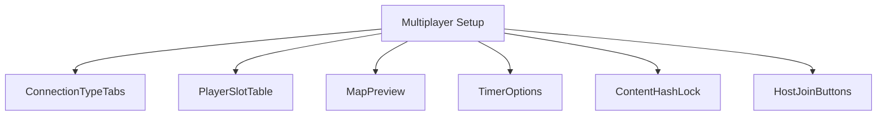
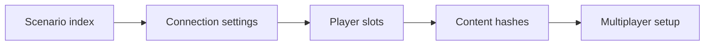
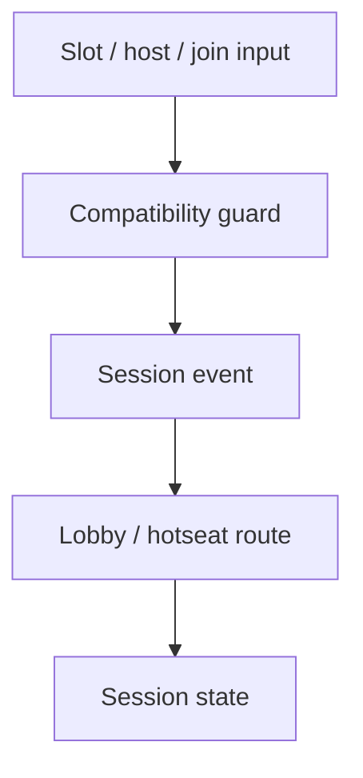
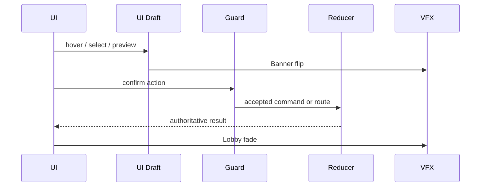
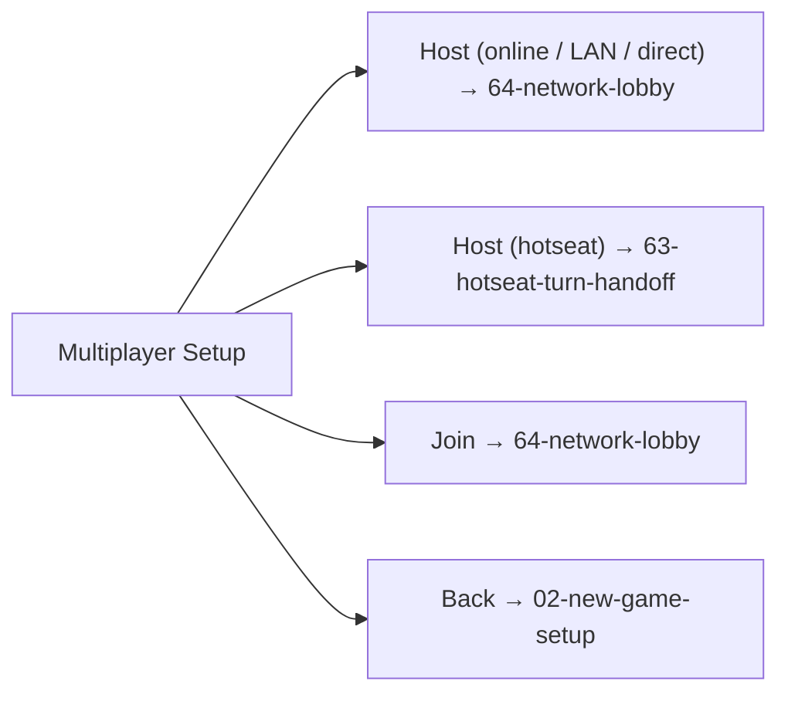

# Screen 62 Architecture: Multiplayer Setup

- System: `multiplayer`
- Screen ID: `multiplayer-setup`
- Visual archetype: `curated-multiplayer-setup`
- Curation status: `curated-pass-6`

### Source Files
- Mockup: `mockup.html`
- Spec: `spec.md`
- Interactions: `interactions.md`
- Data Contracts: `data-contracts.md`

### Purpose
Pre-lobby setup for hotseat, LAN, online, and direct-connect
games: connection type, player slots (color, team, control,
ready), turn timer, scenario / map pick, and deterministic
content-hash lock. Resolves to `63-hotseat-turn-handoff` or
`64-network-lobby` once the guards in `interactions.md` accept.

### Visual Direction
Original internal UI contract. Do not use third-party captures,
copied franchise art, or external product pixels as
implementation input.

### Visual Composition

### Screen Load And Data Resolution

### Main Interaction Flow

### Animation Flow

### Outgoing Transitions

### State Inputs
- `connectionType` → `state.ui.multiplayer.connectionType`
- `playerSlots` → `state.ui.multiplayer.playerSlots`
- `selectedScenario` → `state.ui.multiplayer.scenarioId`
- `timerConfig` → `state.ui.multiplayer.timer`
- `contentHash` → `selectors.multiplayer.contentCompatibilityHash`
- `inviteUrl` → `selectors.multiplayer.inviteUrl`
- `statusThresholds` → `state.net.statusThresholds`

### File Roles
- [`mockup.html`](./mockup.html) — visible regions and data hooks
  only; no logic.
- [`spec.md`](./spec.md) — component tree and state bindings.
- [`interactions.md`](./interactions.md) — controls, timing,
  command routing, disabled states, error behavior.
- [`data-contracts.md`](./data-contracts.md) — schemas, config,
  localization, asset / audio / VFX / save / replay references.
- This file — screen-specific diagrams that mirror the contract
  above. Diagrams never introduce hidden behavior.

### TURN Provisioning
TURN credentials are issued by the signaling server **after** the
host's `CREATE_ROOM` succeeds and **after** a joiner's `JOIN_ROOM`
is admitted — never at app launch and never embedded in the static
client bundle. The credential lifecycle, HMAC-SHA1 long-term-credential
format, and the **5-minute hard TTL ceiling** are pinned by
[`turn-credentials.md`](../../../turn-credentials.md); the wire
shape is
[`turn-credential.schema.json`](../../../../../content-schema/schemas/turn-credential.schema.json),
embedded inside the `TURN_CREDENTIALS` variant of
[`signaling-message.schema.json`](../../../../../content-schema/schemas/signaling-message.schema.json).
The `iceServers` builder in `src/net/webrtc/ice-config.ts` (owned
by [Task 10](../../../../../tasks/phase-3/01-multiplayer/10-turn-fallback-and-credentials.md))
consumes the runtime envelope only; it never reads a build-time
TURN URL constant.

---

## 🔍 Sync Check

- **UI: ✔** — Visual composition matches the component tree in [`spec.md`](./spec.md); outgoing transitions match every navigation row in [`interactions.md`](./interactions.md) (including the previously-missing `Back → 02-new-game-setup` arrow).
- **Schema: ✔** — TURN paragraph defers to canonical [`turn-credentials.md`](../../../turn-credentials.md) (5-minute TTL ceiling, `(roomCode, peerId)` scope, `TURN_CREDENTIALS` envelope) and [`turn-credential.schema.json`](../../../../../content-schema/schemas/turn-credential.schema.json); state-input list matches the state-bindings tables in sibling [`spec.md`](./spec.md) and [`data-contracts.md`](./data-contracts.md), including `state.net.statusThresholds` (added in this rewrite to close prior drift with the siblings).
- **Tasks: ✔** — Owning task [`phase-3.01-multiplayer.08-multiplayer-ui-lobby-invite-link-in-game-status`](../../../../../tasks/phase-3/01-multiplayer/08-multiplayer-ui-lobby-invite-link-in-game-status.md) reads this file First; TURN runtime is owned by [Task 10](../../../../../tasks/phase-3/01-multiplayer/10-turn-fallback-and-credentials.md); consent additions by [Task 23](../../../../../tasks/phase-3/01-multiplayer/23-multiplayer-consent-and-trust-display.md). Sibling [`spec.md`](./spec.md), [`interactions.md`](./interactions.md), and [`data-contracts.md`](./data-contracts.md) — aligned.

## ⚠ Issues

_None._
