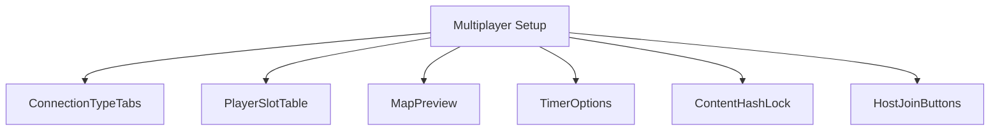
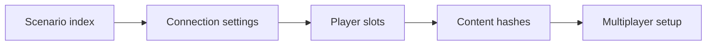
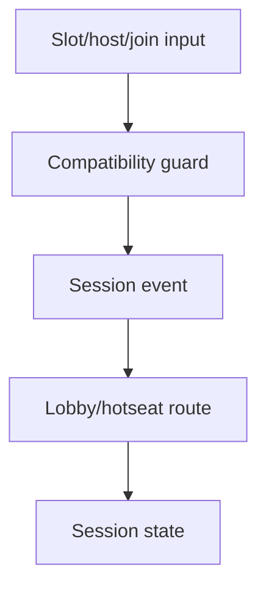
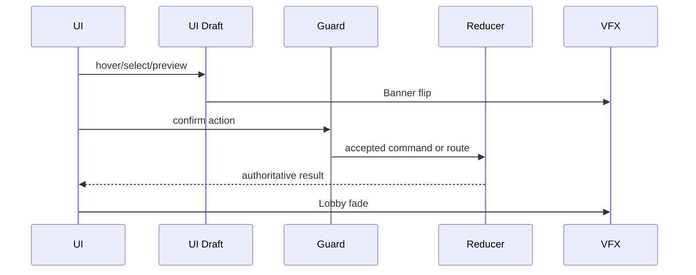
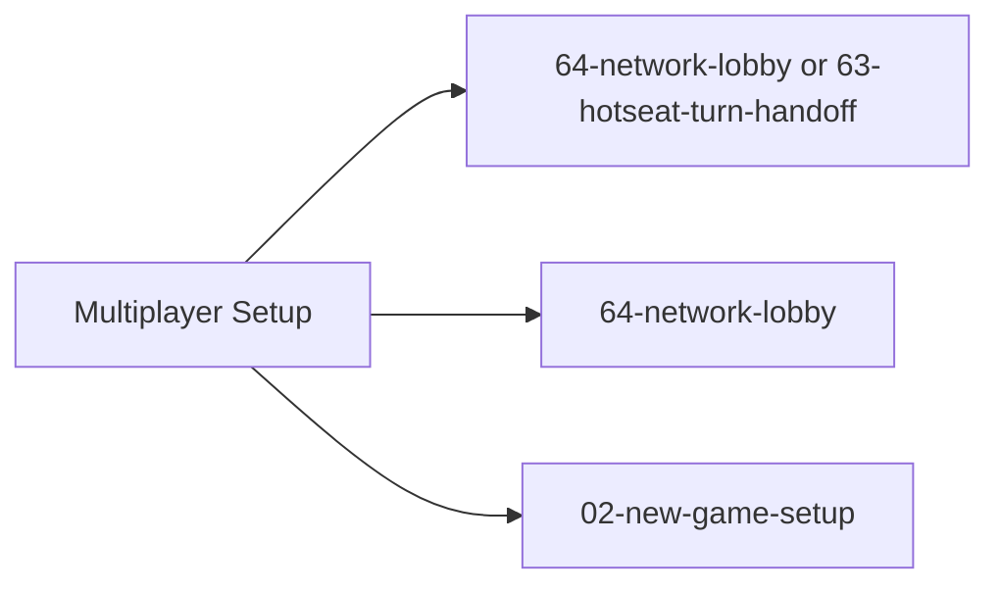

# Screen 62 Architecture: Multiplayer Setup

System: multiplayer
Screen ID: multiplayer-setup
Visual Archetype: curated-multiplayer-setup
Curation Status: curated-pass-6

## Purpose
Multiplayer setup for hotseat, LAN/online lobby, player colors, teams, timers, map/scenario, and deterministic content lock.

## Visual Direction
- Original internal UI contract. Do not use third-party captures,
  copied franchise art, or external product pixels as implementation input.

## Visual Composition

## Screen Load And Data Resolution

## Main Interaction Flow

## Animation Flow

## Outgoing Transitions

## State Inputs
- connectionType -> state.ui.multiplayer.connectionType
- playerSlots -> state.ui.multiplayer.playerSlots
- selectedScenario -> state.ui.multiplayer.scenarioId
- timerConfig -> state.ui.multiplayer.timer
- contentHash -> selectors.multiplayer.contentCompatibilityHash

## Implementation Contract
- Mockup defines visual regions and data hooks only.
- Spec defines the component/state contract.
- Interactions define controls, timing, command routing, disabled states, and error behavior.
- Data contracts define schemas, config, localization, asset, audio, VFX, save, and replay references.
- Diagrams are screen-specific summaries of the same contract and must not introduce hidden behavior.
