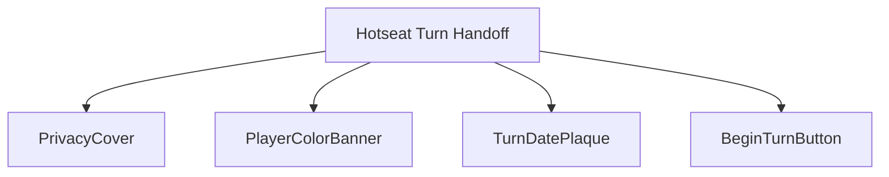
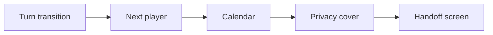
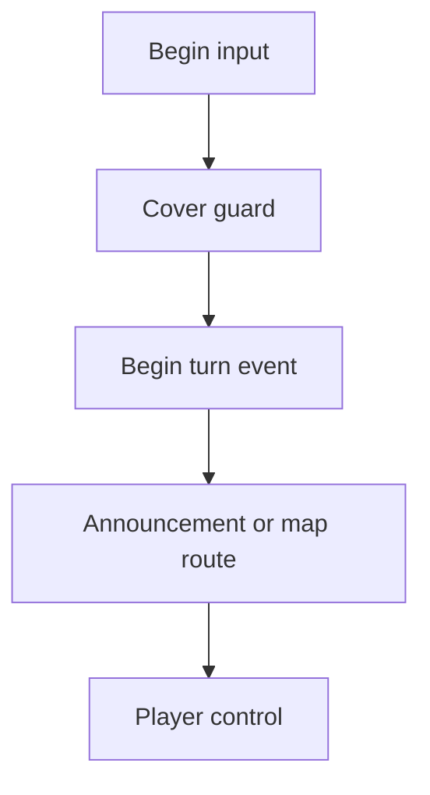
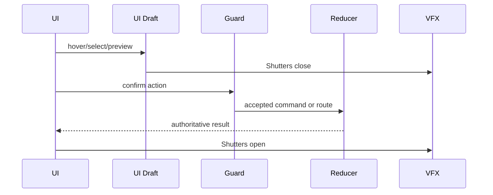
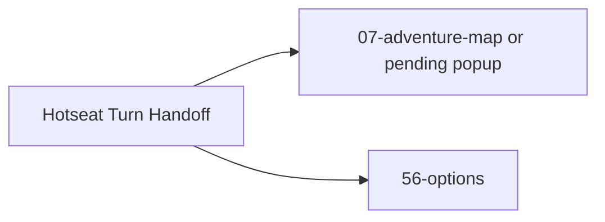

# Screen 63 Architecture: Hotseat Turn Handoff

System: multiplayer
Screen ID: hotseat-turn-handoff
Visual Archetype: curated-hotseat-handoff
Curation Status: curated-pass-6

## Purpose
Privacy handoff screen between hotseat players, hiding the map until the next player confirms readiness.

## Visual Direction
- Original internal UI contract. Do not use third-party captures,
  copied franchise art, or external product pixels as implementation input.

## Visual Composition

## Screen Load And Data Resolution

## Main Interaction Flow

## Animation Flow

## Outgoing Transitions

## State Inputs
- nextPlayer -> state.turn.activePlayerId
- calendar -> state.calendar.currentDate
- privacyCover -> state.ui.hotseat.coverActive
- playerName -> state.players.byId[next].displayName
- pendingAnnouncements -> selectors.turn.pendingStartOfTurnAnnouncements

## Implementation Contract
- Mockup defines visual regions and data hooks only.
- Spec defines the component/state contract.
- Interactions define controls, timing, command routing, disabled states, and error behavior.
- Data contracts define schemas, config, localization, asset, audio, VFX, save, and replay references.
- Diagrams are screen-specific summaries of the same contract and must not introduce hidden behavior.
