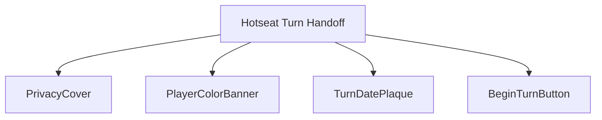
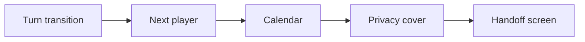
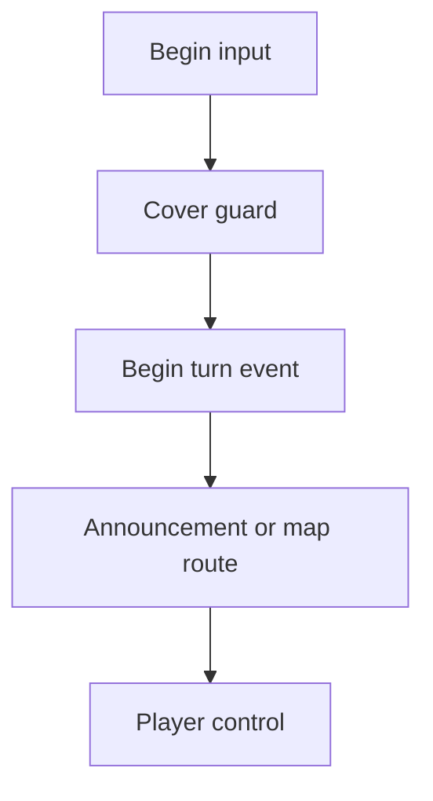
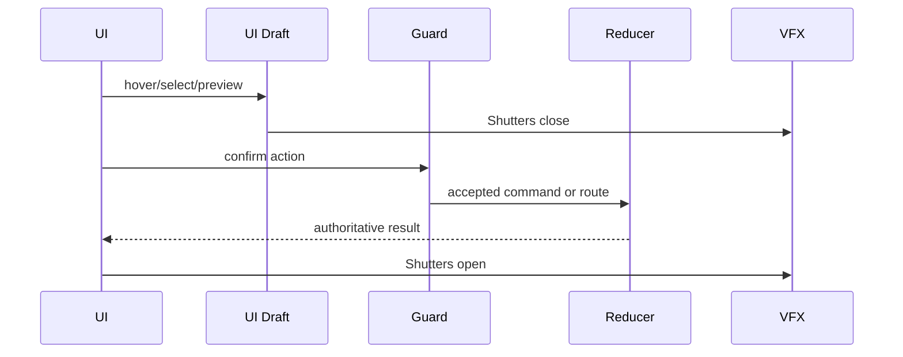
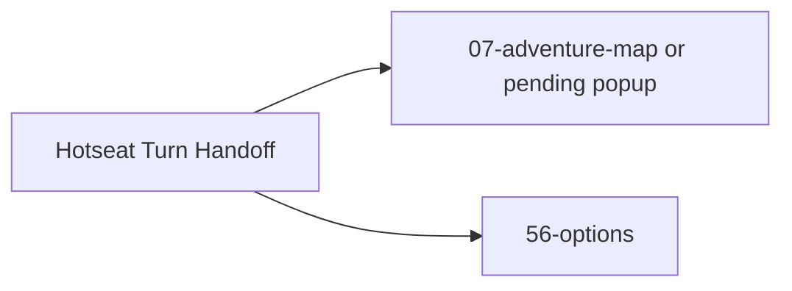

# Screen 63 Architecture: Hotseat Turn Handoff

- System: `multiplayer`
- Screen ID: `hotseat-turn-handoff`
- Visual archetype: `curated-hotseat-handoff`
- Curation status: `curated-pass-6`

### Source Files
- Mockup: `mockup.html`
- Spec: `spec.md`
- Interactions: `interactions.md`
- Data Contracts: `data-contracts.md`

### Companion Docs
- Engine state machine: [`tasks/phase-2/08-meta-systems/07-hotseat-turn-state-machine.md`](../../../../../tasks/phase-2/08-meta-systems/07-hotseat-turn-state-machine.md)
- UI screen task: [`tasks/phase-2/07-ui-screen-backlog/63-hotseat-turn-handoff-screen.md`](../../../../../tasks/phase-2/07-ui-screen-backlog/63-hotseat-turn-handoff-screen.md)
- Z-Stack contract: [`docs/architecture/ui-technology-choice.md` § Z-Stack Contract](../../../ui-technology-choice.md#z-stack-contract)
- Command schema: [`docs/architecture/command-schema.md`](../../../command-schema.md)
- Error formatter: [`docs/architecture/error-formatter.md`](../../../error-formatter.md)

### Purpose
Privacy handoff between hotseat players. The previous player's map
is hidden behind a full-screen cover until the next player presses
BEGIN. Mounts between the prior seat's `END_DAY` and the next seat's
adventure-map input unblock.

### Visual Direction
Original internal UI contract. Do not use third-party captures,
copied franchise art, or external product pixels as implementation
input.

### Visual Composition

### Screen Load And Data Resolution

### Main Interaction Flow

### Animation Flow

### Outgoing Transitions

### State Inputs
| Binding | Source | Notes |
| --- | --- | --- |
| `nextPlayer` | `state.turn.activePlayerId` | Player whose turn is about to be shown. |
| `calendar` | `state.calendar.currentDate` | Current turn date. |
| `privacyCover` | `state.ui.hotseat.coverActive` | Presentation flag; map hidden while true. |
| `playerName` | `state.players.byId[next].displayName` | Localized or player-entered name. |
| `pendingAnnouncements` | `selectors.turn.pendingStartOfTurnAnnouncements` | Week / month / event popups after BEGIN. |

### Implementation Contract
- `mockup.html` defines visible regions and data hooks only.
- `spec.md` owns the component tree and authoritative state bindings.
- `interactions.md` owns controls, command routing, animation timing, disabled, and error cases.
- `data-contracts.md` lists schemas, config, localization, asset, audio, VFX, save, and replay references.
- Diagrams above are screen-scoped summaries of those contracts; they must not introduce hidden behavior.

---

## 🔍 Sync Check

- **UI: ⚠** — Diagrams match sibling [`spec.md`](./spec.md) component tree and [`interactions.md`](./interactions.md) flow. Mockup [`mockup.html`](./mockup.html) renders only the BEGIN button, while sibling files reference a second route action `hotseat.options`; see issues below.
- **Schema: ❌** — Z-Layer 1000 (Modal dialogs) is consistent with [`ui-technology-choice.md` § Z-Stack Contract](../../../ui-technology-choice.md#z-stack-contract). However, the commands cited by sibling `data-contracts.md` (`BEGIN_HOTSEAT_TURN`, `OPEN_OPTIONS_FROM_HANDOFF`) are not defined in [`content-schema/schemas/command.schema.json`](../../../../../content-schema/schemas/command.schema.json). Detail in `## ⚠ Issues`.
- **Tasks: ❌** — Owning UI task [`63-hotseat-turn-handoff-screen.md`](../../../../../tasks/phase-2/07-ui-screen-backlog/63-hotseat-turn-handoff-screen.md) references this package in Read First. Engine task [`07-hotseat-turn-state-machine.md`](../../../../../tasks/phase-2/08-meta-systems/07-hotseat-turn-state-machine.md) defines canonical commands `BEGIN_HOTSEAT_HANDOFF` and `CONFIRM_HOTSEAT_HANDOFF` — names this screen package does not use.

## ⚠ Issues

- **Command-name drift versus engine task.** Sibling `data-contracts.md` and `interactions.md` list `BEGIN_HOTSEAT_TURN` and `OPEN_OPTIONS_FROM_HANDOFF`. The canonical engine state machine [`07-hotseat-turn-state-machine.md`](../../../../../tasks/phase-2/08-meta-systems/07-hotseat-turn-state-machine.md) defines `BEGIN_HOTSEAT_HANDOFF` (validates `END_DAY` last + next seat local-human) and `CONFIRM_HOTSEAT_HANDOFF` (advances `activePlayerId`). Per CLAUDE.md "Stable IDs are public API", the engine task is canonical. Suggested rewrite: `BEGIN_HOTSEAT_TURN` → `CONFIRM_HOTSEAT_HANDOFF` (BEGIN button click), plus dispatch `BEGIN_HOTSEAT_HANDOFF` on screen mount. Skill did not rename (Hard Prohibition A — IDs must survive the rewrite).
- **`OPEN_OPTIONS_FROM_HANDOFF` not visible in `mockup.html`.** Only a single BEGIN button is drawn; no Options affordance. The engine task does not define this command and [`command-schema.md`](../../../command-schema.md) has no matching entry. Either the mockup must gain an Options control (mockup is reference-only) or siblings must drop the action. Skill did not edit `mockup.html` (Hard Prohibition D).
- **Shadow state versus engine state machine.** `state.ui.hotseat.coverActive` cited above and in `spec.md` / `data-contracts.md` violates the engine task's "no shadow state stored elsewhere" rule; the cover state must derive from `AdventureState.phase ∈ {awaiting_confirm}`. Owner: `phase-2.08-meta-systems.07-hotseat-turn-state-machine` plus the screen task's selector layer.
- **Missing `command.schema.json` definitions.** Neither `BEGIN_HOTSEAT_HANDOFF` nor `CONFIRM_HOTSEAT_HANDOFF` appear in [`content-schema/schemas/command.schema.json`](../../../../../content-schema/schemas/command.schema.json). Per CLAUDE.md hard constraints, schema-backed commands must be registered before dispatch. Owner: `phase-2.08-meta-systems.07-hotseat-turn-state-machine` (or its predecessor schema task).
- **Missing `screen-command-coverage.json` row for `63-hotseat-turn-handoff`.** The owning UI task acceptance criterion requires every interaction token to resolve through that file; no entry exists. Owner: `phase-2.07-ui-screen-backlog.63-hotseat-turn-handoff-screen`.
