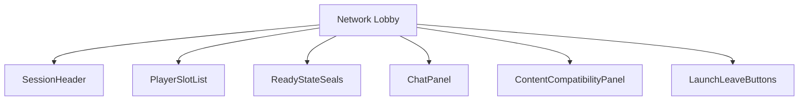
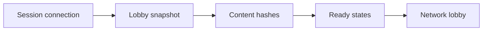
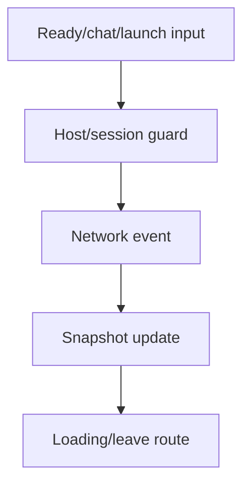
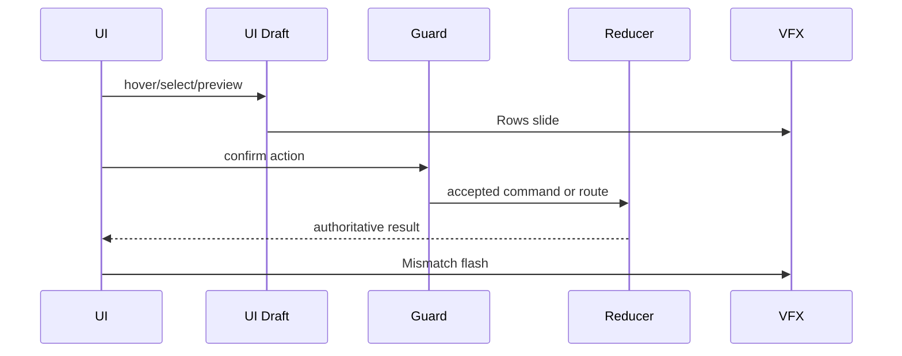
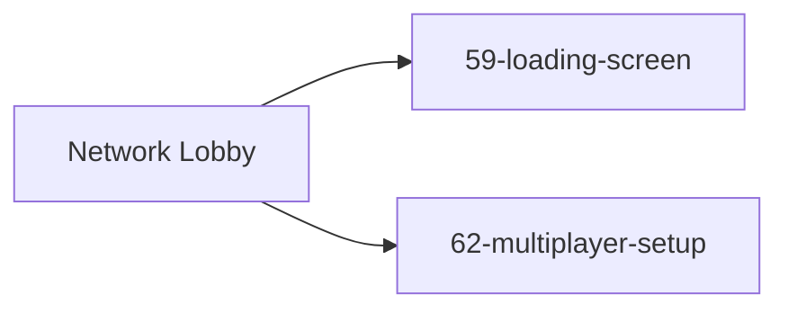
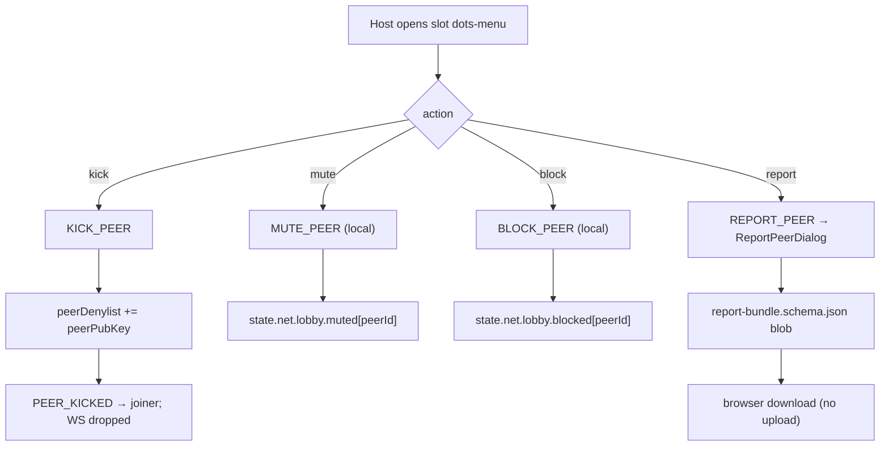
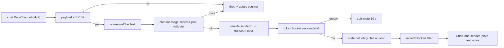

# Screen 64 Architecture: Network Lobby

System: multiplayer
Screen ID: network-lobby
Visual Archetype: curated-network-lobby
Curation Status: curated-pass-6

## Purpose
Network lobby for hosted/joined multiplayer sessions, ready state, chat, content hash checks, slot assignment, and launch.

## Visual Direction
- Original internal UI contract. Do not use third-party captures,
  copied franchise art, or external product pixels as implementation input.

## Visual Composition


## Screen Load And Data Resolution


## Main Interaction Flow


## Animation Flow


## Outgoing Transitions


## Pending-Peer Flow
```mermaid
sequenceDiagram
  participant Joiner
  participant Signaling
  participant Host as Host (this screen)
  Joiner->>Signaling: JOIN_ROOM { peerPubKey, sig }
  Signaling->>Host: PEER_PENDING { peerPubKey, displayNameDraft }
  Note over Signaling,Host: ICE candidates from Joiner are buffered;<br/>only typ relay flows pre-consent
  Host->>Signaling: APPROVE_PEER | REJECT_PEER
  alt approved
    Signaling-->>Joiner: PEER_CONNECTED
    Note over Host,Joiner: Host renegotiates with iceRestart;<br/>full ICE candidate set flows
  else rejected
    Signaling-->>Joiner: PEER_REJECTED { reason }
  else timeout (30 s)
    Signaling-->>Joiner: PEER_REJECTED { reason: "timeout" }
  end
```

## Moderation Flow


## Chat Receive Pipeline


Per [`chat-safety.md` §§ 2–6](../../../chat-safety.md). The full
contract for channel reservation, normalization, schema, rate
limit, mute/block, report, retention, and trust-model disclosure
lives in that doc; this diagram summarizes the runtime steps.

## State Inputs
- sessionId -> state.net.sessionId
- players -> state.net.lobby.players
- pendingPeers -> state.net.lobby.pendingPeers
- peerApproval -> state.net.lobby.peerApproval
- peerDenylist -> state.net.lobby.peerDenylist
- joinAttemptToast -> state.net.lobby.joinAttemptToast
- chatMessages -> state.net.lobby.chat
- muted -> state.net.lobby.muted
- blocked -> state.net.lobby.blocked
- chatRateBucket -> state.net.lobby.chatRateBucket
- chatTrustBannerDismissed -> localStorage `hr.ui.lobby.chat.trust-banner.dismissed`
- compatibility -> selectors.net.lobbyCompatibility
- launchGuard -> selectors.net.canLaunchSession

## Implementation Contract
- Mockup defines visual regions and data hooks only.
- Spec defines the component/state contract.
- Interactions define controls, timing, command routing, disabled states, and error behavior.
- Data contracts define schemas, config, localization, asset, audio, VFX, save, and replay references.
- Diagrams are screen-specific summaries of the same contract and must not introduce hidden behavior.
