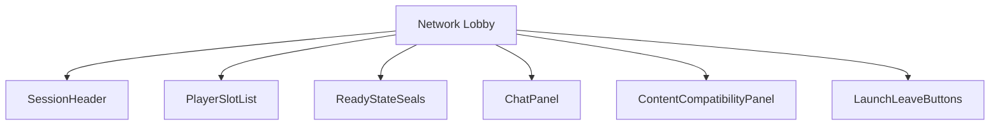
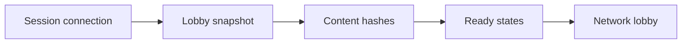
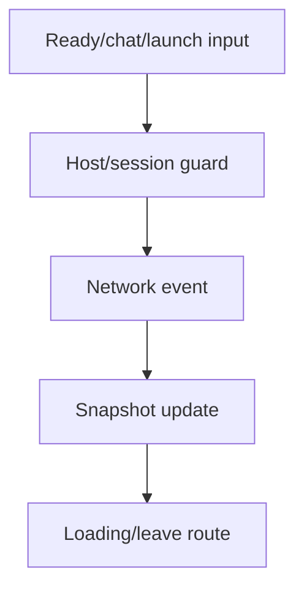
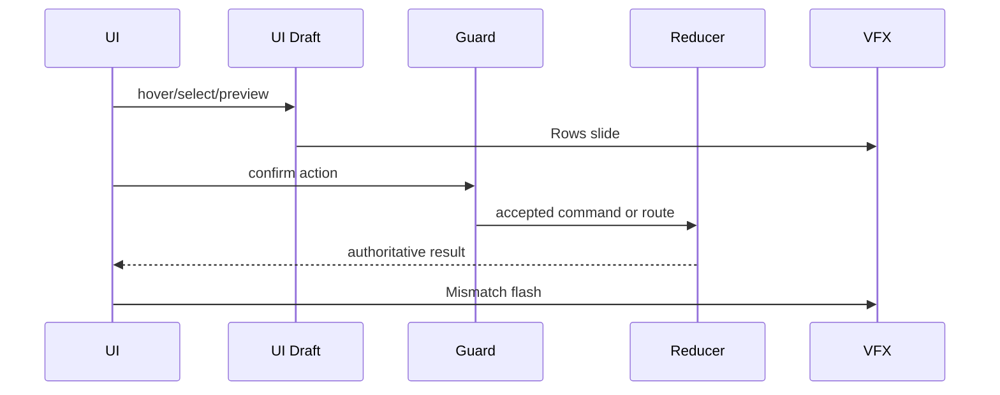
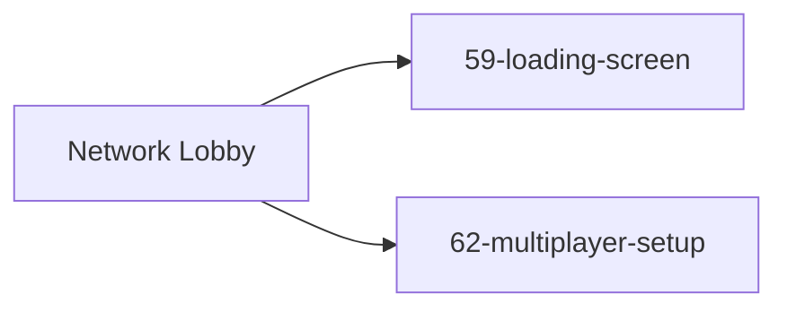
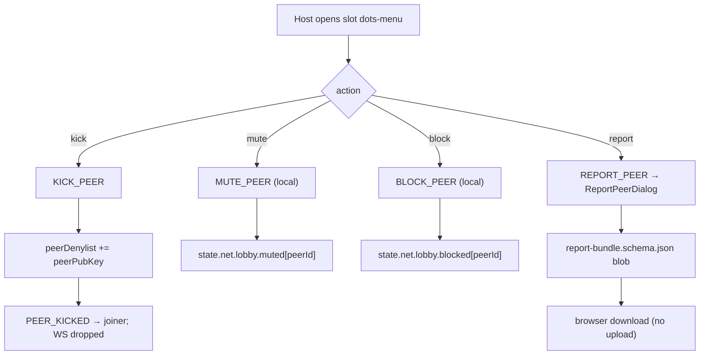
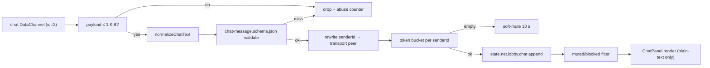
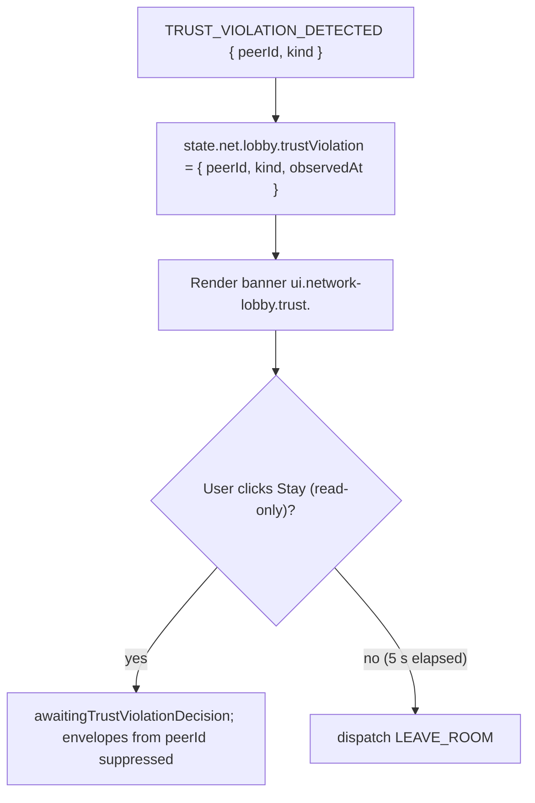

# Screen 64 Architecture: Network Lobby

- System: `multiplayer`
- Screen ID: `network-lobby`
- Visual Archetype: `curated-network-lobby`
- Curation Status: `curated-pass-6`

### Companion docs
- [`spec.md`](./spec.md) — static regions, component tree, state
  bindings.
- [`interactions.md`](./interactions.md) — per-control behavior,
  timing, command routing.
- [`data-contracts.md`](./data-contracts.md) — schemas, selectors,
  command tokens, localization, save / replay policy.
- [`mockup.html`](./mockup.html) — visual reference (read-only).

## Purpose

Screen-specific diagrams for the hosted/joined multiplayer lobby:
ready state, chat, content-hash checks, slot assignment, host
moderation, and launch. Each diagram is a summary of the contracts
owned by the sibling files above; this file MUST NOT introduce
hidden behavior.

## Visual Direction

- Original internal UI contract. Do not use third-party captures,
  copied franchise art, or external product pixels as
  implementation input.

## Visual Composition



## Screen Load And Data Resolution



## Main Interaction Flow



## Animation Flow



## Outgoing Transitions



## Pending-Peer Flow

```mermaid
sequenceDiagram
  participant Joiner
  participant Signaling
  participant Host as Host (this screen)
  Joiner->>Signaling: JOIN_ROOM { peerPubKey, sig }
  Signaling->>Host: PEER_PENDING { peerPubKey, displayNameDraft }
  Note over Signaling,Host: ICE candidates from Joiner are buffered;<br/>only typ relay flows pre-consent
  Host->>Signaling: APPROVE_PEER | REJECT_PEER
  alt approved
    Signaling-->>Joiner: PEER_CONNECTED
    Note over Host,Joiner: Host renegotiates with iceRestart;<br/>full ICE candidate set flows
  else rejected
    Signaling-->>Joiner: PEER_REJECTED { reason }
  else timeout (30 s)
    Signaling-->>Joiner: PEER_REJECTED { reason: "timeout" }
  end
```

Per [`ice-disclosure-policy.md`](../../../ice-disclosure-policy.md)
and [`interactions.md` § Pending Peer Flow](./interactions.md#pending-peer-flow).

## Moderation Flow



## Chat Receive Pipeline



Per [`chat-safety.md` §§ 2–6](../../../chat-safety.md). The full
contract for channel reservation, normalization, schema, rate
limit, mute / block, report, retention, and trust-model disclosure
lives in that doc; this diagram summarizes the runtime steps. The
send-side pipeline (NFKC normalization, schema validation, bucket
check, then `SEND_LOBBY_CHAT`) is in
[`interactions.md` § Chat Send Pipeline](./interactions.md#chat-send-pipeline).

## Trust-Violation Flow



Per [`spec.md` § Trust](./spec.md#trust),
[`undo-policy.md`](../../../undo-policy.md), and the
`TRUST_VIOLATION_DETECTED` `kind` enum owned by
[`command-schema.md` § Multiplayer Trust & Identity Commands](../../../command-schema.md#multiplayer-trust--identity-commands).

## State Inputs

UI bindings consumed by this screen (full table in
[`data-contracts.md` § Runtime State Selectors](./data-contracts.md#runtime-state-selectors)):

- `sessionId` → `state.net.sessionId`
- `players` → `state.net.lobby.players`
- `pendingPeers` → `state.net.lobby.pendingPeers`
- `peerApproval` → `state.net.lobby.peerApproval`
- `peerDenylist` → `state.net.lobby.peerDenylist`
- `joinAttemptToast` → `state.net.lobby.joinAttemptToast`
- `chatMessages` → `state.net.lobby.chat`
- `muted` → `state.net.lobby.muted`
- `blocked` → `state.net.lobby.blocked`
- `chatRateBucket` → `state.net.lobby.chatRateBucket`
- `trustViolation` → `state.net.lobby.trustViolation`
- `errorState` → `state.net.lobby.errorState`
- `unsignedPacksAck` → `state.net.lobby.unsignedPacksAck`
- `chatTrustBannerDismissed` → `localStorage` `hr.ui.lobby.chat.trust-banner.dismissed`
- `knownPeers` → `state.profile.knownPeers`
- `peerTrustLevel(peerId)` → `selectors.net.peerTrustLevel`
- `compatibility` → `selectors.net.lobbyCompatibility`
- `launchGuard` → `selectors.net.canLaunchSession`

## Implementation Contract

- `mockup.html` defines visual regions and data hooks only.
- `spec.md` defines the component / state contract.
- `interactions.md` defines controls, timing, command routing,
  disabled states, and error behavior.
- `data-contracts.md` defines schemas, config, localization,
  asset, audio, VFX, save, and replay references.
- Diagrams here are screen-specific summaries of those contracts
  and MUST NOT introduce hidden behavior.

---

## 🔍 Sync Check

- **UI: ✔** — Diagram participants, transitions, and command
  tokens match sibling `spec.md`, `interactions.md`, and
  `mockup.html`. Outgoing transitions (`59-loading-screen`,
  `62-multiplayer-setup`) match sibling `interactions.md` §
  Navigation Outcomes.
- **Schema: ✔** — Pipeline diagrams reference
  [`chat-message.schema.json`](../../../../../content-schema/schemas/chat-message.schema.json)
  and [`report-bundle.schema.json`](../../../../../content-schema/schemas/report-bundle.schema.json)
  in the shapes documented by
  [`chat-safety.md`](../../../chat-safety.md); the
  `TRUST_VIOLATION_DETECTED` `kind` enum points to its
  authoritative owner in
  [`command-schema.md`](../../../command-schema.md#multiplayer-trust--identity-commands).
- **Tasks: ✔** — `KICK_PEER`, `MUTE_PEER`, `BLOCK_PEER`,
  `REPORT_PEER`, `APPROVE_PEER`, `REJECT_PEER`, `JOIN_ROOM`,
  `PEER_CONNECTED`, `PEER_PENDING`, `PEER_REJECTED`,
  `PEER_KICKED`, and `LEAVE_ROOM` are all registered in
  [`screen-command-coverage.json`](../../../screen-command-coverage.json).
  Owning UI task
  [`08-multiplayer-ui-lobby-invite-link-in-game-status`](../../../../../tasks/phase-3/01-multiplayer/08-multiplayer-ui-lobby-invite-link-in-game-status.md)
  reads this file; reducer-side ownership is split across tasks
  14, 17, 18, 19, 21, 26, 27, 28, 35 under
  `tasks/phase-3/01-multiplayer/`.

## ⚠ Issues

- **`localStorage` write outside the persistence allowlist.**
  This file's State Inputs binds `chatTrustBannerDismissed` to
  `localStorage`; sibling `spec.md`, `data-contracts.md`, and
  [`chat-safety.md` ⚠ Issues](../../../chat-safety.md#-issues)
  carry the canonical gap description. Owning fix: task
  [`18-mute-block-and-trust-banner`](../../../../../tasks/phase-3/01-multiplayer/18-mute-block-and-trust-banner.md).
