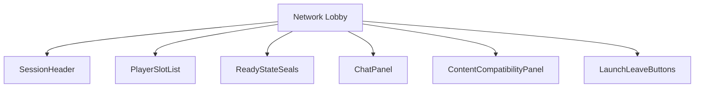
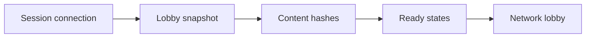
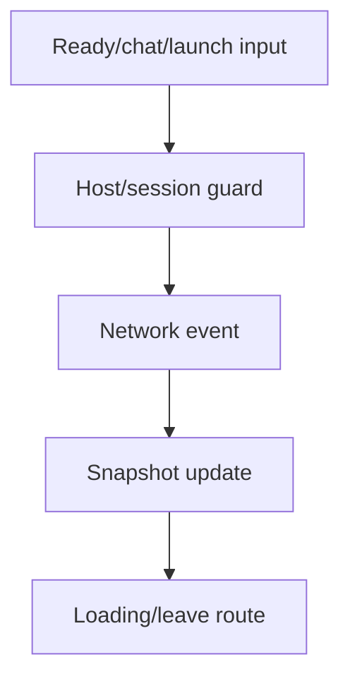
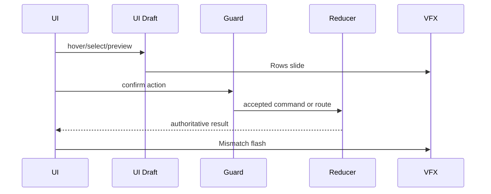
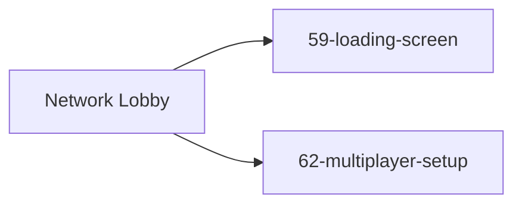

# Screen 64 Architecture: Network Lobby

System: multiplayer
Screen ID: network-lobby
Visual Archetype: curated-network-lobby
Curation Status: curated-pass-6

## Purpose
Network lobby for hosted/joined multiplayer sessions, ready state, chat, content hash checks, slot assignment, and launch.

## Visual Direction
- Original internal UI contract. Do not use third-party captures,
  copied franchise art, or external product pixels as implementation input.

## Visual Composition

## Screen Load And Data Resolution

## Main Interaction Flow

## Animation Flow

## Outgoing Transitions

## State Inputs
- sessionId -> state.net.sessionId
- players -> state.net.lobby.players
- chatMessages -> state.net.lobby.chat
- compatibility -> selectors.net.lobbyCompatibility
- launchGuard -> selectors.net.canLaunchSession

## Implementation Contract
- Mockup defines visual regions and data hooks only.
- Spec defines the component/state contract.
- Interactions define controls, timing, command routing, disabled states, and error behavior.
- Data contracts define schemas, config, localization, asset, audio, VFX, save, and replay references.
- Diagrams are screen-specific summaries of the same contract and must not introduce hidden behavior.
