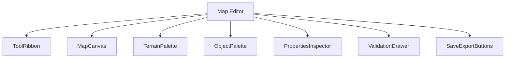
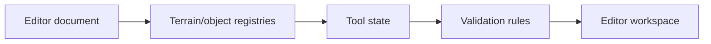
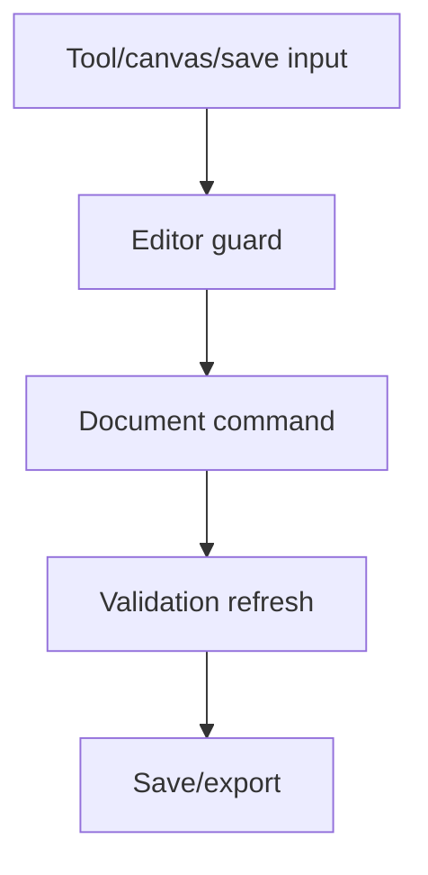
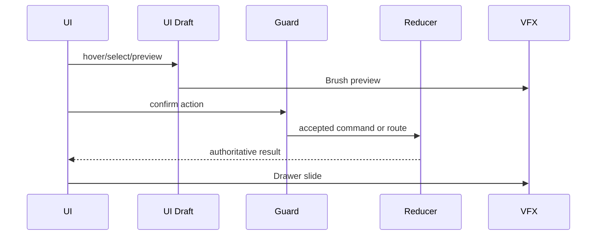
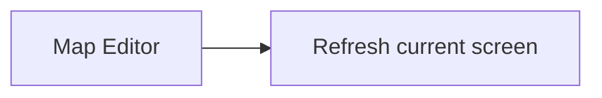

# Screen 65 Architecture: Map Editor

System: editor
Screen ID: map-editor
Visual Archetype: curated-map-editor
Curation Status: curated-pass-6

## Purpose
Map editor shell with terrain/object palettes, brush tools, layers, scenario properties, validation, and save/export controls.

## Visual Direction
- Original internal UI contract. Do not use third-party captures,
  copied franchise art, or external product pixels as implementation input.

## Visual Composition

## Screen Load And Data Resolution

## Main Interaction Flow

## Animation Flow

## Outgoing Transitions

## State Inputs
- editorDocument -> state.editor.currentDocument
- selectedTool -> state.editor.selectedTool
- selectedLayer -> state.editor.selectedLayer
- selection -> state.editor.selection
- validationIssues -> selectors.editor.validationIssues

## Implementation Contract
- Mockup defines visual regions and data hooks only.
- Spec defines the component/state contract.
- Interactions define controls, timing, command routing, disabled states, and error behavior.
- Data contracts define schemas, config, localization, asset, audio, VFX, save, and replay references.
- Diagrams are screen-specific summaries of the same contract and must not introduce hidden behavior.
