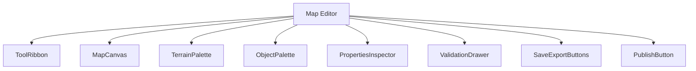
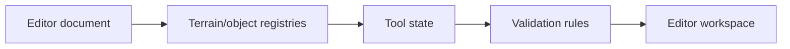
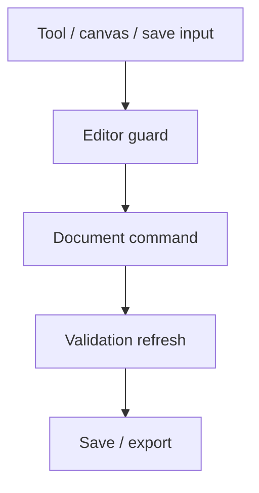
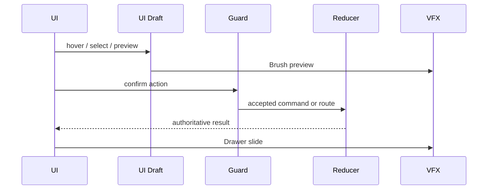
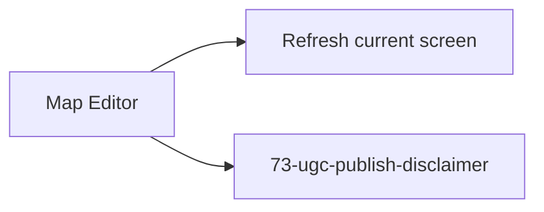

# Screen 65 Architecture: Map Editor

System: editor
Screen ID: map-editor
Visual Archetype: curated-map-editor
Curation Status: curated-pass-6

## Purpose
Map editor shell with terrain/object palettes, brush tools, layers,
scenario properties, validation, and save/export controls.

## Visual Direction
- Original internal UI contract. Do not use third-party captures,
  copied franchise art, or external product pixels as implementation
  input.

## Visual Composition

## Screen Load And Data Resolution

## Main Interaction Flow

## Animation Flow

## Outgoing Transitions

The Publish route runs after the editor's validation guard passes;
on accept, screen 73 dispatches `EXPORT_SCENARIO_AS_PACK` and the
OS file-picker resolves the destination. See
[`interactions.md`](./interactions.md) § Navigation Outcomes.

## State Inputs
- `editorDocument` → `state.editor.currentDocument`
- `selectedTool` → `state.editor.selectedTool`
- `selectedLayer` → `state.editor.selectedLayer`
- `selection` → `state.editor.selection`
- `validationIssues` → `selectors.editor.validationIssues`

## Implementation Contract
- `mockup.html` defines visual regions and data hooks only.
- [`spec.md`](./spec.md) defines the component/state contract.
- [`interactions.md`](./interactions.md) defines controls, timing,
  command routing, disabled states, and error behavior.
- [`data-contracts.md`](./data-contracts.md) defines schemas,
  config, localization, asset, audio, VFX, save, and replay
  references.
- The diagrams above are screen-specific summaries of the same
  contract and must not introduce hidden behavior.

---

## 🔍 Sync Check

- **UI: ✔** — Visual Composition matches [`spec.md`](./spec.md) §
  Component Tree (now includes `PublishButton`); Outgoing
  Transitions matches [`interactions.md`](./interactions.md) §
  Navigation Outcomes (Publish → 73).
- **Schema: ✔** — State inputs mirror
  [`data-contracts.md`](./data-contracts.md) § Runtime State
  Selectors; no schema mutated here.
- **Tasks: ✔** — Owning task
  [`phase-2.07-ui-screen-backlog.65-map-editor-screen`](../../../../../tasks/phase-2/07-ui-screen-backlog/65-map-editor-screen.md)
  reads this file. Publish-flow handoff to
  [`phase-2.04-content-editor.10-publish-disclaimer-flow`](../../../../../tasks/phase-2/04-content-editor/10-publish-disclaimer-flow.md)
  is consistent with the diagram.

## ⚠ Issues

- **Diagram reconciliation (in-target fix).** The original Visual
  Composition omitted `PublishButton` and the original Outgoing
  Transitions omitted the route to screen 73, while sibling
  [`spec.md`](./spec.md) § Component Tree listed `PublishButton`
  and sibling [`interactions.md`](./interactions.md) § Actions
  listed the Publish → 73 navigation. Per this file's own
  Implementation Contract ("diagrams are screen-specific summaries
  of the same contract and must not introduce hidden behavior"),
  the rewrite added both elements so the diagram mirrors the
  siblings. No new feature was introduced; both elements already
  existed in the screen's documented surface.
