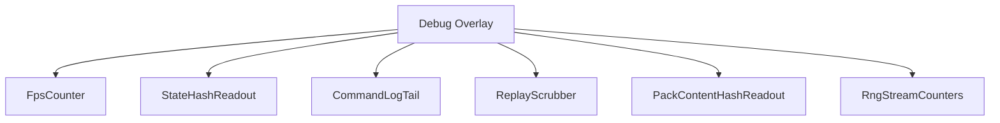
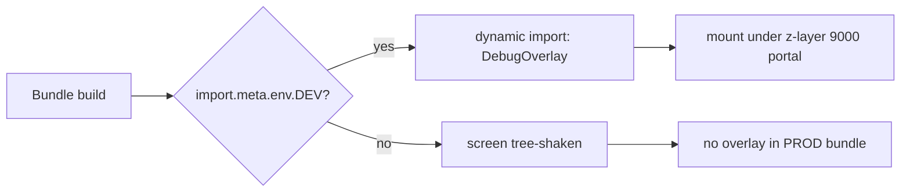
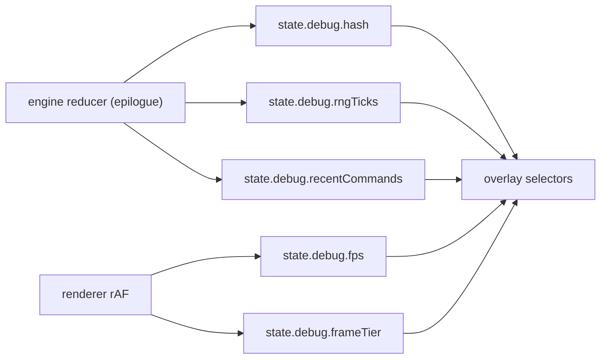
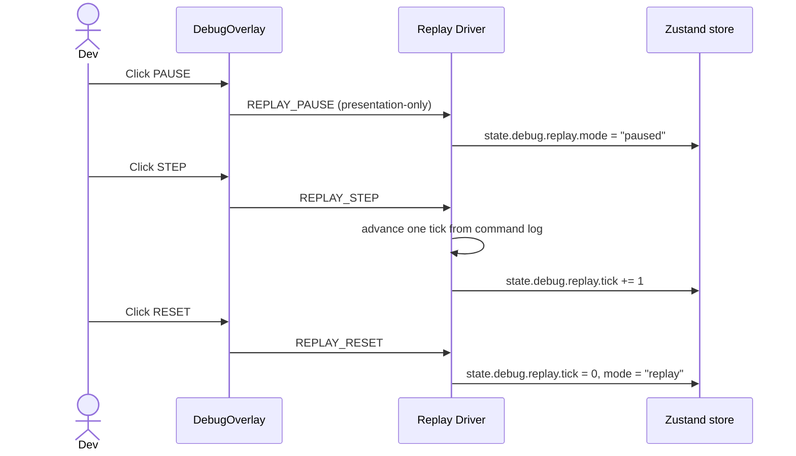

# Screen 66 Architecture: Debug Overlay

System: diagnostics
Screen ID: debug-overlay
Visual Archetype: diagnostics-overlay
Curation Status: curated-pass-1

## Purpose
Developer-only diagnostics overlay. Read-only by default; the
replay scrubber dispatches presentation-only commands consumed by
the replay driver.

## Visual Direction
- Internal developer UI. No franchise art, no curated theme.

## Visual Composition

## Build-Flag Gate

## Subscription Cadence

## Replay Scrubber Flow

## Outgoing Transitions
- None. The overlay does not navigate. Hiding it returns input
  control to the underlying layer.

## State Inputs
| Element | Selector |
| --- | --- |
| `fps` | `state.debug.fps` |
| `frameTimeTier` | `state.debug.frameTier` |
| `stateHash` | `state.debug.hash` |
| `rngTicks` | `state.debug.rngTicks` |
| `commandLogTail` | `state.debug.recentCommands` |
| `replay` | `state.debug.replay` |
| `contentHashes` | `state.content.hashes` |
| `missingComponents` | `state.debug.missingComponentCount` |
| `viewport` | `state.ui.viewport` |

## Implementation Contract
- The screen is dynamically imported only when `import.meta.env.DEV`
  is true. Production bundles tree-shake it (see
  [`ui-technology-choice.md` § Build Flags](../../../ui-technology-choice.md#build-flags)).
- The overlay reads diagnostic state; it never mutates gameplay
  state.
- Replay-scrubber actions go through the replay driver per
  [`ui-frame-lag-contract.md` § 5. Replay](../../../ui-frame-lag-contract.md#5-replay),
  not the live engine.
- Z-layer 9000; non-input-blocking.
- Localization keys live under `ui.debug-overlay.*` (full list in
  `data-contracts.md`).

---

## 🔍 Sync Check

- **UI: ✔** — Component tree, replay-scrubber flow, and state inputs match sibling `spec.md` § State Bindings, `interactions.md` § Actions, and `data-contracts.md` § Runtime State Selectors.
- **Schema: ✔** — No schema fields are claimed in this file; cross-checked `data-contracts.md`, no drift.
- **Tasks: ✔** — Owning task [`phase-2.08-meta-systems.08-debug-overlay-screen`](../../../../../tasks/phase-2/08-meta-systems/08-debug-overlay-screen.md) lists this file in Read First; status `planned`.

## ⚠ Issues

- **Replay commands missing from `command-schema.md`.** Diagrams reference `REPLAY_PAUSE`, `REPLAY_STEP`, `REPLAY_RESET` that are not defined in [`command-schema.md`](../../../command-schema.md). Tracked in sibling `interactions.md` § ⚠ Issues and `data-contracts.md` § ⚠ Issues — aligned. The owning task `phase-2.08-meta-systems.08-debug-overlay-screen` must close the gap.
