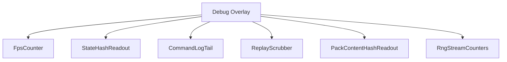
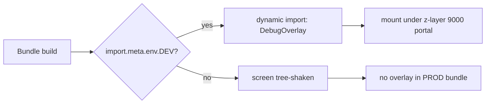
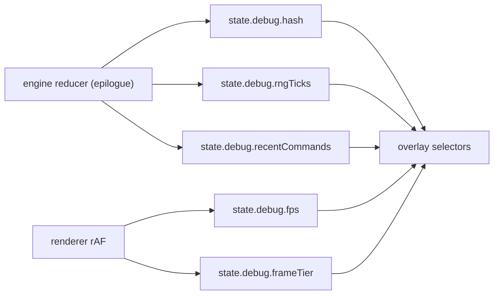
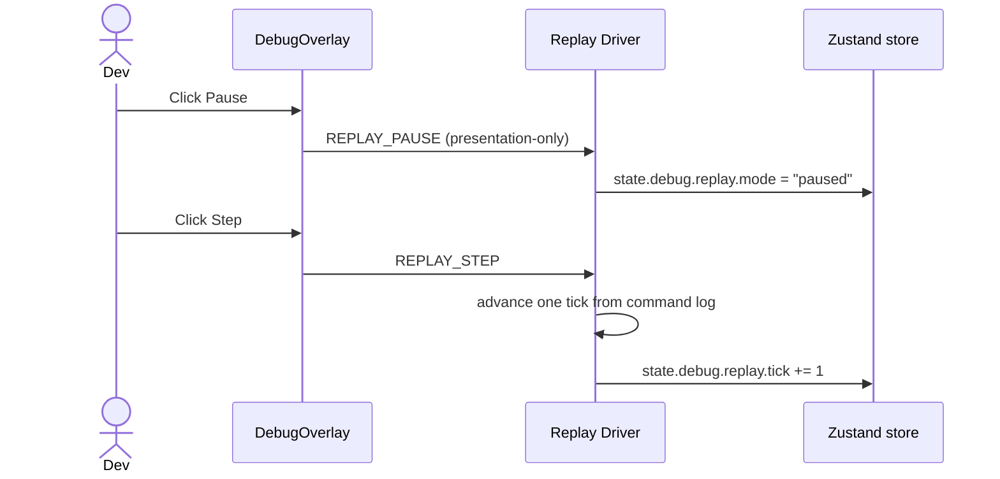

# Screen 66 Architecture: Debug Overlay

System: diagnostics
Screen ID: debug-overlay
Visual Archetype: diagnostics-overlay
Curation Status: curated-pass-1

## Purpose
Developer-only diagnostics overlay. Read-only by default; replay
scrubber dispatches presentation-only commands.

## Visual Direction
- Internal developer UI. No franchise art, no curated theme.

## Visual Composition

## Build-Flag Gate

## Subscription Cadence

## Replay Scrubber Flow

## Outgoing Transitions
- None. The overlay does not navigate. Hiding it returns input to the
  underlying layer.

## State Inputs
- fps -> state.debug.fps
- frameTimeTier -> state.debug.frameTier
- stateHash -> state.debug.hash
- rngTicks -> state.debug.rngTicks
- commandLogTail -> state.debug.recentCommands
- replay -> state.debug.replay
- contentHashes -> state.content.hashes
- missingComponents -> state.debug.missingComponentCount
- viewport -> state.ui.viewport

## Implementation Contract
- Screen is dynamically imported only when `import.meta.env.DEV` is
  true. Production bundles tree-shake the screen.
- Overlay reads diagnostics state; it never mutates gameplay state.
- Replay-scrubber actions go through the replay driver, not the live
  engine.
- Z-layer 9000; non-input-blocking.
- Localization keys live under `ui.debug-overlay.*`.
