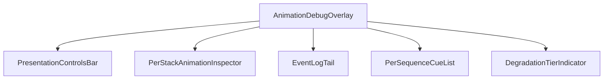
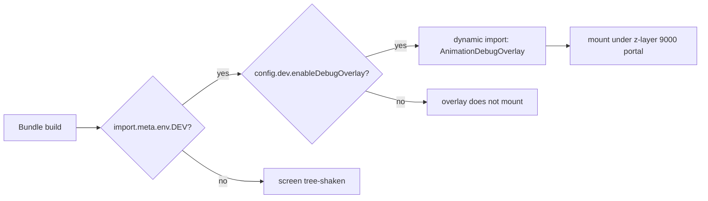
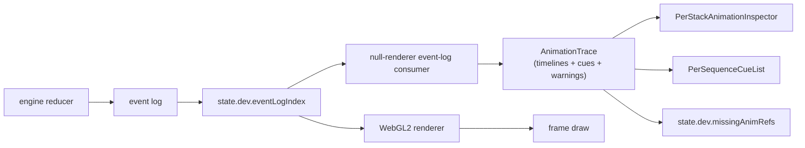
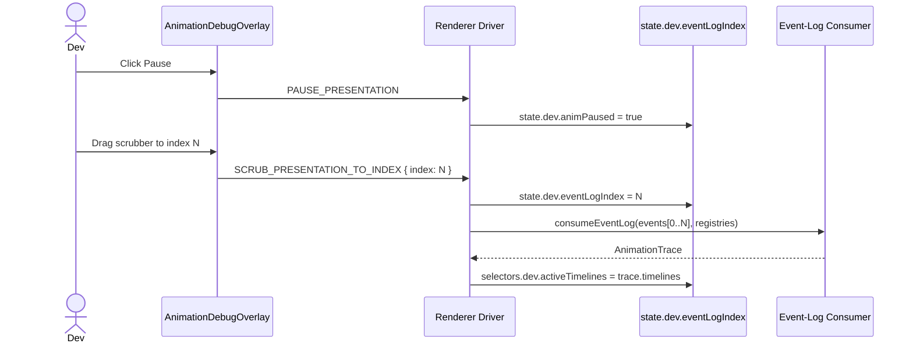

# Screen 67 Architecture: Animation Debug Overlay

System: diagnostics
Screen ID: animation-debug-overlay
Visual Archetype: diagnostics-overlay
Curation Status: curated-pass-1

## Purpose
Developer-only animation-timeline inspector. Pause / step / scrub
the renderer's event-log cursor without affecting engine state.
Reuses the null-renderer event-log consumer to compute the per-stack
inspector data.

## Visual Direction
Internal developer UI. Matches sibling
[`66-debug-overlay`](../66-debug-overlay/spec.md) styling.

## Visual Composition

## Build-Flag Gate

## Presentation Loop Interaction With Event Log

## Scrubbing Flow

## Outgoing Transitions
None. The overlay does not navigate. Hiding it returns input to the
underlying layer.

## State Inputs
- `animOverlayVisible` → `state.dev.animOverlayVisible`
- `paused` → `state.dev.animPaused`
- `eventLogIndex` → `state.dev.eventLogIndex`
- `eventLogTotal` → `selectors.dev.eventLogLength`
- `timelineSpeed` → `state.dev.timelineSpeed`
- `activeTimelines` → `selectors.dev.activeTimelines`
- `recentEvents` → `state.debug.recentCommands`
- `degradationTier` → `state.debug.frameTier`
- `missingRefs` → `state.dev.missingAnimRefs`

## Implementation Contract
- Screen is dynamically imported only when `import.meta.env.DEV` is
  true and `config.dev.enableDebugOverlay` is true.
- Overlay reads diagnostics state and the renderer cursor; it never
  mutates gameplay state.
- All four scrubbing commands go through the renderer driver, not
  the live engine reducer; they carry no `metadata.nonce`.
- Z-layer 9000 per
  [`ui-technology-choice.md` § Z-Stack Contract](../../../ui-technology-choice.md#z-stack-contract);
  non-input-blocking.
- Localization keys live under `ui.animation-debug-overlay.*`.
- Reuses the event-log consumer at
  [`src/renderer/null/event-log-consumer.mjs`](../../../../../src/renderer/null/event-log-consumer.mjs)
  to compute inspector data.

## 🔍 Sync Check
- **UI: ✔** — Visual Composition mirrors `mockup.html` panels and
  `spec.md` Component Tree (PresentationControlsBar,
  PerStackAnimationInspector, EventLogTail, PerSequenceCueList,
  DegradationTierIndicator).
- **Schema: ✔** — State Inputs match `spec.md § State Bindings` and
  `data-contracts.md § Runtime State Selectors` 1:1 (nine entries
  each, including the newly-added `animOverlayVisible` and
  `eventLogTotal`).
- **Tasks: ✔** — diagrams realize the build-flag gate and the
  scrubbing flow required by
  [`tasks/phase-2/08-meta-systems/09-animation-debug-overlay-screen.md`](../../../../../tasks/phase-2/08-meta-systems/09-animation-debug-overlay-screen.md)
  Acceptance Criteria.
- **Siblings: ✔** — sibling
  [`66-debug-overlay`](../66-debug-overlay/spec.md) confirms the
  reused `state.debug.recentCommands` and `state.debug.frameTier`
  bindings.

## ⚠ Issues
- **`PAUSE_PRESENTATION`, `STEP_PRESENTATION_FORWARD`,
  `STEP_PRESENTATION_BACK`, and `SCRUB_PRESENTATION_TO_INDEX` are
  not in the `Command` closed enum.** Correct by design — they are
  presentation-only and dispatched against the renderer driver, not
  the engine reducer — but the screen-coverage owner must keep
  [`screen-command-coverage.json`](../../../screen-command-coverage.json)
  (lines 58–61) updated if any of the four kinds is renamed.
- **`selectors.dev.eventLogLength` and `state.dev.animOverlayVisible`
  added in this revision** for cross-sibling alignment with
  `interactions.md` and `mockup.html`. Owner should pin both in
  [`state-shape.md`](../../../state-shape.md) before runtime
  mounting.
