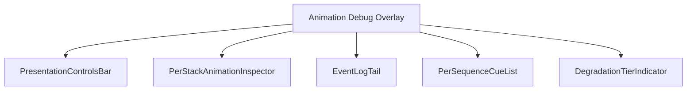
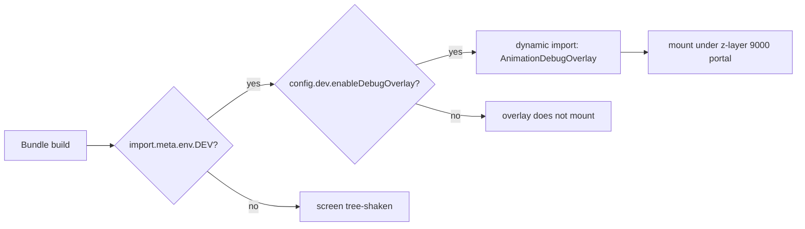
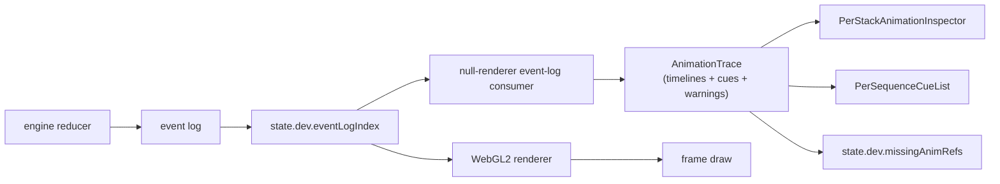
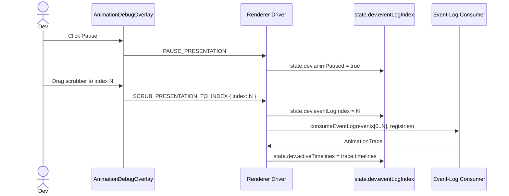

# Screen 67 Architecture: Animation Debug Overlay

System: diagnostics
Screen ID: animation-debug-overlay
Visual Archetype: diagnostics-overlay
Curation Status: curated-pass-1

## Purpose
Developer-only animation-timeline inspector. Pause / step / scrub the
renderer's event-log cursor without affecting engine state. Reuses
the null-renderer event-log consumer to compute the per-stack
inspector data.

## Visual Direction
- Internal developer UI. Matches screen 66 (debug-overlay) styling.

## Visual Composition

## Build-Flag Gate

## Presentation Loop Interaction With Event Log

## Scrubbing Flow

## Outgoing Transitions
- None. The overlay does not navigate. Hiding it returns input to the
  underlying layer.

## State Inputs
- paused -> state.dev.animPaused
- eventLogIndex -> state.dev.eventLogIndex
- timelineSpeed -> state.dev.timelineSpeed
- activeTimelines -> selectors.dev.activeTimelines
- recentEvents -> state.debug.recentCommands
- degradationTier -> state.debug.frameTier
- missingRefs -> state.dev.missingAnimRefs

## Implementation Contract
- Screen is dynamically imported only when `import.meta.env.DEV` is
  true and `config.dev.enableDebugOverlay` is true.
- Overlay reads diagnostics state and the renderer cursor; it never
  mutates gameplay state.
- All four scrubbing commands go through the renderer driver, not
  the live engine.
- Z-layer 9000; non-input-blocking.
- Localization keys live under `ui.animation-debug-overlay.*`.
- Reuses the event-log consumer at
  [`src/renderer/null/event-log-consumer.mjs`](../../../../../src/renderer/null/event-log-consumer.mjs)
  to compute inspector data.
