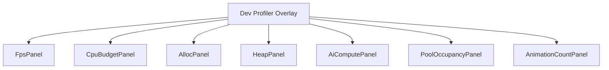
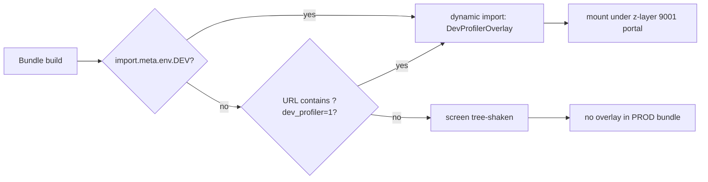
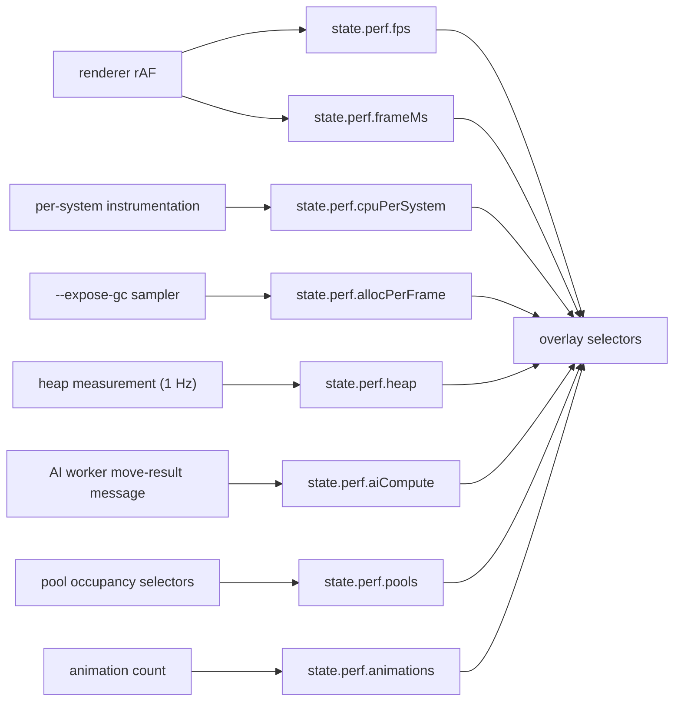

# Screen 68 Architecture: Dev Profiler

System: diagnostics
Screen ID: dev-profiler
Visual Archetype: diagnostics-overlay
Curation Status: curated-pass-1

## Purpose
Developer-only profiling overlay. Read-only.

## Visual Direction
- Internal developer UI. No franchise art, no curated theme.

## Visual Composition

## Build-Flag Gate

## Subscription Cadence

## Outgoing Transitions
- None. The overlay does not navigate. Hiding it returns input
  to the underlying layer.

## State Inputs
- fps -> state.perf.fps
- frameMs -> state.perf.frameMs
- cpuPerSystem -> state.perf.cpuPerSystem
- allocPerFrame -> state.perf.allocPerFrame
- heap -> state.perf.heap
- aiCompute -> state.perf.aiCompute
- poolOccupancy -> state.perf.pools
- activeAnimations -> state.perf.animations

## Implementation Contract
- Screen is dynamically imported only when
  `import.meta.env.DEV === true` or when
  `?dev_profiler=1` is present on the URL.
- Overlay reads diagnostics state; it never mutates gameplay
  state, never dispatches commands.
- Z-layer 9001; non-input-blocking; one above the
  `66-debug-overlay` so both can coexist.
- Localization keys live under `ui.dev-profiler.*`.
- Owning task:
  [`tasks/mvp/00-perf/04-profiling-overlay.md`](../../../../../tasks/mvp/00-perf/04-profiling-overlay.md).
- Source of every numeric ceiling shown in the overlay:
  [`docs/architecture/performance.md`](../../../performance.md).
