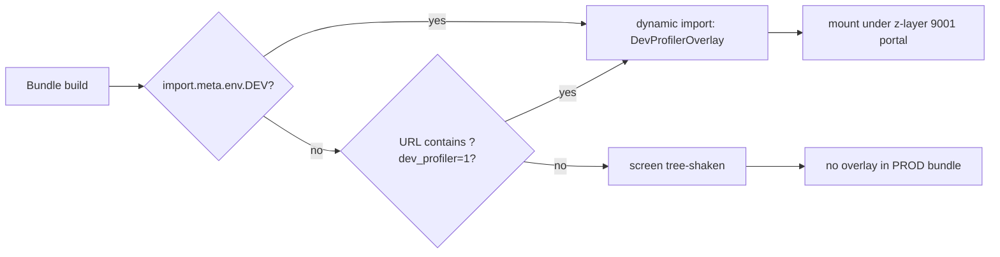
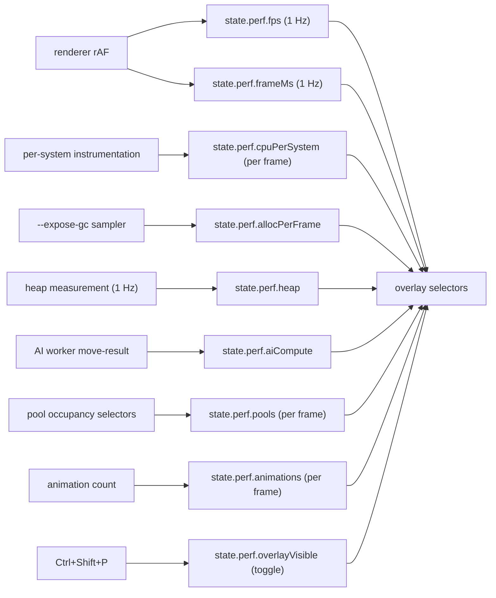

# Screen 68 Architecture: Dev Profiler

System: diagnostics
Screen ID: dev-profiler
Visual Archetype: diagnostics-overlay
Curation Status: curated-pass-1

> Sibling package files:
> [`spec.md`](./spec.md) (components, state bindings),
> [`interactions.md`](./interactions.md) (toggle behaviour, cadence),
> [`data-contracts.md`](./data-contracts.md) (selectors, config,
> localization), [`mockup.html`](./mockup.html) (visual reference).
>
> Authoritative companions:
> [`performance.md` § 7](../../../performance.md#7-in-game-profiling-overlay)
> (numeric ceilings, < 0.2 ms self-cost),
> [`ui-technology-choice.md` § Build Flags](../../../ui-technology-choice.md#build-flags)
> and [§ Z-Stack Contract](../../../ui-technology-choice.md#z-stack-contract),
> [`ui-hotkeys.md`](../../../ui-hotkeys.md) (registry rules).

## Purpose

Developer-only profiling overlay. Read-only. Localizes performance
spikes that the bench harness
([`tasks/mvp/00-perf/01-bench-harness.md`](../../../../../tasks/mvp/00-perf/01-bench-harness.md))
trends. Never mutates gameplay state and never dispatches commands.

## Visual Direction

Internal developer UI; no franchise art, no curated theme. Dark-amber
panel system, distinct from `66-debug-overlay` (dark-blue) so the two
diagnostic overlays remain visually separable when co-displayed.

## Visual Composition

## Build-Flag Gate

The screen is dynamically imported; production bundles tree-shake it
unless the URL escape hatch is present.

## Subscription Cadence

Selectors are the only inbound surface. The reducer never writes
`state.perf.*` from a profiler call; producers below populate the
slices the overlay reads.

## Outgoing Transitions

- None. Hiding the overlay returns input to the layer below; no route
  change.

## State Inputs

| Slice | Selector | Cadence |
| --- | --- | --- |
| fps | `state.perf.fps` | 1 Hz |
| frameMs | `state.perf.frameMs` | 1 Hz |
| cpuPerSystem | `state.perf.cpuPerSystem` | per frame |
| allocPerFrame | `state.perf.allocPerFrame` | per frame (only when `--expose-gc`) |
| heap | `state.perf.heap` | 1 Hz |
| aiCompute | `state.perf.aiCompute` | per AI move-result |
| poolOccupancy | `state.perf.pools` | per frame |
| activeAnimations | `state.perf.animations` | per frame |
| overlayVisible | `state.perf.overlayVisible` | on hotkey toggle |

## Implementation Contract

- Dynamic import gated by `import.meta.env.DEV === true` **or** the
  `?dev_profiler=1` URL parameter (QA / alpha-tester escape hatch).
- Overlay is presentation-only: selectors only; never mutates
  gameplay state, never dispatches gameplay commands, owns no
  save / replay surface.
- Z-layer **9001**, non-input-blocking. One above the existing debug
  overlay (9000) so both diagnostic overlays can coexist.
- Hotkey registration goes through the central registry
  ([`ui-hotkeys.md`](../../../ui-hotkeys.md)); registration is cleaned
  up on unmount to avoid the leak class caught by Scenario D in
  [`tasks/mvp/00-perf/03-memory-regression-gate.md`](../../../../../tasks/mvp/00-perf/03-memory-regression-gate.md).
- Localization keys live under `ui.dev-profiler.*`.
- Owning task:
  [`tasks/mvp/00-perf/04-profiling-overlay.md`](../../../../../tasks/mvp/00-perf/04-profiling-overlay.md).
- Every numeric ceiling shown in the overlay traces back to
  [`performance.md`](../../../performance.md) (CPU table § 2, GC /
  allocation budget § 3, memory ceilings § 4, entity ceilings § 5,
  AI budget § 6, overlay self-cost § 7).

---

## 🔍 Sync Check

- **UI: ✔** — Component tree, build-flag gate, z-layer 9001, hotkey,
  and URL escape hatch agree with sibling
  [`spec.md`](./spec.md) § Visual Contract / Component Tree,
  [`interactions.md`](./interactions.md) § Actions, and
  [`mockup.html`](./mockup.html) `data-component` attributes. Panel
  set matches the seven mockup `data-component` rects exactly.
- **Schema: ✔** — `state.perf.*` slices match
  [`data-contracts.md`](./data-contracts.md) § Runtime State
  Selectors; the only schema referenced by the package
  ([`ui-component-registry.schema.json`](../../../../../content-schema/schemas/ui-component-registry.schema.json))
  is used solely to resolve the listed `data-component` ids.
- **Tasks: ✔** — Owning task
  [`mvp.00-perf.04-profiling-overlay`](../../../../../tasks/mvp/00-perf/04-profiling-overlay.md)
  lists this screen package in its `Read First` and pins the panel
  set, hotkey, < 0.2 ms self-cost, and URL escape hatch in its
  Acceptance Criteria.

## ⚠ Issues

- **Z-layer 9001 has no row in
  [`ui-technology-choice.md` § Z-Stack Contract](../../../ui-technology-choice.md#z-stack-contract).**
  The contract lists Debug overlay = 9000 and Synchronizing overlay
  = 9500 but no row at 9001. Per the contract ("Modals, tooltips,
  popups, toasts, the debug overlay, loading, and the fatal error
  boundary all live above the canvas and the HUD. The named layer
  indices are canonical") the dev profiler needs a named row (e.g.
  "Dev profiler overlay — 9001 — dev-only — gated by
  `import.meta.env.DEV`"). Owner:
  [`mvp.00-perf.04-profiling-overlay`](../../../../../tasks/mvp/00-perf/04-profiling-overlay.md)
  must propose the row via the UI-shell owner. Skill did not edit
  `ui-technology-choice.md` (Hard Prohibition D).
- **`state.perf.*` slice is not registered in
  [`data-inventory.md`](../../../data-inventory.md).** Per CLAUDE.md
  root contract ("every persisted field is registered in
  `data-inventory.md`"). The slice is dev-only / in-memory and never
  persisted, so the row would be an in-memory / session entry (see
  the existing `lobby chat (transient)` pattern). Already flagged
  from [`performance.md` § 7 trailer](../../../performance.md);
  mirrored here because all four screen-package files bind selectors
  under this slice. Owner:
  [`mvp.00-perf.04-profiling-overlay`](../../../../../tasks/mvp/00-perf/04-profiling-overlay.md).
- **Hotkey `Ctrl+Shift+P` is not yet registered in
  [`ui-hotkeys.md`](../../../ui-hotkeys.md).** The registry's id
  pattern is `^(global|screen)\.[a-z0-9-]+(\.[a-z0-9-]+)*$` and
  `defaultBinding` uses W3C `KeyboardEvent.code` form
  (`Control+Shift+KeyP`). The package consistently uses the
  user-facing label `Ctrl+Shift+P` (preserved verbatim across all
  four sibling files); the missing registry entry is a separate
  concern. Owner:
  [`mvp.07-ui-shell.18-hotkey-registry`](../../../../../tasks/mvp/07-ui-shell/18-hotkey-registry.md)
  (registration) and
  [`mvp.07-ui-shell.13-screen-package-contract-sweep`](../../../../../tasks/mvp/07-ui-shell/13-screen-package-contract-sweep.md)
  (Hotkey column in this screen's Actions table).
