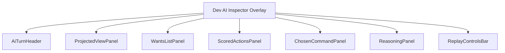
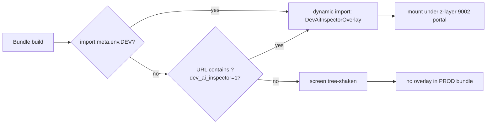
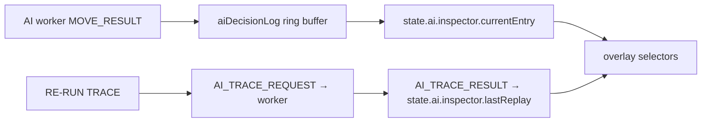
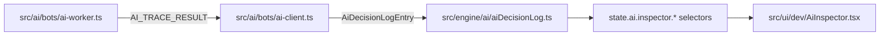

# Screen 69 Architecture: Dev AI Inspector

System: diagnostics
Screen ID: dev-ai-inspector
Visual Archetype: diagnostics-overlay
Curation Status: curated-pass-1

Companion docs:
[`spec.md`](./spec.md) (component tree, state bindings),
[`interactions.md`](./interactions.md) (per-control behaviour),
[`data-contracts.md`](./data-contracts.md) (schemas, selectors, localization),
[`ai-contract.md`](../../../ai-contract.md) (§ 3 Worker Protocol, § 7 Decision Log),
[`ui-technology-choice.md`](../../../ui-technology-choice.md#build-flags) (build flags, z-stack).

## 1. Purpose

Developer-only AI inspector overlay. Read-only consumer of the
`aiDecisionLog` ring buffer plus the `AI_TRACE_*` worker messages.
Renders one `AiDecisionLogEntry` end-to-end and lets the developer
re-run the worker against the same `(view, rngSeed)` to reproduce.

## 2. Visual Direction

- Internal developer UI. No franchise art, no curated theme.
- Dark-amber-on-charcoal panels, distinct from `dev-profiler`
  (dark-amber, vertically tiled) and `debug-overlay` (dark-blue) so
  all three diagnostic overlays remain separable when stacked.

## 3. Visual Composition

## 4. Build-Flag Gate

## 5. Subscription Cadence

## 6. State Inputs

| Slice            | State path                              |
| ---------------- | --------------------------------------- |
| `currentEntry`   | `state.ai.inspector.currentEntry`       |
| `bufferIndex`    | `state.ai.inspector.bufferIndex`        |
| `replayInFlight` | `state.ai.inspector.replayInFlight`     |
| `lastReplay`     | `state.ai.inspector.lastReplay`         |
| `overlayVisible` | `state.ai.inspector.overlayVisible`     |

All slices are in-memory only (see `data-contracts.md` for the
`data-inventory.md` flag note).

## 7. Data Sources

## 8. Outgoing Transitions

None. The overlay does not navigate. Hiding it returns input control
to the underlying layer.

## 9. Implementation Contract

- Dynamically imported only when `import.meta.env.DEV === true` or
  when `?dev_ai_inspector=1` is present on the URL.
- Reads diagnostic state; never mutates gameplay state, never
  dispatches gameplay commands.
- Z-layer 9002; non-input-blocking outside its panel; one above
  `dev-profiler` (9001) so all three diagnostic overlays
  (`debug-overlay` 9000, `dev-profiler` 9001, `dev-ai-inspector`
  9002) can stack.
- Localization keys live under `ui.dev-ai-inspector.*`.
- Owning task:
  [`tasks/mvp/10-heuristic-ai/08-ai-inspector-dev-screen.md`](../../../../../tasks/mvp/10-heuristic-ai/08-ai-inspector-dev-screen.md).
- Worker contract source:
  [`ai-contract.md`](../../../ai-contract.md) § 3 (worker protocol) + § 7 (decision log).

---

## 🔍 Sync Check

- **UI: ✔** — Component tree, state slices, and z-layer 9002 match `spec.md`, `interactions.md`, and `mockup.html`; mockup tag `data-component="DevAiInspectorOverlay"` resolves to the root listed here.
- **Schema: ⚠** — `state.ai.inspector.*` is in-memory only per [`ai-contract.md` § 7 Decision Log](../../../ai-contract.md#7-decision-log), but [`data-inventory.md`](../../../data-inventory.md) has no explicit in-memory row pinning the intent (see sibling `data-contracts.md` § Issues).
- **Tasks: ✔** — Owning task `mvp.10-heuristic-ai.08-ai-inspector-dev-screen` cites this folder; it depends on `09-ai-decision-log-channel` (ring buffer producer) and `06-run-ai-in-web-worker` (worker entrypoint).

## ⚠ Issues

- **Z-Stack Contract table does not enumerate the diagnostics sub-band (9001 / 9002).** [`ui-technology-choice.md` § Z-Stack Contract](../../../ui-technology-choice.md#z-stack-contract) lists only `Debug overlay 9000` between HUD (100) and the synchronizing overlay (9500); `dev-profiler` (9001) and this overlay (9002) sit inside that table's "Add new layer indices outside the Z-Stack Contract" DON'T region. Per Hard Prohibition D the audit did not edit `ui-technology-choice.md`. Suggested values: add explicit rows `Dev profiler 9001` and `Dev AI inspector 9002` to the canonical table (or split the diagnostics band into a numbered sub-range), owned jointly by [`tasks/mvp/07-ui-shell/01-react-18-app-shell-with-canvas-overlay.md`](../../../../../tasks/mvp/07-ui-shell/01-react-18-app-shell-with-canvas-overlay.md) and this screen's owning task.
