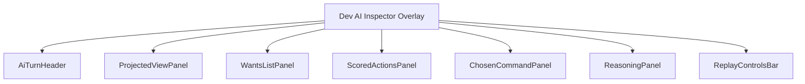
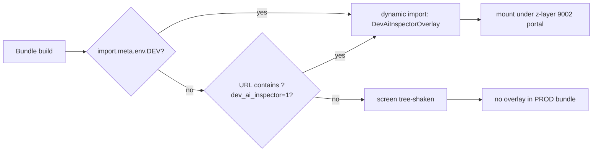
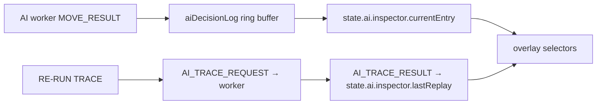
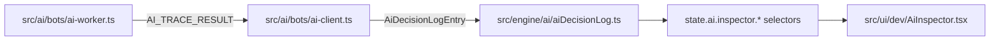

# Screen 69 Architecture: Dev AI Inspector

System: diagnostics
Screen ID: dev-ai-inspector
Visual Archetype: diagnostics-overlay
Curation Status: curated-pass-1

## Purpose
Developer-only AI inspector overlay. Read-only consumer of
`aiDecisionLog` plus the `AI_TRACE_*` worker messages.

## Visual Direction
- Internal developer UI. No franchise art, no curated theme.

## Visual Composition

## Build-Flag Gate

## Subscription Cadence

## Outgoing Transitions
- None. The overlay does not navigate. Hiding it returns input
  to the underlying layer.

## State Inputs
- currentEntry -> state.ai.inspector.currentEntry
- bufferIndex -> state.ai.inspector.bufferIndex
- replayInFlight -> state.ai.inspector.replayInFlight
- lastReplay -> state.ai.inspector.lastReplay
- overlayVisible -> state.ai.inspector.overlayVisible

## Data Sources

## Implementation Contract
- Screen is dynamically imported only when
  `import.meta.env.DEV === true` or when
  `?dev_ai_inspector=1` is present on the URL.
- Overlay reads diagnostics state; it never mutates gameplay
  state, never dispatches gameplay commands.
- Z-layer 9002; non-input-blocking outside its panel; one above
  `dev-profiler` (9001) so all three diagnostic overlays
  (`debug-overlay` 9000, `dev-profiler` 9001, `dev-ai-inspector`
  9002) can stack.
- Localization keys live under `ui.dev-ai-inspector.*`.
- Owning task:
  [`tasks/mvp/10-heuristic-ai/08-ai-inspector-dev-screen.md`](../../../../../tasks/mvp/10-heuristic-ai/08-ai-inspector-dev-screen.md).
- Source of every contract clause referenced by the overlay:
  [`docs/architecture/ai-contract.md`](../../../ai-contract.md).
