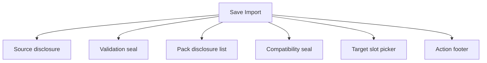
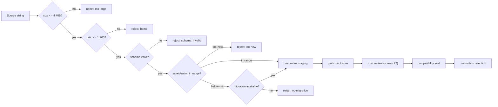
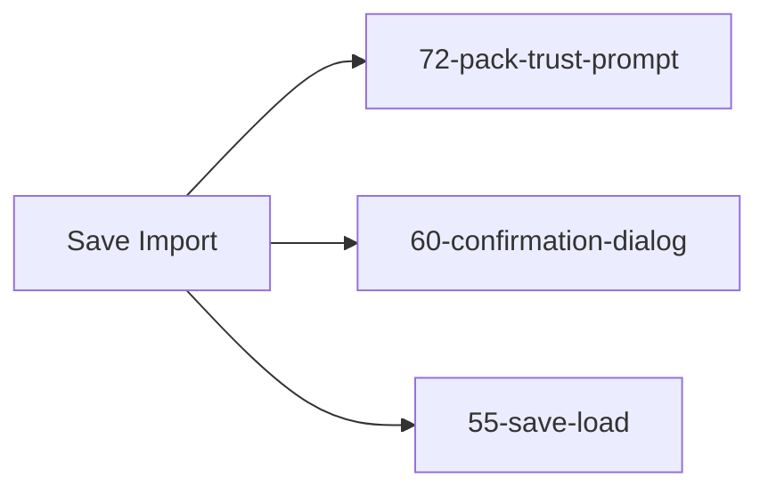

# Screen 70 Architecture: Save Import

System: system
Screen ID: save-import
Visual Archetype: system-import-dialog
Curation Status: curated-pass-1

## Purpose
Quarantined save-import flow. Ensures schema validate, quarantine
staging, pack disclosure, and trust review all complete before any
slot or pack write.

## Visual Direction
- Original internal UI contract. Do not use third-party captures,
  copied franchise art, or external product pixels as implementation input.

## Visual Composition

## Import Pipeline

## State Inputs
- source -> state.ui.saveImport.source
- stagingState -> state.ui.saveImport.stagingState
- stagedSave -> selectors.persistence.import.staging
- compatibility -> selectors.persistence.selectedSaveCompatibility
- referencedPacks -> selectors.packs.referencedFromStaging
- pendingTrust -> selectors.packs.pendingTrustDecisions
- targetSlot -> state.ui.saveImport.targetSlotId
- overwriteRing -> selectors.persistence.recycle.savedSlots

## Outgoing Transitions

## Implementation Contract
- Mockup defines visual regions and data hooks only.
- Spec defines the component/state contract.
- Interactions define controls, timing, command routing, disabled
  states, and error behavior.
- Data contracts define schemas, config, localization, asset, audio,
  VFX, save, and replay references.
- Caps, traversal rules, and trust-anchor lookup precedence are
  pinned in [`pack-trust.md`](../../../pack-trust.md). Do not invent
  per-screen thresholds.
