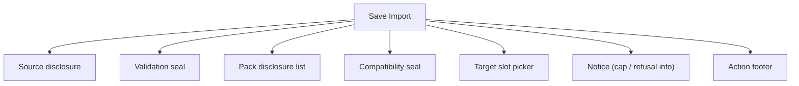
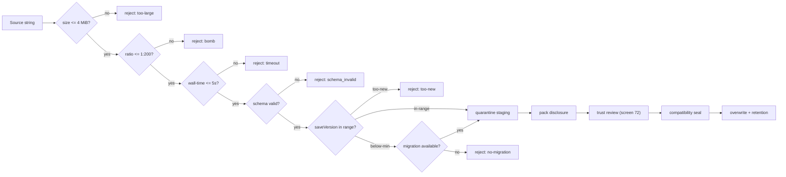
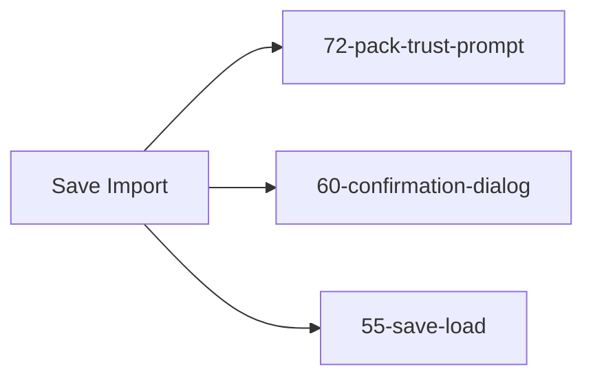

# Screen 70 Architecture: Save Import

System: system
Screen ID: save-import
Visual Archetype: system-import-dialog
Curation Status: curated-pass-1

## Purpose
Quarantined save-import flow. Schema validate, quarantine staging,
pack disclosure, and trust review must all complete before any slot
write or pack mount.

## Visual Direction
- Original internal UI contract. Do not use third-party captures,
  copied franchise art, or external product pixels as
  implementation input.

## Visual Composition

## Import Pipeline
Caps and the ZIP path-traversal sanitizer are pinned in
[`pack-trust.md` § 1](../../../pack-trust.md#1-resource-limits);
version bounds in [`pack-trust.md` § 3](../../../pack-trust.md#3-save-version-bounds).

## State Inputs
- `source` → `state.ui.saveImport.source`
- `stagingState` → `state.ui.saveImport.stagingState`
- `stagedSave` → `selectors.persistence.import.staging`
- `compatibility` → `selectors.persistence.selectedSaveCompatibility`
- `referencedPacks` → `selectors.packs.referencedFromStaging`
- `pendingTrust` → `selectors.packs.pendingTrustDecisions`
- `targetSlot` → `state.ui.saveImport.targetSlotId`
- `overwriteRing` → `selectors.persistence.recycle.savedSlots`
- `safeMode` → `state.session.safeMode` (read-only gate per
  [`pack-trust.md` § Safe Mode](../../../pack-trust.md#5-safe-mode))

## Outgoing Transitions

- `T0`: `OPEN_PACK_TRUST_PROMPT` from `saveImport.review`.
- `T1`: `CONFIRM_SAVE_IMPORT` from `saveImport.confirm`
  (overwrite decision modal).
- `T2`: `CANCEL_SAVE_IMPORT` from `saveImport.cancel`, and the
  success return from the confirmation modal.

## Implementation Contract
- `mockup.html` defines visual regions and data-hook positions.
- `spec.md` defines the component / state contract.
- `interactions.md` owns controls, timing, command routing, disabled
  states, and error behavior.
- `data-contracts.md` enumerates schemas, config, localization,
  assets, audio, VFX, save, and replay references.
- Caps, traversal rules, and trust-anchor lookup precedence are
  pinned in [`pack-trust.md`](../../../pack-trust.md). Do not invent
  per-screen thresholds.

---

## 🔍 Sync Check

- **UI: ✔** — Visual Composition children, the Import Pipeline
  branches, and Outgoing Transitions match sibling
  [`spec.md`](./spec.md),
  [`interactions.md`](./interactions.md),
  [`data-contracts.md`](./data-contracts.md), and
  [`mockup.html`](./mockup.html). The pipeline's `too-large`,
  `bomb`, `timeout`, `too-new`, `no-migration`, and `schema_invalid`
  branches match [`pack-trust.md` § 1](../../../pack-trust.md#1-resource-limits)
  and [`pack-trust.md` § 3](../../../pack-trust.md#3-save-version-bounds).
- **Schema: ✔** — The compatibility-seal arm and the `saveVersion`
  bounds match
  [`save.schema.json`](../../../../../content-schema/schemas/save.schema.json)
  and the union declared in
  [`pack-trust.md` § 3](../../../pack-trust.md#3-save-version-bounds).
- **Tasks: ⚠** — Owning task
  [`mvp.08-persistence.11`](../../../../../tasks/mvp/08-persistence/11-save-import-screen-and-quarantine.md)
  references this file in Read First. The `overwriteRing` slice
  surfaced by the `O["overwrite + retention"]` pipeline terminus is
  not registered in
  [`data-inventory.md`](../../../data-inventory.md); see sibling
  [`spec.md` § ⚠ Issues](./spec.md) — aligned.

## ⚠ Issues

- **Overwrite ring not registered in `data-inventory.md`.** See
  sibling [`spec.md`](./spec.md) for the full description and
  suggested row. Same gap flagged in
  [`pack-trust.md` § ⚠ Issues](../../../pack-trust.md). Owning
  task:
  [`mvp.08-persistence.11`](../../../../../tasks/mvp/08-persistence/11-save-import-screen-and-quarantine.md).
  Skill did not edit `data-inventory.md` (Hard Prohibition D).
