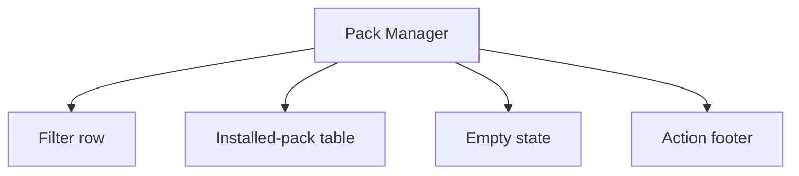
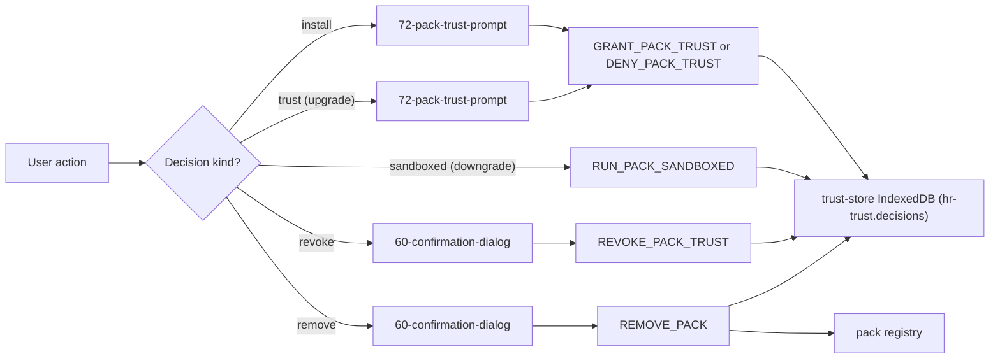
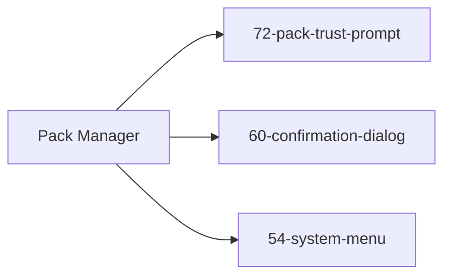

# Screen 71 Architecture: Pack Manager

System: system
Screen ID: pack-manager
Visual Archetype: system-list-dialog
Curation Status: curated-pass-1

### Companion Docs
- [`pack-trust.md`](../../../pack-trust.md) — trust anchors (§ 4),
  safe mode (§ 5), modded indicator (§ 6), trust phrasing (§ 7).
- Sibling screens:
  [`72-pack-trust-prompt/`](../72-pack-trust-prompt/) (review
  surface that performs the actual `GRANT_PACK_TRUST` /
  `DENY_PACK_TRUST` writes),
  [`60-confirmation-dialog/`](../60-confirmation-dialog/)
  (destructive-action gate),
  [`54-system-menu/`](../54-system-menu/) (caller; entry via
  `system.managePacks` → `OPEN_PACK_MANAGER`).
- Command vocabulary:
  [`command-schema.md` § Save-Import & Pack-Trust Commands](../../../command-schema.md#save-import--pack-trust-commands).

## Purpose
Audit installed packs and surface install / trust / sandboxed /
revoke / remove controls. All persistent decisions write to the
trust store per
[`pack-trust.md` § 4](../../../pack-trust.md#4-trust-anchors).

## Visual Direction
- Original internal UI contract. Do not use third-party captures,
  copied franchise art, or external product pixels as
  implementation input.

## Visual Composition

## Trust-Decision Flow
Revoke and remove are guarded through
[`60-confirmation-dialog`](../60-confirmation-dialog/); trust
review (upgrade) goes through
[`72-pack-trust-prompt`](../72-pack-trust-prompt/). Sandboxed is
a downgrade — it writes directly without a re-prompt.

## State Inputs
| UI Element | Selector / State Path |
| --- | --- |
| `installed` | `selectors.packs.installed` |
| `trustStore` | `selectors.packs.trustStore` |
| `filter` | `state.ui.packManager.filter` |
| `selectedPackId` | `state.ui.packManager.selectedPackId` |
| `modeIndicator` | `selectors.session.moddedIndicator` |

## Outgoing Transitions

## Implementation Contract
- Every install path runs the traversal sanitizer per
  [`pack-trust.md` § 1](../../../pack-trust.md#1-resource-limits)
  before opening screen 72.
- Trust decisions are keyed on `(packId, contentHash)`; a content
  change re-prompts per
  [`pack-trust.md` § 4](../../../pack-trust.md#4-trust-anchors).
- Safe mode (`state.session.safeMode === true`) bypasses trust
  decisions but keeps the manager visible for `REMOVE_PACK` per
  [`pack-trust.md` § 5](../../../pack-trust.md#5-safe-mode).
- Revoke and remove dispatch
  `REQUEST_CONFIRMATION { pendingAction }` first; the underlying
  `REVOKE_PACK_TRUST` / `REMOVE_PACK` only fires when the
  `ConfirmEnabled` predicate in
  [`60-confirmation-dialog/spec.md` § Click-Through Resistance](../60-confirmation-dialog/spec.md#click-through-resistance)
  passes.

---

## 🔍 Sync Check

- **UI: ✔** — Visual composition, transitions, and the trust-decision
  flow mirror sibling [`spec.md`](./spec.md) component tree and
  sibling [`interactions.md`](./interactions.md) action routes
  (install / trust → screen 72; revoke / remove → screen 60;
  sandboxed direct; close → screen 54).
- **Schema: ✔** — State inputs match
  [`data-contracts.md`](./data-contracts.md) selector table;
  `trust-store.schema.json` `(packId, contentHash)` key, `decision`
  and `scope` enums, and the `hr-trust.decisions` IndexedDB store
  match [`data-inventory.md`](../../../data-inventory.md)
  (row `trust store`) and
  [`trust-store.schema.json`](../../../../../content-schema/schemas/trust-store.schema.json).
- **Tasks: ✔** — Owning task
  [`tasks/mvp/08-persistence/12-pack-trust-prompt-and-manager.md`](../../../../../tasks/mvp/08-persistence/12-pack-trust-prompt-and-manager.md)
  reserves both screen surfaces, `src/persistence/trust-store.ts`,
  and `src/content-runtime/trust-anchors.ts`.

## ⚠ Issues

- **Trust-Decision Flow diagram reconciled with sibling
  `interactions.md`.** The prior diagram showed revoke and remove
  routing directly to `REVOKE_PACK_TRUST` / `REMOVE_PACK`, and
  showed only `GRANT_PACK_TRUST` as the screen-72 outcome. Sibling
  [`interactions.md`](./interactions.md) routes both destructive
  paths through `60-confirmation-dialog` (`REQUEST_CONFIRMATION` →
  X) and sibling
  [`72-pack-trust-prompt/interactions.md`](../72-pack-trust-prompt/interactions.md)
  shows the screen-72 outcome can be `GRANT_PACK_TRUST`,
  `DENY_PACK_TRUST`, or `RUN_PACK_SANDBOXED`. Updated the diagram
  to match the cross-checked interaction routes. Per Hard
  Prohibition A, surfaced rather than silently rewritten.
