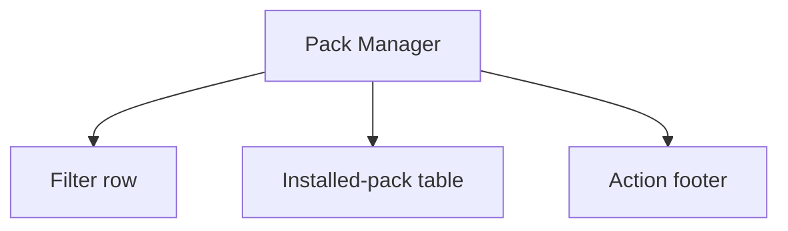
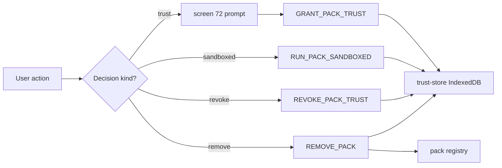
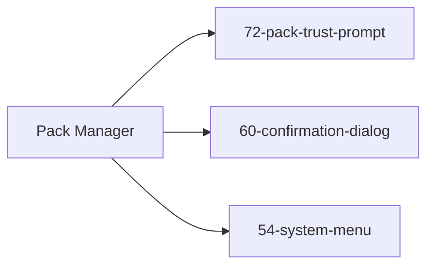

# Screen 71 Architecture: Pack Manager

System: system
Screen ID: pack-manager
Visual Archetype: system-list-dialog
Curation Status: curated-pass-1

## Purpose
Audit installed packs and surface trust / sandbox / revoke / remove
controls. All decisions write to the trust store per
[`pack-trust.md` § Trust Anchors](../../../pack-trust.md#4-trust-anchors).

## Visual Direction
- Original internal UI contract. Do not use third-party captures,
  copied franchise art, or external product pixels as implementation input.

## Visual Composition

## Trust-Decision Flow

## State Inputs
- installed -> selectors.packs.installed
- trustStore -> selectors.packs.trustStore
- filter -> state.ui.packManager.filter
- selectedPackId -> state.ui.packManager.selectedPackId
- modeIndicator -> selectors.session.moddedIndicator

## Outgoing Transitions

## Implementation Contract
- Every install path runs the traversal sanitizer first, then opens
  screen 72 for trust review.
- Trust decisions are keyed on `(packId, contentHash)`; a content
  change re-prompts.
- Safe mode bypasses trust decisions but keeps the manager visible
  for `REMOVE_PACK`.
