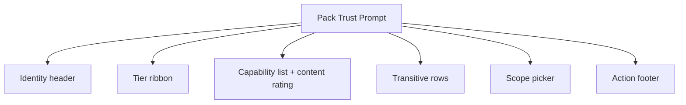
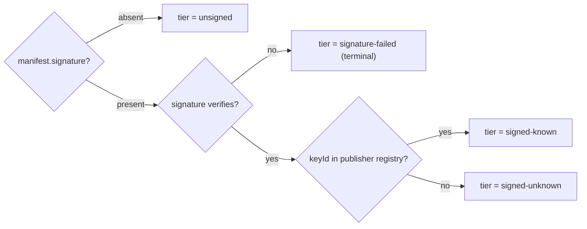
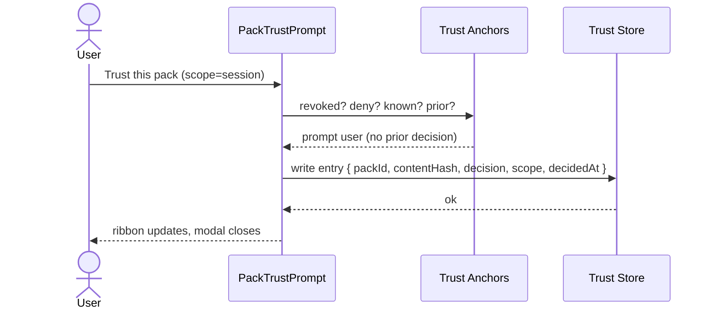
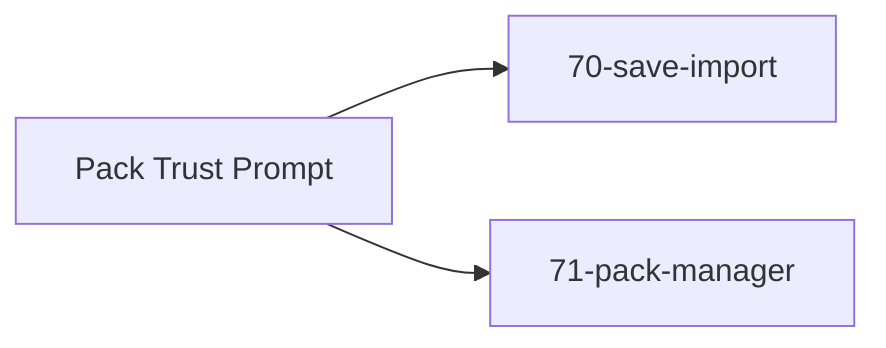

# Screen 72 Architecture: Pack Trust Prompt

System: `system`
Screen ID: `pack-trust-prompt`
Visual Archetype: `system-trust-dialog`
Curation Status: `curated-pass-1`

## Companion Docs
- Sibling: [`spec.md`](./spec.md), [`interactions.md`](./interactions.md),
  [`data-contracts.md`](./data-contracts.md), [`mockup.html`](./mockup.html).
- Anchors:
  [`pack-trust.md` § 4 Trust Anchors](../../../pack-trust.md#4-trust-anchors),
  [§ 5 Safe Mode](../../../pack-trust.md#5-safe-mode),
  [§ 7 Phrasing](../../../pack-trust.md#7-trust--safety-phrasing).
- Owning task:
  [`tasks/mvp/08-persistence/12-pack-trust-prompt-and-manager.md`](../../../../../tasks/mvp/08-persistence/12-pack-trust-prompt-and-manager.md).

## Purpose
Per-pack trust review with signature-tier ribbon, capability
disclosure, per-transitive consent, and persistence-scope picker.

## Visual Direction
- Original internal UI contract. Do not use third-party captures,
  copied franchise art, or external product pixels as implementation
  input.

## Visual Composition

## Tier Selection
Mirrors [`pack-trust.md` § Trust-tier ribbon](../../../pack-trust.md#trust-tier-ribbon).

## Trust-Decision Write
Anchors precedence per
[`pack-trust.md` § 4 Trust Anchors](../../../pack-trust.md#4-trust-anchors):
revocation → trust-store deny → publisher registry → trust-store
allow → prompt.

## State Inputs
| Element | Selector / state path | Notes |
| --- | --- | --- |
| `pack` | `selectors.packs.pendingTrustRequest` | Pack under review. |
| `tier` | `selectors.packs.signatureTier` | `signed-known \| signed-unknown \| unsigned \| signature-failed`. |
| `transitive` | `selectors.packs.pendingTransitive` | Per-dependency consent rows. |
| `scope` | `state.ui.packTrust.scope` | `session \| save \| global` (default `session`). |
| `trustStore` | `selectors.packs.trustStore` | Read-only consult; skip if prior decision exists. |

## Outgoing Transitions

Caller (screen 70 or 71) resumes after the trust-store write or
cancel.

## Implementation Contract
- `signature-failed` is terminal — the `Trust this pack` control is
  removed entirely (no soft-warning click-through).
- Per-transitive consent is required; there is no `Trust all`
  control.
- Trust-store entries key on `(packId, contentHash)`; a content-hash
  change re-prompts.
- Safe mode (`state.session.safeMode === true`) disables every
  positive decision per
  [`pack-trust.md` § 5 Safe Mode](../../../pack-trust.md#5-safe-mode).
- All copy follows
  [`pack-trust.md` § 7 Trust & Safety Phrasing](../../../pack-trust.md#7-trust--safety-phrasing).

---

## 🔍 Sync Check

- **UI: ✔** — Composition, tier-selection, and trust-decision-write
  diagrams mirror behaviour described in sibling
  [`spec.md`](./spec.md) § State Bindings and
  [`interactions.md`](./interactions.md) § Actions; outgoing-
  transition targets `70-save-import` and `71-pack-manager` match
  the callers named there.
- **Schema: ✔** — Tier branch matches `manifest.signature` /
  `publisher-registry.schema.json` (`keyId` lookup); trust-store
  write fields match
  [`trust-store.schema.json`](../../../../../content-schema/schemas/trust-store.schema.json)
  (`packId`, `contentHash`, `decision`, `scope`, `decidedAt`).
- **Tasks: ✔** — Diagrams encode behaviour owned by
  [`tasks/mvp/08-persistence/12-pack-trust-prompt-and-manager.md`](../../../../../tasks/mvp/08-persistence/12-pack-trust-prompt-and-manager.md);
  trust-anchor precedence aligns with
  [`pack-trust.md` § 4](../../../pack-trust.md#4-trust-anchors).

## ⚠ Issues

- **Trust-decision diagram does not surface the
  `reason ∈ {deprecated, user-revoked}` → `sandboxed` ceiling.**
  [`pack-trust.md` § 4 Trust Anchors](../../../pack-trust.md#4-trust-anchors)
  states that revocation-list entries with `reason ∈ {deprecated,
  user-revoked}` cap the resulting decision at `sandboxed`. The
  sequenceDiagram here collapses revocation into a single `revoked?`
  branch. Non-blocking (the rule is canonical in `pack-trust.md`),
  but the diagram would be clearer if the ceiling were named
  inline. Owner:
  [`tasks/mvp/08-persistence/12-pack-trust-prompt-and-manager.md`](../../../../../tasks/mvp/08-persistence/12-pack-trust-prompt-and-manager.md)
  when it next iterates the screen. See sibling
  [`data-contracts.md`](./data-contracts.md) § Validation And
  Fallback — aligned on the malware/tampered terminal path.
