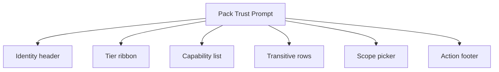
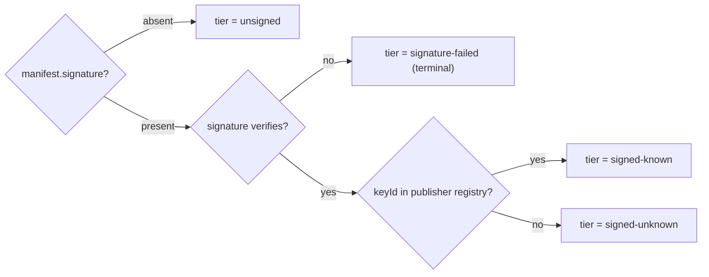
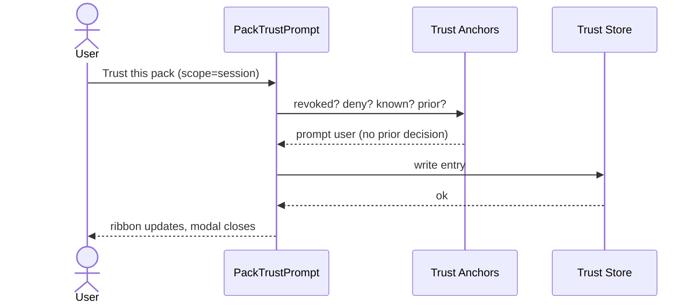
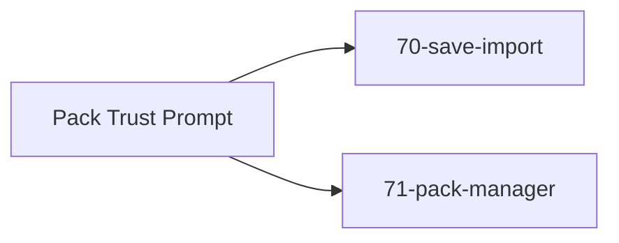

# Screen 72 Architecture: Pack Trust Prompt

System: system
Screen ID: pack-trust-prompt
Visual Archetype: system-trust-dialog
Curation Status: curated-pass-1

## Purpose
Per-pack trust review with signature-tier ribbon, capability
disclosure, transitive consent, and persistence-scope picker.

## Visual Direction
- Original internal UI contract. Do not use third-party captures,
  copied franchise art, or external product pixels as implementation input.

## Visual Composition

## Tier Selection

## Trust-Decision Write

## State Inputs
- pack -> selectors.packs.pendingTrustRequest
- tier -> selectors.packs.signatureTier
- transitive -> selectors.packs.pendingTransitive
- scope -> state.ui.packTrust.scope
- trustStore -> selectors.packs.trustStore

## Outgoing Transitions

## Implementation Contract
- `signature-failed` is terminal — the install/trust control is
  removed entirely.
- Per-transitive consent is required; there is no `Trust all`
  control.
- Decisions are keyed on `(packId, contentHash)`; a content change
  re-prompts.
- All copy follows
  [`pack-trust.md` § Trust & Safety Phrasing](../../../pack-trust.md#7-trust--safety-phrasing).
