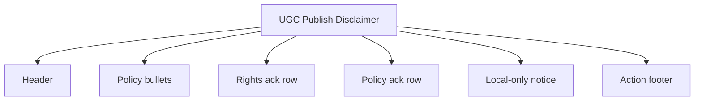
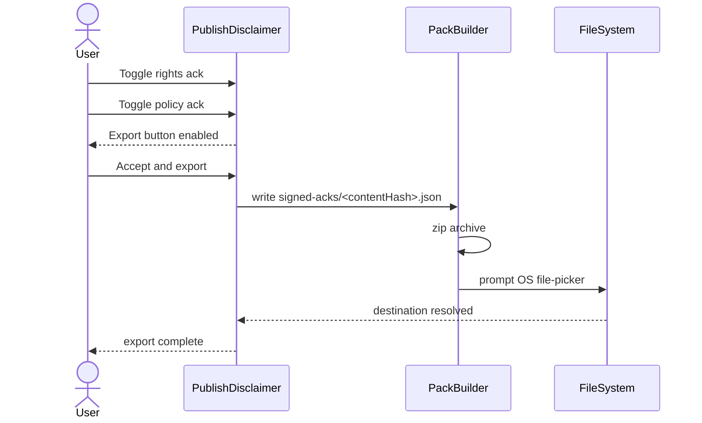
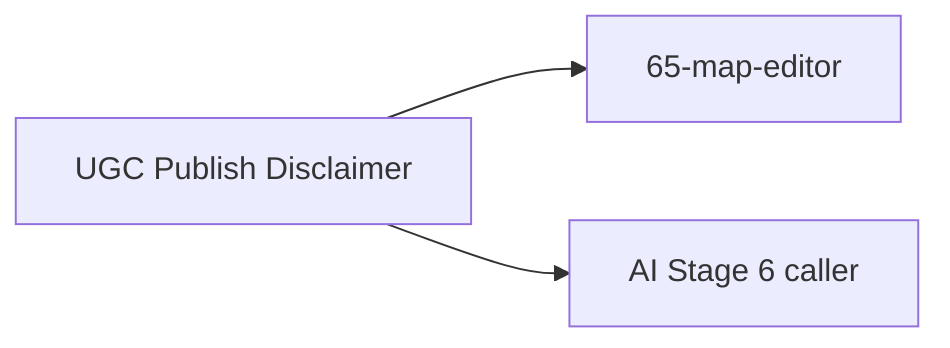

# Screen 73 Architecture: UGC Publish Disclaimer

System: system
Screen ID: ugc-publish-disclaimer
Visual Archetype: system-disclosure-modal
Curation Status: curated-pass-1

## Purpose
Per-pack content-policy ack before any local `.hrmod` export. The
ack is recorded inside the archive itself
(`signed-acks/<contentHash>.json`) so an out-of-band redistribution
still carries the policy acceptance.

## Visual Direction
Original internal UI contract. Do not use third-party captures,
copied franchise art, or external product pixels as implementation
input.

## Visual Composition

## Acceptance + Export Sequence

## State Inputs
- `pack` -> `selectors.publish.candidatePack`
- `policyVersion` -> `selectors.publish.policyVersion`
- `acks` -> `state.ui.publish.acks`
- `destination` -> `state.ui.publish.destination`

## Outgoing Transitions

## Implementation Contract
- Both ack checkboxes MUST be true before export enables. Disabled,
  not hidden — see sibling
  [`interactions.md`](./interactions.md).
- The ack file lives inside the exported archive only; it is not
  recorded in the trust store and never embedded in any save.
- No network upload at v1. A future moderation backend consumes the
  on-disk ack format when authored.
- All copy follows
  [`ugc-safety.md` § 7 Localization Keys](../../../ugc-safety.md#7-localization-keys).

---

## 🔍 Sync Check

- **UI: ✔** — Diagrams mirror sibling
  [`spec.md`](./spec.md) and
  [`interactions.md`](./interactions.md); transitions
  (`65-map-editor`, AI Stage 6 caller) and state inputs match the
  spec's `State Bindings` table. SVG mockup at
  [`mockup.html`](./mockup.html) carries the corresponding regions
  (`SHARING A CREATION`, `CONTENT POLICY`, ack rows, local-only
  notice, action footer).
- **Schema: ✔** — `selectors.publish.candidatePack` shape consumes
  [`manifest.schema.json`](../../../../../content-schema/schemas/manifest.schema.json)
  (identity + `aiProvenance`); ack file path
  `signed-acks/<contentHash>.json` matches the in-pack row in
  [`data-inventory.md`](../../../data-inventory.md) (`signed publish
  ack`).
- **Tasks: ✔** — Owning task
  [`tasks/phase-2/04-content-editor/10-publish-disclaimer-flow.md`](../../../../../tasks/phase-2/04-content-editor/10-publish-disclaimer-flow.md)
  matches the sequence above (write ack → dispatch
  `EXPORT_SCENARIO_AS_PACK` against the OS file-picker, no network
  upload at v1); the two engine-visible commands
  (`ACCEPT_PUBLISH_DISCLAIMER`, `EXPORT_SCENARIO_AS_PACK`) are
  catalogued in
  [`command-schema.md` § UGC, Privacy & Content-Report Commands](../../../command-schema.md#ugc-privacy--content-report-commands).

## ⚠ Issues

- **UI-local toggle tokens not catalogued in
  [`command-schema.md`](../../../command-schema.md).** The
  `TOGGLE_PUBLISH_RIGHTS_ACK` / `TOGGLE_PUBLISH_POLICY_ACK` /
  `CLOSE_PUBLISH_DISCLAIMER` tokens drive the modal's interactions
  (see sibling
  [`interactions.md` § Actions](./interactions.md#actions)) but are
  absent from the UGC section of `command-schema.md` and from
  [`screen-command-coverage.json`](../../../screen-command-coverage.json).
  Owner:
  [`tasks/phase-2/04-content-editor/10-publish-disclaimer-flow.md`](../../../../../tasks/phase-2/04-content-editor/10-publish-disclaimer-flow.md)
  — add three `local-ui` rows alongside `OPEN_PUBLISH_DISCLAIMER`.
  The audit did not edit those files (Hard Prohibition D); see
  siblings
  [`interactions.md` § ⚠ Issues](./interactions.md#-issues) and
  [`data-contracts.md` § ⚠ Issues](./data-contracts.md#-issues) —
  aligned.
