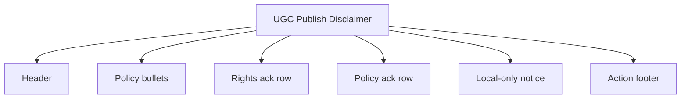
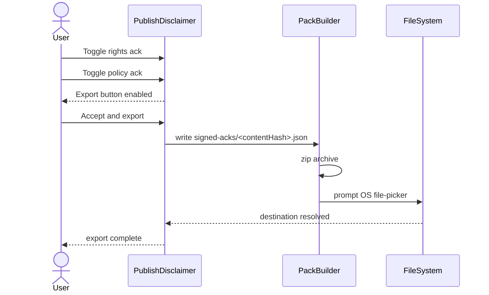
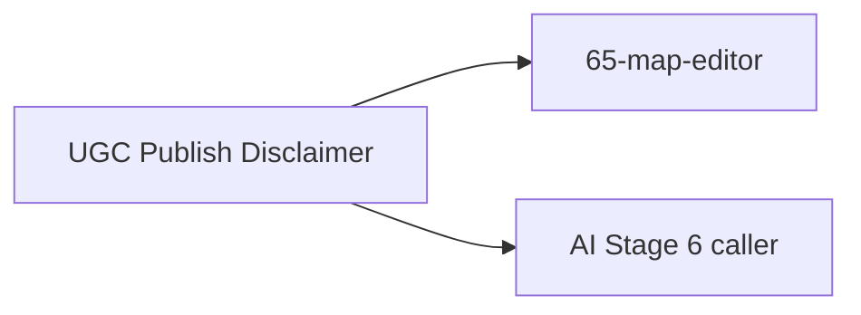

# Screen 73 Architecture: UGC Publish Disclaimer

System: system
Screen ID: ugc-publish-disclaimer
Visual Archetype: system-disclosure-modal
Curation Status: curated-pass-1

## Purpose
Per-pack content-policy ack before any local `.hrmod` export. Records
the ack inside the archive itself so an out-of-band redistribution
still carries the policy acceptance.

## Visual Direction
- Original internal UI contract. Do not use third-party captures,
  copied franchise art, or external product pixels as implementation input.

## Visual Composition

## Acceptance + Export Sequence

## State Inputs
- pack -> selectors.publish.candidatePack
- policyVersion -> selectors.publish.policyVersion
- acks -> state.ui.publish.acks
- destination -> state.ui.publish.destination

## Outgoing Transitions

## Implementation Contract
- Both ack checkboxes MUST be true before export enables.
- The ack file lives inside the exported archive — not in the trust
  store, not in any save.
- No network upload at v1. (moderation backend) consumes the
  ack format when authored.
- All copy follows
  [`ugc-safety.md` § Localization Keys](../../../ugc-safety.md#7-localization-keys).
