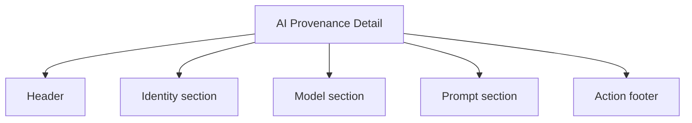
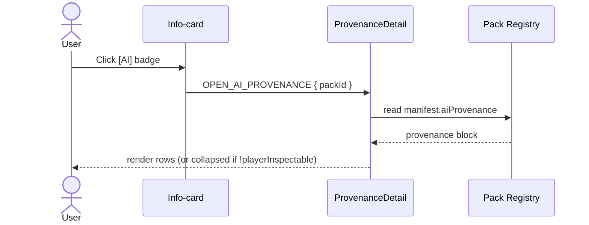
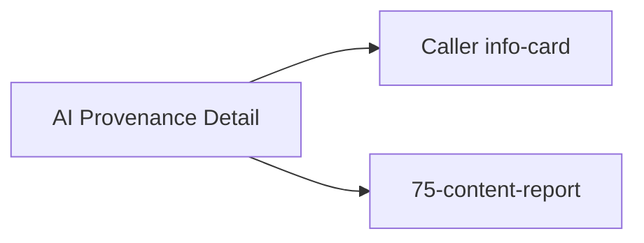

# Screen 74 Architecture: AI Provenance Detail

System: system
Screen ID: ai-provenance-detail
Visual Archetype: system-info-modal
Curation Status: curated-pass-1

## Purpose
Player-facing surface for `manifest.aiProvenance`. Read-only.

## Visual Direction
- Original internal UI contract. Do not use third-party captures,
  copied franchise art, or external product pixels as implementation input.

## Visual Composition

## Provenance Read

## State Inputs
- pack -> selectors.packs.byId(targetPackId)
- provenance -> selectors.packs.aiProvenance(targetPackId)
- inspectable -> selectors.packs.aiProvenance(targetPackId).playerInspectable

## Outgoing Transitions

## Implementation Contract
- Read-only; never dispatches a gameplay command.
- Truncated prompt excerpt MUST go through the `safeUserText` helper
  per [`ugc-safety.md` § Text Sanitization Contract](../../../ugc-safety.md#3-text-sanitization-contract).
- `playerInspectable === false` collapses the body; `present === false`
  prevents the badge from rendering upstream.
- All copy follows
  [`ugc-safety.md` § Localization Keys](../../../ugc-safety.md#7-localization-keys).
