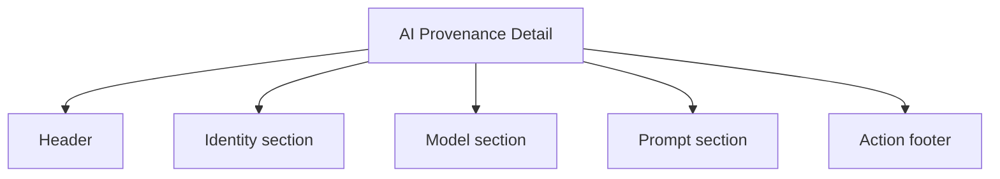
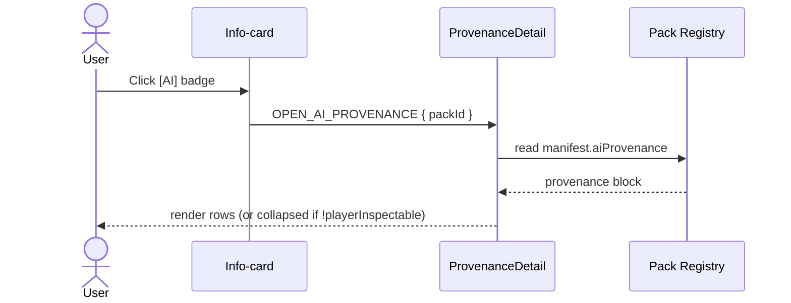
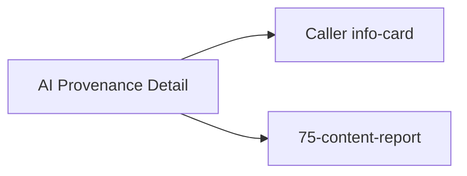

# Screen 74 Architecture: AI Provenance Detail

System: system
Screen ID: ai-provenance-detail
Visual Archetype: system-info-modal
Curation Status: curated-pass-1

## Companion Docs

- Sibling files: [`spec.md`](./spec.md), [`interactions.md`](./interactions.md), [`data-contracts.md`](./data-contracts.md), [`mockup.html`](./mockup.html).
- Schemas:
  [`manifest.schema.json`](../../../../../content-schema/schemas/manifest.schema.json)
  (`aiProvenance` block),
  [`generated-faction.schema.json`](../../../../../content-schema/schemas/generated-faction.schema.json)
  (`notes`).
- Architecture:
  [`ugc-safety.md`](../../../ugc-safety.md) (text sanitization, localization keys),
  [`ai-generation-pipeline.md`](../../../ai-generation-pipeline.md) (emits `aiProvenance`),
  [`command-schema.md` § UGC, Privacy & Content-Report Commands](../../../command-schema.md#ugc-privacy--content-report-commands).
- Owning task:
  [`tasks/phase-2/05-mod-system/13-ai-provenance-detail-screen.md`](../../../../../tasks/phase-2/05-mod-system/13-ai-provenance-detail-screen.md).

## 1. Purpose

Player-facing read of `manifest.aiProvenance` for an AI-generated
pack. Read-only — never dispatches a gameplay command.

## 2. Visual Direction

Original internal UI contract. Do not use third-party captures,
copied franchise art, or external product pixels as implementation
input.

## 3. Visual Composition

## 4. Provenance Read

## 5. State Inputs

| Element | Selector | Notes |
| --- | --- | --- |
| `pack` | `selectors.packs.byId(targetPackId)` | `{ id, version, contentHash }`. |
| `provenance` | `selectors.packs.aiProvenance(targetPackId)` | `manifest.aiProvenance`. |
| `inspectable` | `selectors.packs.aiProvenance(targetPackId).playerInspectable` | Collapses body when `false`. |

## 6. Outgoing Transitions

## 7. Implementation Contract

- Read-only — never dispatches a gameplay command.
- Truncated prompt excerpt MUST go through `safeUserText(280)` per
  [`ugc-safety.md` § 3 Text Sanitization Contract](../../../ugc-safety.md#3-text-sanitization-contract).
  `aiProvenance.promptExcerpt` is itself capped at 280 chars by
  [`manifest.schema.json`](../../../../../content-schema/schemas/manifest.schema.json).
- `aiProvenance.present === false` prevents the badge from rendering
  upstream and the screen never mounts.
- `aiProvenance.playerInspectable === false` collapses the body to
  `ui.ai-provenance.details-unavailable`; the close affordance
  remains.
- All copy lives under `ui.ai-provenance.*` per
  [`ugc-safety.md` § 7 Localization Keys](../../../ugc-safety.md#7-localization-keys).

---

## 🔍 Sync Check

- **UI: ✔** — Diagrams mirror sibling [`spec.md`](./spec.md) regions,
  [`interactions.md`](./interactions.md) transitions, and the panels
  in [`mockup.html`](./mockup.html).
- **Schema: ✔** — `aiProvenance` shape (`present`,
  `playerInspectable`, `promptExcerpt[280]`) matches
  [`manifest.schema.json`](../../../../../content-schema/schemas/manifest.schema.json)
  lines 119–135; `notes.modelVersion` / `notes.playerInspectable`
  mirror
  [`generated-faction.schema.json`](../../../../../content-schema/schemas/generated-faction.schema.json)
  lines 52–65. `Manifest` and `GeneratedFaction` rows present in
  [`schema-matrix.md`](../../../schema-matrix.md) (lines 35, 51).
- **Tasks: ✔** — Owning task
  [`phase-2.05-mod-system.13-ai-provenance-detail-screen`](../../../../../tasks/phase-2/05-mod-system/13-ai-provenance-detail-screen.md)
  lists this folder in `Read First` and reserves
  `src/ui/screens/ai-provenance-detail-screen.tsx`. The
  `OPEN_AI_PROVENANCE` / `CLOSE_AI_PROVENANCE` tokens are registered
  as local-ui in
  [`command-schema.md`](../../../command-schema.md#ugc-privacy--content-report-commands).

## ⚠ Issues

_None._
