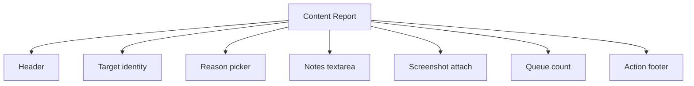
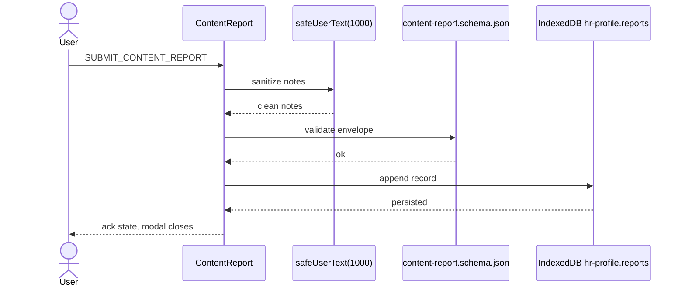
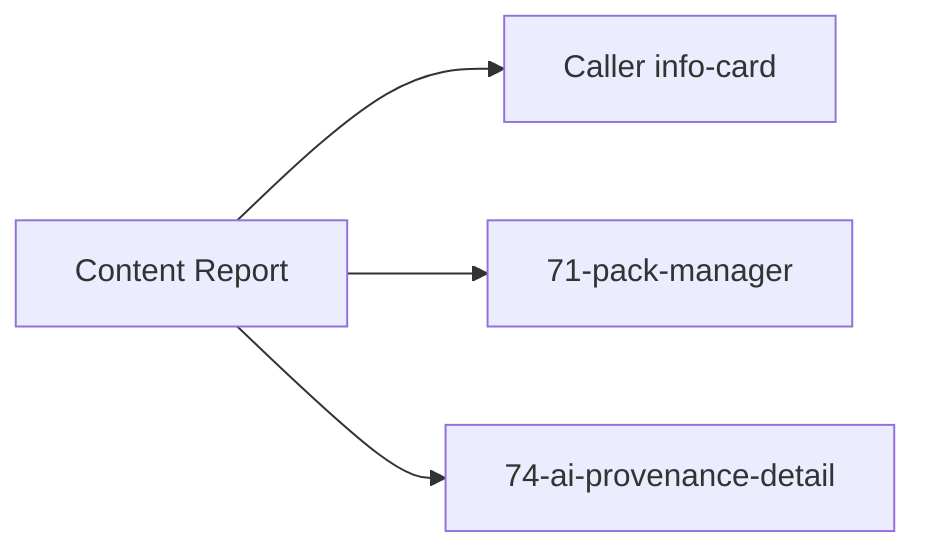

# Screen 75 Architecture: Content Report

System: `system`
Screen ID: `content-report`
Visual archetype: `system-form-modal`
Curation status: `curated-pass-1`

## Purpose
Player-facing intake for content-targeting reports. Distinct from
`REPORT_PEER` (chat-safety), which targets player behavior; this
screen targets **content** (pack, scenario, hero, unit, AI-faction).
See sibling [`spec.md`](./spec.md) § Description for the player-
visible contract.

## Visual Direction
- Original internal UI contract. Do not use third-party captures,
  copied franchise art, or external product pixels as implementation
  input.

## Visual Composition

## Submit Flow

A validation failure short-circuits before the IDB write and
surfaces a modal error keyed by `error.content-report.invalid.body`;
an IDB write failure surfaces `error.storage.rejected.body`. Both
preserve the form draft so the user can retry. See sibling
[`interactions.md`](./interactions.md) § Error surfaces for the
matrix.

## State Inputs
| Field | State path | Notes |
| --- | --- | --- |
| `target` | `state.ui.contentReport.target` | `{ targetType, targetId, contentHash? }` pre-filled by the caller. |
| `reason` | `state.ui.contentReport.reason` | Closed enum from `content-report.schema.json`. |
| `notes` | `state.ui.contentReport.notes` | Free-text; sanitized via `safeUserText(1000)`. |
| `screenshotAssetId` | `state.ui.contentReport.screenshotAssetId` | Optional. |
| `queue` | `selectors.privacy.outboundReportQueue` | Read-only count of `state.privacy.outboundReports[]`. |

## Outgoing Transitions

Both `SUBMIT_CONTENT_REPORT` (post-ack) and `CANCEL_CONTENT_REPORT`
route back to the caller; cancel performs no write. See
[`71-pack-manager/`](../71-pack-manager/) and
[`74-ai-provenance-detail/`](../74-ai-provenance-detail/) for the
two non-info-card callers.

## Implementation Contract
- No network call at v1. The local queue is the dequeue point a
  future moderation backend will consume; persisted in IndexedDB
  store `hr-profile.reports` per
  [`persistence.md` § 1](../../../persistence.md#1-per-slice-mapping)
  and registered as row "outbound content reports" in
  [`data-inventory.md` § 1](../../../data-inventory.md#1-inventory).
- Notes are sanitized via `safeUserText(1000)` per
  [`ugc-safety.md` § 3 Text Sanitization Contract](../../../ugc-safety.md#3-text-sanitization-contract).
- Schema validation precedes the IndexedDB write; failure preserves
  the form draft so the user can retry.
- All copy keys live under `ui.report.*` per
  [`ugc-safety.md` § 7 Localization Keys](../../../ugc-safety.md#7-localization-keys).
- Errors render through `formatUserError(err, locale)` per
  [`error-formatter.md`](../../../error-formatter.md); never
  construct error toast text inline.

---

## 🔍 Sync Check

- **UI: ✔** — Visual-composition nodes mirror the mockup regions
  (target panel, reason panel, notes panel, footer); state inputs
  match sibling [`spec.md`](./spec.md) § State Bindings; submit-
  flow steps mirror sibling
  [`interactions.md`](./interactions.md) § Actions row "Submit".
- **Schema: ✔** — Schema reference and persistence target match
  [`content-report.schema.json`](../../../../../content-schema/schemas/content-report.schema.json)
  and the `ContentReport` row in
  [`schema-matrix.md`](../../../schema-matrix.md);
  `hr-profile.reports` is row "outbound content reports" in
  [`data-inventory.md` § 1](../../../data-inventory.md#1-inventory).
- **Tasks: ✔** — Submit-flow steps match the acceptance criteria
  in
  [`tasks/phase-2/05-mod-system/12-content-report-intake-and-local-queue.md`](../../../../../tasks/phase-2/05-mod-system/12-content-report-intake-and-local-queue.md)
  (sanitize → validate → enqueue, validation failure preserves
  draft).

## ⚠ Issues

_None._
