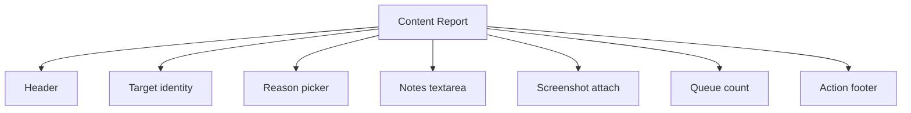
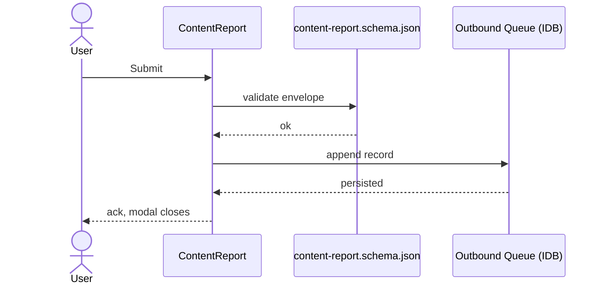
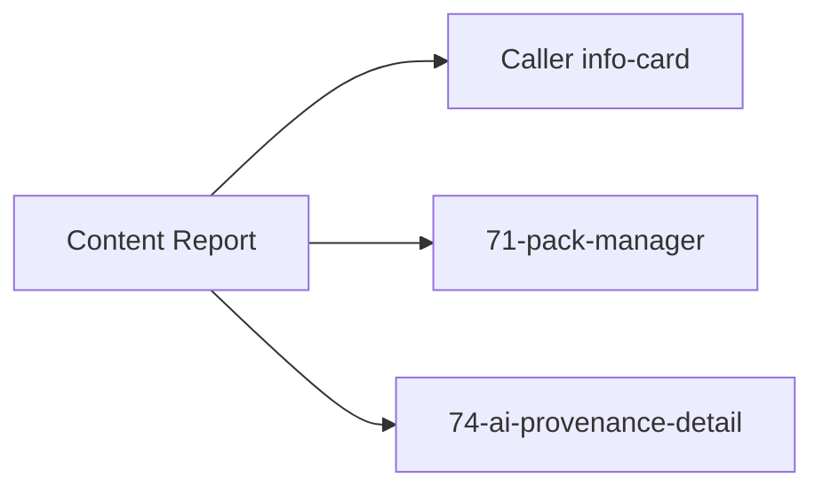

# Screen 75 Architecture: Content Report

System: system
Screen ID: content-report
Visual Archetype: system-form-modal
Curation Status: curated-pass-1

## Purpose
Player-facing intake for content-targeting reports. Distinct from
`REPORT_PEER` (chat-safety / Plan 19) which targets behavior; this
screen targets content.

## Visual Direction
- Original internal UI contract. Do not use third-party captures,
  copied franchise art, or external product pixels as implementation input.

## Visual Composition

## Submit Flow

## State Inputs
- target -> state.ui.contentReport.target
- reason -> state.ui.contentReport.reason
- notes -> state.ui.contentReport.notes
- screenshotAssetId -> state.ui.contentReport.screenshotAssetId
- queue -> selectors.privacy.outboundReportQueue

## Outgoing Transitions

## Implementation Contract
- No network call at v1. The local queue is the dequeue point that
  Plan 30 (moderation backend) will consume.
- Notes are sanitized via `safeUserText(1000)` per
  [`ugc-safety.md` § Text Sanitization Contract](../../../ugc-safety.md#3-text-sanitization-contract).
- Schema validation precedes the IndexedDB write; a validation
  failure surfaces a modal error and preserves the form draft so
  the user can retry.
- All copy follows
  [`ugc-safety.md` § Localization Keys](../../../ugc-safety.md#7-localization-keys).
