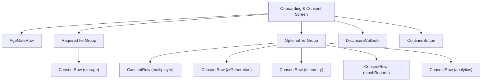
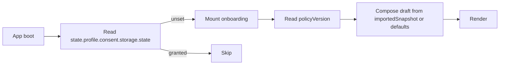
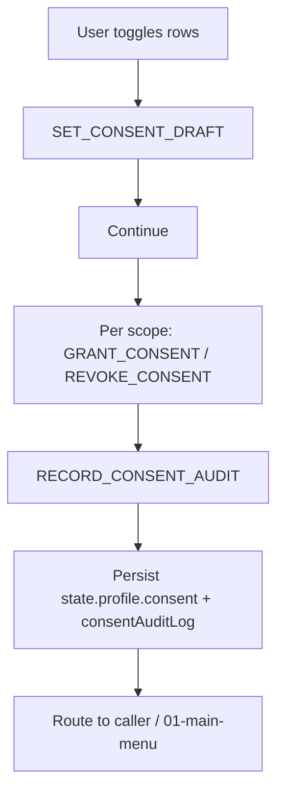
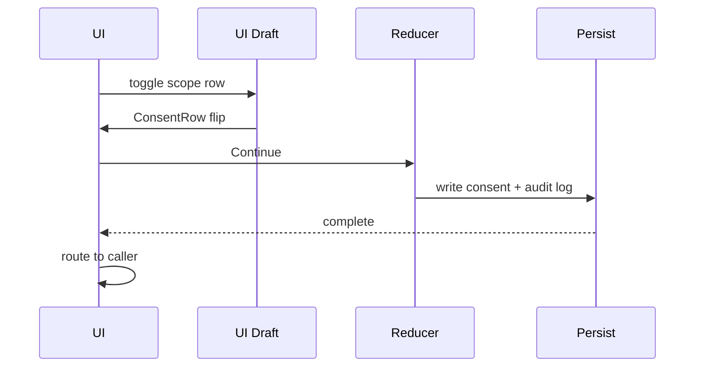
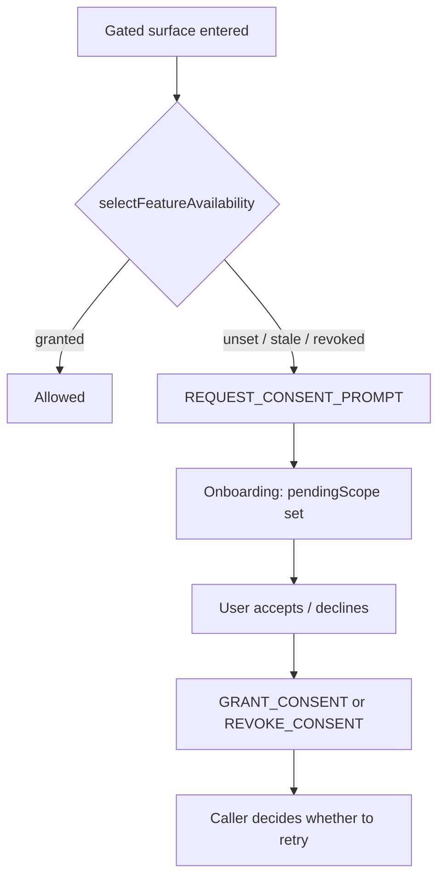
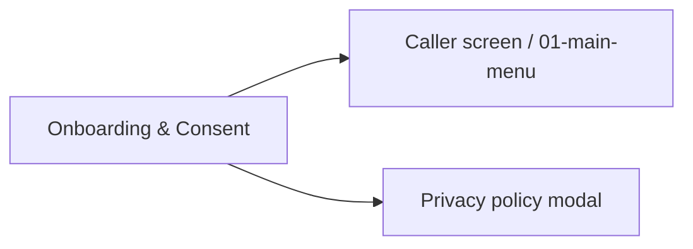

# Screen 61b Architecture: Onboarding & Consent

System: system
Screen ID: onboarding-consent
Visual Archetype: curated-tiered-list
Curation Status: curated-pass-1

## Purpose
First-run onboarding screen that captures the age gate and tiered
consent before any network, AI, telemetry, or crash-report surface
becomes reachable. Re-prompts on policy bumps, revocations, and save
imports.

## Visual Direction
- Original internal UI contract. Do not use third-party captures,
  copied franchise art, or external product pixels as implementation input.

## Visual Composition

## Screen Load And Data Resolution

## Main Interaction Flow

## Animation Flow

## Re-Prompt Flow

## Outgoing Transitions

## State Inputs
- ageGateDraft -> state.ui.onboarding.ageGateDraft
- consentDraft -> state.ui.onboarding.consentDraft
- policyVersion -> selectors.onboarding.policyVersion
- pendingScope -> state.ui.onboarding.pendingScope
- importedSnapshot -> state.ui.onboarding.importedSnapshot
- featureAvailability -> selectors.onboarding.featureAvailability

## Implementation Contract
- Mockup defines visual regions and data hooks only.
- Spec defines the component/state contract.
- Interactions define controls, timing, command routing, disabled
  states, and error behavior.
- Data contracts define schemas, config, localization, asset, audio,
  VFX, save, and replay references.
- Diagrams are screen-specific summaries of the same contract and must
  not introduce hidden behavior.
