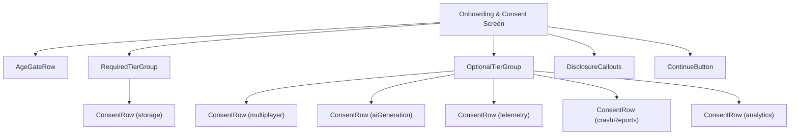
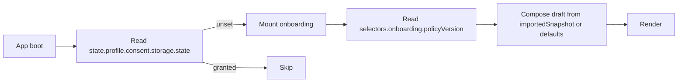
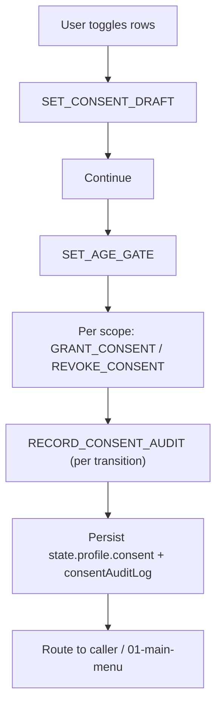
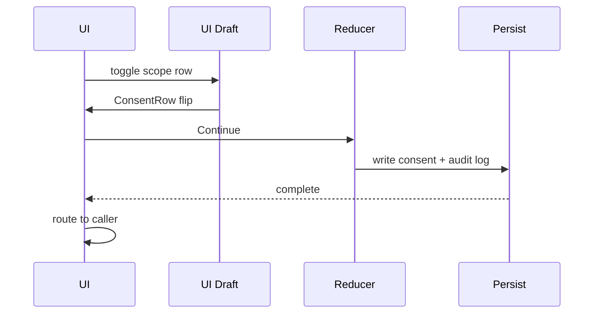
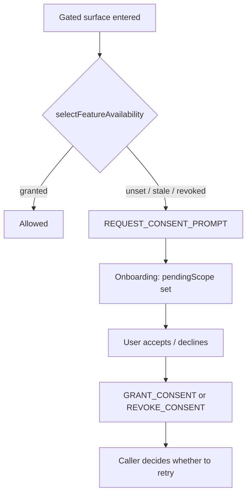
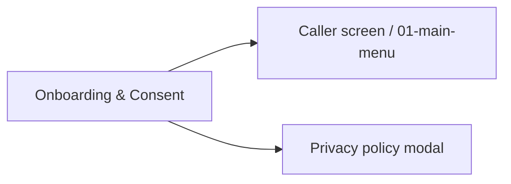

# Screen 76 Architecture: Onboarding & Consent

System: system
Screen ID: onboarding-consent
Visual Archetype: curated-tiered-list
Curation Status: curated-pass-1

### Screen Package
- Mockup: `mockup.html`
- Spec: `spec.md`
- Interactions: `interactions.md`
- Data Contracts: `data-contracts.md`
- Architecture Diagrams: `architecture.md` _(this file)_

### Companion Docs
- [`docs/architecture/onboarding.md`](../../../onboarding.md) —
  canonical flow, policy version, re-prompt rules.
- [`docs/architecture/age-gate.md`](../../../age-gate.md) —
  `config.player.ageGate` lifecycle and feature matrix.
- [`docs/architecture/diagrams/30-onboarding-consent.md`](../../../diagrams/30-onboarding-consent.md)
  — repo-wide onboarding diagram (these screen-local diagrams are
  the runtime view of the same flow).

## Purpose
First-run onboarding screen that captures the age gate and tiered
consent before any network, AI, telemetry, or crash-report surface
becomes reachable. Re-prompts on policy bumps, revocations, and save
imports.

## Visual Direction
- Original internal UI contract. Do not use third-party captures,
  copied franchise art, or external product pixels as implementation
  input.

## Visual Composition

## Screen Load And Data Resolution

## Main Interaction Flow

## Animation Flow

## Re-Prompt Flow

## Outgoing Transitions

## State Inputs
| UI binding | Source |
| --- | --- |
| `ageGateDraft` | `state.ui.onboarding.ageGateDraft` |
| `consentDraft` | `state.ui.onboarding.consentDraft` |
| `policyVersion` | `selectors.onboarding.policyVersion` |
| `pendingScope` | `state.ui.onboarding.pendingScope` |
| `importedSnapshot` | `state.ui.onboarding.importedSnapshot` |
| `featureAvailability` | `selectors.onboarding.featureAvailability` |

Full state-binding contract lives in `spec.md`; payload contracts in
`data-contracts.md`; action timing in `interactions.md`.

## Implementation Contract
- `mockup.html` carries visual regions only.
- `spec.md` owns components and state bindings.
- `interactions.md` owns controls, timing, command routing,
  disabled states, and error behavior.
- `data-contracts.md` owns schemas, config, localization, asset,
  audio, VFX, save, and replay references.
- Diagrams in this file are screen-specific summaries of the
  contracts above and must not introduce hidden behavior.

---

## 🔍 Sync Check

- **UI: ✔** — Component composition matches sibling `spec.md`
  (component tree) and `mockup.html` (visible rows). The Main
  Interaction Flow diagram mirrors `interactions.md` § Actions
  (`SET_AGE_GATE_DRAFT` → `SET_CONSENT_DRAFT` → `SET_AGE_GATE` →
  per-scope `GRANT_CONSENT` / `REVOKE_CONSENT` → `RECORD_CONSENT_AUDIT`).
- **Schema: ✔** — Diagrams reference only commands defined in
  [`command-schema.md` § Consent, Onboarding & Destructive-UX Commands](../../../command-schema.md#consent-onboarding--destructive-ux-commands)
  and state paths registered in
  [`data-inventory.md`](../../../data-inventory.md). No
  schema-level mismatches.
- **Tasks: ✔** — Owning runtime task
  [`mvp.07-ui-shell.27-onboarding-consent-screen`](../../../../../tasks/mvp/07-ui-shell/27-onboarding-consent-screen.md)
  reads this file under *Read First* and lists every diagrammed
  transition under its acceptance criteria.

## ⚠ Issues

- **Main Interaction Flow now includes the `SET_AGE_GATE` step that
  was previously implicit.** The prior diagram jumped from
  `Continue` straight to `GRANT_CONSENT`, leaving the
  `config.player.ageGate` write unrepresented; the rewrite makes
  it explicit so the diagram matches `interactions.md` and
  [`age-gate.md` § 1](../../../age-gate.md#1-stored-value). No
  behavior change.
- **Re-Prompt Flow's `unset / stale / revoked` branch dispatches
  `REVOKE_CONSENT` for the decline path, which writes `'revoked'`
  rather than the `'denied'` state the audit log claims for
  explicit decline.** Already tracked in
  [`onboarding.md` § ⚠ Issues](../../../onboarding.md) and
  sibling `interactions.md` / `spec.md`; surfaced here so the
  diagram and the textual contract drift together when the gap
  closes.
