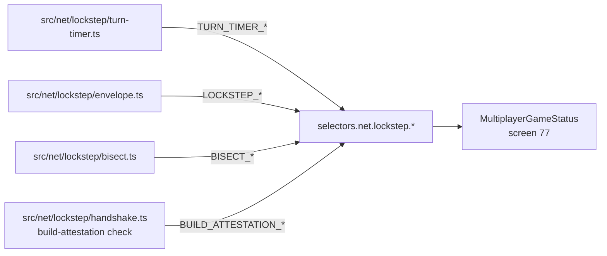
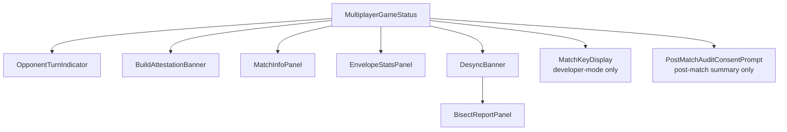
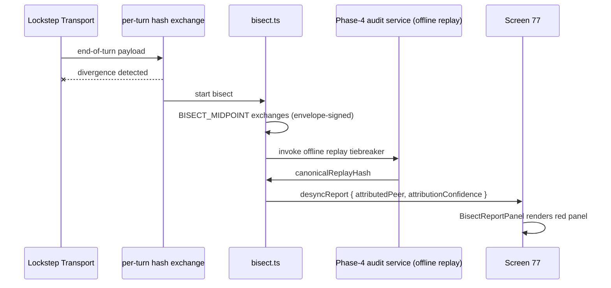

# Screen 77: Multiplayer Game Status — Architecture

## Screen Package
- Mockup: `mockup.html`
- Spec: `spec.md`
- Interactions: `interactions.md`
- Data Contracts: `data-contracts.md`

## 1. Telemetry Subscriptions



Event families are defined by the canonical sibling docs:
[`turn-timer.md` § 5](../../../turn-timer.md),
[`lockstep-envelope.md` § 5](../../../lockstep-envelope.md),
[`bisect-protocol.md` § 4](../../../bisect-protocol.md),
[`build-attestation.md` § 4](../../../build-attestation.md).

## 2. Component Composition



## 3. Stall Escalation Flow

```mermaid
sequenceDiagram
  participant Local as Local UI
  participant TT as turn-timer.ts
  participant Wire as Lockstep Transport
  participant Reducer as Engine Reducer

  Local->>TT: turn start (t = 0)
  TT->>Local: WAITING
  TT->>Local: STALLED (t ≥ waitingThresholdMs = 30_000 ms)
  TT->>Wire: wrap(END_DAY{source:'auto-timeout'}) at t ≥ stallLimitMs = 90_000 ms
  Wire->>Reducer: apply canonical envelope
  Reducer->>Local: turn ends; OpponentTurnIndicator → auto-ended
```

Thresholds are configurable via `multiplayer.turnTimerMs` per
[`turn-timer.md` § 3](../../../turn-timer.md); ranked play pins the
default 30 s / 90 s pair.

## 4. Bisect / Desync Flow



Report shape and confidence rules are pinned in
[`bisect-protocol.md` § 5](../../../bisect-protocol.md). The
Phase-4 offline tiebreaker is contracted in
[`replay-audit-pipeline.md` § 4](../../../replay-audit-pipeline.md);
M5 ships the contract only.

## 5. Module Graph Compliance

- Screen 77 lives entirely in `src/ui/multiplayer/`. It imports
  selectors from `src/net/lockstep/*` per
  [`module-graph.md`](../../../module-graph.md): UI may import any
  module below it.
- Screen 77 MUST NOT import anything from `src/engine/` or
  `src/rules/` directly except for closed-form selector re-exports
  surfaced by `src/net/lockstep/`.

## 6. Cross-Reference Index

- Turn timer: [`turn-timer.md`](../../../turn-timer.md)
- Envelope: [`lockstep-envelope.md`](../../../lockstep-envelope.md)
- Handshake: [`match-handshake.md`](../../../match-handshake.md)
- Bisect: [`bisect-protocol.md`](../../../bisect-protocol.md)
- Build attestation: [`build-attestation.md`](../../../build-attestation.md)
- Audit pipeline: [`replay-audit-pipeline.md`](../../../replay-audit-pipeline.md)
- Security model: [`security-model.md`](../../../security-model.md)
- Peer reputation: [`peer-reputation.md`](../../../peer-reputation.md)

---

## 🔍 Sync Check

- **UI: ✔** — Components, selector paths, and the `desyncReport`
  field name (`attributedPeer`) match sibling [`spec.md`](./spec.md),
  [`data-contracts.md`](./data-contracts.md), and
  [`interactions.md`](./interactions.md). `BisectReportPanel` is
  nested under `DesyncBanner` in both this composition diagram and
  spec.md § 3.
- **Schema: ✔** — Telemetry families resolve to the canonical
  doctrines above; the schemas they consume
  (`lockstep-envelope.schema.json`, `match-handshake.schema.json`,
  `telemetry-event.schema.json`, `command.schema.json`) all exist.
- **Tasks: ⚠** — Owning task
  [`phase-3.01-multiplayer.14-screen-multiplayer-game-status`](../../../../../tasks/phase-3/01-multiplayer/14-screen-multiplayer-game-status.md)
  reads-first the four sibling docs. The `multiplayer.turnTimerMs`
  manifest extension named by § 3 is not yet declared in
  [`manifest.schema.json`](../../../../../content-schema/schemas/manifest.schema.json);
  the `END_DAY.source` discriminator named by § 3 is not yet in
  [`command.schema.json`](../../../../../content-schema/schemas/command.schema.json).
  Detail in ⚠ Issues.

## ⚠ Issues

- **Manifest schema does not yet declare `multiplayer.turnTimerMs`.**
  § 3 cites `waitingThresholdMs` / `stallLimitMs` thresholds and
  links the manifest override per
  [`turn-timer.md` § 3](../../../turn-timer.md), but
  [`manifest.schema.json`](../../../../../content-schema/schemas/manifest.schema.json)
  has no `multiplayer` property at all. Per CLAUDE.md root contract
  on additive-first schema evolution, the addition is owned by
  [`tasks/phase-3/01-multiplayer/11-turn-timer-and-stall-detection.md`](../../../../../tasks/phase-3/01-multiplayer/11-turn-timer-and-stall-detection.md)
  (already lists the extension under Outputs). Already raised by
  [`turn-timer.md` ⚠ Issues](../../../turn-timer.md). Skill did not
  edit the schema (Hard Prohibition D).
- **`END_DAY` `source` discriminator not yet declared.** § 3's
  sequence diagram wraps `END_DAY { source: 'auto-timeout' }`, but
  [`command-schema.md`](../../../command-schema.md) and
  [`command.schema.json`](../../../../../content-schema/schemas/command.schema.json)
  define `END_DAY` with `{ kind, metadata }` only. Owner: task 11
  (or a paired command-schema task). Already raised by
  [`turn-timer.md` ⚠ Issues](../../../turn-timer.md). Suggested
  values: `source: { type: "string", enum: ["manual",
  "auto-timeout"] }`, required on the payload. Skill did not edit
  `command-schema.md` or `command.schema.json` (Hard Prohibition D).
- **Telemetry `kind` labels drift from the dotted-domain pattern.**
  § 1 lists `TURN_TIMER_*`, `LOCKSTEP_*`, `BISECT_*`,
  `BUILD_ATTESTATION_*`; the schema constrains `kind` to
  `^[a-z][a-z0-9_]*(\.[a-z][a-z0-9_]*)+$`. Same shared drift covers
  every sibling doc that names these events. Owner:
  [`tasks/phase-2/11-observability/02-required-emissions-catalogue.md`](../../../../../tasks/phase-2/11-observability/02-required-emissions-catalogue.md)
  should pin a translation pass. Already raised by sibling
  [`data-contracts.md` ⚠ Issues](./data-contracts.md) and by
  [`turn-timer.md` ⚠ Issues](../../../turn-timer.md). Skill kept
  labels as-is to match sibling docs (Hard Prohibition A).
