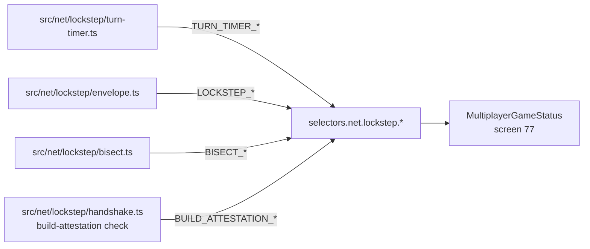
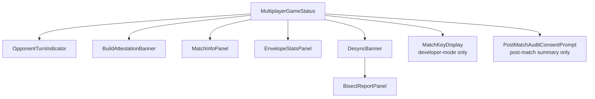
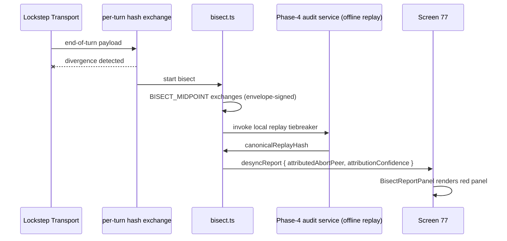

# Screen 77: Multiplayer Game Status
## Architecture

### Source Files
- Mockup: `mockup.html`
- Spec: `spec.md`
- Interactions: `interactions.md`
- Data Contracts: `data-contracts.md`

### Telemetry Subscriptions



### Component Composition



### Stall Escalation Flow

```mermaid
sequenceDiagram
  participant Local as Local UI
  participant TT as turn-timer.ts
  participant Wire as Lockstep Transport
  participant Reducer as Engine Reducer

  Local->>TT: turn start
  TT->>Local: WAITING
  TT->>Local: STALLED (≥ 30s)
  TT->>Wire: wrap(END_DAY{source:'auto-timeout'})
  Wire->>Reducer: apply canonical envelope
  Reducer->>Local: turn ends; OpponentTurnIndicator → auto-ended
```

### Bisect / Desync Flow



### Module Graph Compliance
- Screen 77 lives entirely in `src/ui/multiplayer/`. It imports
  selectors from `src/net/lockstep/*` per the module-graph
  table in [`module-graph.md`](../../../module-graph.md): UI may
  import any module below it.
- Screen 77 MUST NOT import anything from `src/engine/` or
  `src/rules/` directly except for closed-form selector
  re-exports surfaced by `src/net/lockstep/`.

### Cross-Reference Index
- Turn timer: [`turn-timer.md`](../../../turn-timer.md)
- Envelope: [`lockstep-envelope.md`](../../../lockstep-envelope.md)
- Handshake: [`match-handshake.md`](../../../match-handshake.md)
- Bisect: [`bisect-protocol.md`](../../../bisect-protocol.md)
- Build attestation: [`build-attestation.md`](../../../build-attestation.md)
- Audit pipeline: [`replay-audit-pipeline.md`](../../../replay-audit-pipeline.md)
- Security model: [`security-model.md`](../../../security-model.md)
- Peer reputation: [`peer-reputation.md`](../../../peer-reputation.md)
